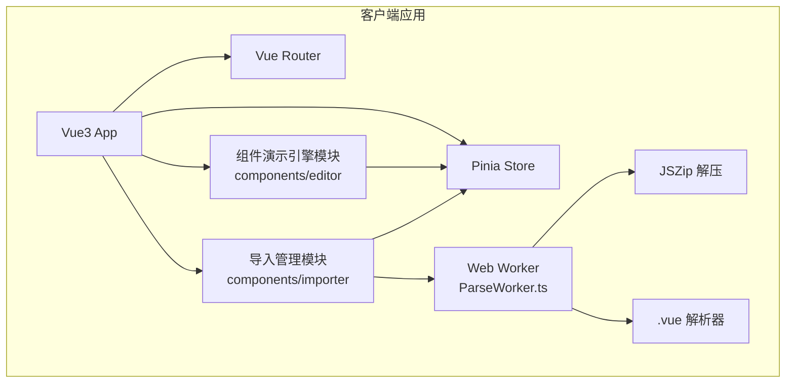

## 1. 架构设计



## 2. 技术描述

- **前端框架**：Vue 3 + TypeScript
- **构建工具**：Vite
- **状态管理**：Pinia
- **路由**：Vue Router 4
- **代码编辑器**：Monaco Editor
- **压缩解析**：JSZip
- **目标**：ES2020，严格模式 TypeScript

## 3. 路由定义

| 路由 | 用途 |
|------|------|
| / | 首页，自动重定向到第一个组件详情页 |
| /component/:id | 组件详情页，展示实时预览、代码编辑器、属性面板、示例卡片 |

## 4. 数据模型

### 4.1 Store 状态定义

```typescript
interface ComponentProp {
  name: string
  type: 'string' | 'number' | 'boolean' | 'color' | 'select'
  default: any
  options?: string[]
  min?: number
  max?: number
  step?: number
}

interface ComponentExample {
  id: string
  name: string
  code: string
  thumbnail?: string
}

interface RegisteredComponent {
  id: string
  name: string
  version: string
  isLatest: boolean
  sourceCode: string
  props: ComponentProp[]
  examples: ComponentExample[]
}

interface ImportState {
  isImporting: boolean
  progress: number
  totalFiles: number
  processedFiles: number
}
```

## 5. 文件组织结构

```
auto43/
├── package.json
├── index.html
├── vite.config.ts
├── tsconfig.json
└── src/
    ├── main.ts
    ├── App.vue
    ├── router/
    │   └── index.ts
    ├── stores/
    │   └── componentStore.ts
    ├── components/
    │   ├── editor/
    │   │   ├── ComponentPreview.vue
    │   │   ├── PropsPanel.vue
    │   │   ├── SourceEditor.vue
    │   │   └── ExampleCards.vue
    │   └── importer/
    │       ├── ImportPanel.vue
    │       └── ParseWorker.ts
    └── pages/
        └── ComponentDetail.vue
```

## 6. 核心模块说明

### 6.1 stores/componentStore.ts
- 管理组件注册表列表
- 当前激活组件状态
- 导入进度状态
- 提供 registerComponent、setActive、importZip 等 action

### 6.2 components/editor/
- **ComponentPreview.vue**：动态组件渲染，watch props 变化重新渲染
- **PropsPanel.vue**：根据 props 接口动态生成控件，emit URL 参数变更
- **SourceEditor.vue**：Monaco Editor 封装，vue 语言模式，0.3s 防抖 emit
- **ExampleCards.vue**：示例卡片网格，代码查看浮层，一键复制

### 6.3 components/importer/
- **ImportPanel.vue**：拖拽上传区域，圆环进度条组件
- **ParseWorker.ts**：Web Worker 后台解析，JSZip 解压，.vue SFC 解析
