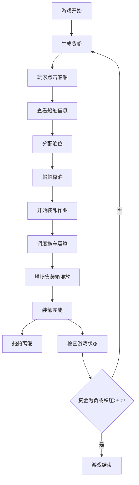

## 1. 产品概述

海港货物装卸模拟经营游戏，玩家扮演港口调度员，管理船舶靠泊、集装箱装卸和堆场分配，体验港口日常运营的紧张与挑战。

- 核心玩法：规划泊位、分配岸桥和拖车，平衡进口卸货与出口装货，最大化港口吞吐量和利润
- 目标用户：喜欢模拟经营类游戏的玩家，对物流调度、资源管理感兴趣的用户
- 市场价值：提供高度沉浸感的港口运营体验，结合策略规划和实时操作，具有强 replayability

## 2. 核心特性

### 2.1 用户角色

| 角色 | 注册方式 | 核心权限 |
|------|----------|----------|
| 玩家 | 无需注册 | 完整游戏操作权限，包括船舶调度、堆场管理、游戏控制 |

### 2.2 功能模块

1. **主游戏界面**：俯视海港地图，包含海域、泊位、堆场、实时动画
2. **船舶管理**：船舶到港、靠泊、装卸、离港全流程
3. **堆场管理**：集装箱堆放、拖拽调整、容量监控
4. **物流调度**：拖车运输、路径规划、自动分配
5. **游戏控制**：开始、暂停、重置、设置
6. **状态显示**：日期、吞吐量、资金、统计数据

### 2.3 页面详情

| 页面名称 | 模块名称 | 功能描述 |
|----------|----------|-------------|
| 主游戏界面 | 顶部状态栏 | 显示当天日期、港口总吞吐量、资金余额，半透明深灰色面板 |
| 主游戏界面 | 海域区域 | 蓝色海水带波浪动画，船舶驶入驶出动画 |
| 主游戏界面 | 泊位区域 | 3个泊位，显示状态（空闲/占用/维修），岸桥数量 |
| 主游戏界面 | 堆场区域 | 6x6格子网格，显示集装箱堆叠，容量指示器 |
| 主游戏界面 | 船舶信息面板 | 点击船舶弹出，显示详细信息和装卸进度，分配泊位按钮 |
| 主游戏界面 | 暂停菜单 | 半透明遮罩，继续/重新开始/设置按钮 |
| 主游戏界面 | 游戏结束面板 | 统计数据展示，返回主菜单/再玩一局按钮 |

## 3. 核心流程

玩家开始游戏后，每天有货船到港，需要为船舶分配泊位，调度拖车在泊位和堆场之间运输集装箱，管理堆场空间，维持港口正常运营。

## 4. 用户界面设计

### 4.1 设计风格

- **主色调**：深海蓝 (#1a1a2e) 作为背景色，蓝色 (#0066cc) 代表进口，红色 (#cc3333) 代表出口，绿色 (#33aa55) 代表中转
- **强调色**：金色 (#ffd700) 用于游戏结束统计数据
- **按钮风格**：圆角矩形，悬停时背景色从透明渐变到蓝色，边框渐变动画
- **字体**：等宽字体用于数字显示，确保对齐和可读性
- **布局风格**：俯视图，左侧海域右侧堆场，顶部状态栏，右侧信息面板
- **动画风格**：流畅平滑，使用 requestAnimationFrame 驱动，拖拽带弹性动画，闪烁警告效果

### 4.2 页面设计概述

| 页面名称 | 模块名称 | UI 元素 |
|----------|----------|----------|
| 主游戏界面 | 顶部状态栏 | 半透明深灰色面板 (#1a1a2ecc)，圆角 8px，白色等宽字体 |
| 主游戏界面 | 海域区域 | 蓝色渐变背景 (#1a5f7a - #0d3b52)，正弦波动画，白色泡沫效果 |
| 主游戏界面 | 泊位区域 | 深灰色混凝土平台 (#4a4a4a)，黄色虚线标记泊位边界 |
| 主游戏界面 | 堆场区域 | 浅灰色网格 (#888888)，每个格子 80x80px，间隔 4px |
| 主游戏界面 | 集装箱 | 60x40px 圆角矩形，蓝色/红色/绿色，顶部显示目的地缩写 |
| 主游戏界面 | 拖车 | 橙色卡车头 + 灰色集装箱，车轮旋转动画 |
| 主游戏界面 | 船舶信息面板 | 白色背景 (#ffffff)，阴影 0 4px 20px rgba(0,0,0,0.15)，圆角 12px |
| 主游戏界面 | 进度条 | 高度 8px，圆角 4px，蓝色渐变动画 |
| 主游戏界面 | 暂停菜单 | 半透明遮罩 rgba(0,0,0,0.6)，白色圆角卡片，按钮悬停效果 |
| 主游戏界面 | 游戏结束面板 | 宽度 400px，高度 300px，深蓝到深紫渐变背景，金色发光文字 |

### 4.3 响应性

- 桌面端优先设计，固定 1000x800px 游戏画布
- 游戏画布居中显示，周围区域使用深色背景填充
- UI 面板使用绝对定位，确保在各种屏幕尺寸下正确显示

### 4.4 交互设计

- **船舶选择**：点击船舶高亮显示，弹出信息面板
- **泊位分配**：信息面板点击按钮自动分配可用泊位
- **集装箱拖拽**：鼠标按下拖拽，半透明跟随，释放弹性动画
- **格子点击**：点击空闲格子新建堆放点
- **暂停操作**：按 ESC 或点击暂停按钮，所有动画冻结
