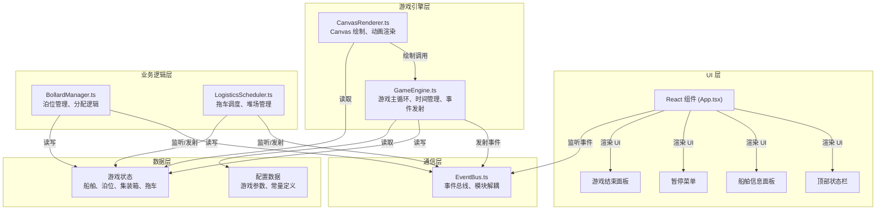

## 1. 架构设计



## 2. 技术描述

- **前端框架**：React 18 + TypeScript
- **构建工具**：Vite 5
- **渲染技术**：HTML5 Canvas 2D
- **状态管理**：自定义 EventBus + React useState
- **动画驱动**：requestAnimationFrame
- **包管理器**：npm
- **依赖库**：
  - react: ^18.2.0
  - react-dom: ^18.2.0
  - typescript: ^5.0.0
  - vite: ^5.0.0
  - @types/react: ^18.2.0
  - @types/react-dom: ^18.2.0
  - uuid: ^9.0.0

## 3. 目录结构

```
├── index.html              # 入口 HTML
├── package.json            # 项目依赖和脚本
├── tsconfig.json           # TypeScript 配置
├── vite.config.js          # Vite 配置
├── src/
│   ├── main.tsx            # React 入口
│   ├── App.tsx             # 主应用组件
│   ├── GameEngine.ts       # 游戏核心引擎
│   ├── BollardManager.ts   # 泊位管理模块
│   ├── LogisticsScheduler.ts # 物流调度模块
│   ├── EventBus.ts         # 事件总线
│   ├── CanvasRenderer.ts   # Canvas 渲染器
│   ├── types.ts            # 类型定义
│   └── styles.css          # 全局样式
```

## 4. 数据模型

### 4.1 核心类型定义

```typescript
// 船舶状态
type ShipStatus = 'approaching' | 'waiting' | 'docked' | 'loading' | 'unloading' | 'departing' | 'departed';

// 泊位状态
type BollardStatus = 'idle' | 'occupied' | 'maintenance';

// 集装箱类型
type ContainerType = 'import' | 'export' | 'transit';

// 拖车状态
type TruckStatus = 'idle' | 'moving_to_bollard' | 'loading' | 'moving_to_yard' | 'unloading';

// 集装箱
interface Container {
  id: string;
  type: ContainerType;
  destination: string;
  shipId?: string;
  gridX?: number;
  gridY?: number;
  stackLevel?: number;
}

// 船舶
interface Ship {
  id: string;
  name: string;
  hullColor: string;
  x: number;
  y: number;
  targetX: number;
  targetY: number;
  angle: number;
  speed: number;
  capacity: number;
  importContainers: number;
  exportContainers: number;
  unloadedImport: number;
  loadedExport: number;
  status: ShipStatus;
  bollardId?: string;
  estimatedDockingTime: number;
  remainingDockingTime: number;
}

// 泊位
interface Bollard {
  id: string;
  x: number;
  y: number;
  status: BollardStatus;
  maxDepth: number;
  craneCount: number;
  shipId?: string;
}

// 堆场格子
interface YardGrid {
  x: number;
  y: number;
  capacity: number;
  stackedContainers: Container[];
}

// 拖车
interface Truck {
  id: string;
  x: number;
  y: number;
  targetX: number;
  targetY: number;
  speed: number;
  status: TruckStatus;
  container?: Container;
  path: { x: number; y: number }[];
  pathIndex: number;
  wheelRotation: number;
}

// 游戏状态
interface GameState {
  day: number;
  totalThroughput: number;
  balance: number;
  isPaused: boolean;
  isGameOver: boolean;
  averageDockingTime: number;
  maxYardUtilization: number;
  totalDockingTime: number;
  totalShipsProcessed: number;
}
```

## 5. 事件总线事件定义

| 事件名称 | 数据类型 | 触发时机 | 监听方 |
|----------|----------|----------|--------|
| `shipArrived` | `{ ship: Ship }` | 船舶进入港口 | GameEngine, UI |
| `shipDocked` | `{ ship: Ship, bollard: Bollard }` | 船舶靠泊完成 | BollardManager, UI |
| `shipLeft` | `{ ship: Ship }` | 船舶离港 | BollardManager, GameEngine |
| `bollardAllocated` | `{ bollard: Bollard, ship: Ship }` | 泊位分配成功 | UI |
| `bollardFreed` | `{ bollard: Bollard }` | 泊位释放 | UI |
| `cargoUnloaded` | `{ container: Container, bollardId: string }` | 集装箱从船卸下 | LogisticsScheduler |
| `cargoLoaded` | `{ container: Container, shipId: string }` | 集装箱装上船 | GameEngine |
| `cargoMoved` | `{ container: Container, fromX: number, fromY: number, toX: number, toY: number }` | 集装箱移动 | UI |
| `truckAssigned` | `{ truck: Truck, bollardId: string }` | 拖车分配 | UI |
| `truckArrived` | `{ truck: Truck, location: 'bollard' | 'yard' }` | 拖车到达 | LogisticsScheduler |
| `yardGridUpdated` | `{ grid: YardGrid }` | 堆场格子更新 | UI |
| `yardOverflow` | `{ grids: YardGrid[] }` | 堆场超容 | UI |
| `gameStateUpdated` | `{ state: GameState }` | 游戏状态更新 | UI |
| `gamePaused` | `{}` | 游戏暂停 | 所有模块 |
| `gameResumed` | `{}` | 游戏继续 | 所有模块 |
| `gameOver` | `{ reason: string, stats: GameState }` | 游戏结束 | UI, 所有模块 |
| `gameReset` | `{}` | 游戏重置 | 所有模块 |

## 6. 性能优化策略

1. **Canvas 分层渲染**：
   - 静态层：地图、网格、泊位（绘制一次缓存）
   - 动态层：船舶、拖车、集装箱（每帧重绘）

2. **对象池模式**：
   - 复用拖车和集装箱对象，避免频繁 GC
   - 离屏 Canvas 缓存集装箱图形

3. **动画优化**：
   - 所有动画使用 requestAnimationFrame 驱动
   - 暂停时取消动画帧请求
   - 使用 CSS transform 而非 top/left 进行 UI 动画

4. **事件节流**：
   - 高频事件（如 mousemove）使用节流处理
   - 状态更新批量处理，减少 React 重渲染

5. **帧率监控**：
   - 内置 FPS 计数器，性能测试使用
   - 动态调整粒子效果数量

## 7. 核心算法

### 7.1 泊位分配算法

```
输入：船舶吃水深度、载货量
输出：最优泊位

1. 筛选所有空闲泊位（status === 'idle'）
2. 过滤满足吃水要求的泊位（maxDepth >= ship.draft）
3. 按岸桥数量排序（craneCount 降序）
4. 若多个泊位满足条件，选择距离最近的
5. 返回泊位或 null（无可用泊位）
```

### 7.2 堆场格子分配算法

```
输入：集装箱类型、优先级
输出：目标格子坐标

1. 按优先级查找同级格子：
   - 优先查找已有同类型集装箱的格子（未满）
   - 其次查找完全空闲的格子
   - 最后查找任何未满的格子
2. 距离泊位最近的格子优先
3. 返回格子坐标或 null（无可用空间）
```

### 7.3 A* 路径规划算法

```
输入：起点坐标、终点坐标
输出：路径点数组

1. 使用曼哈顿距离作为启发函数
2. 考虑固定通道限制（仅允许在预设路径上移动）
3. 返回最短路径
4. 路径使用灰色虚线在 Canvas 上标记
```
