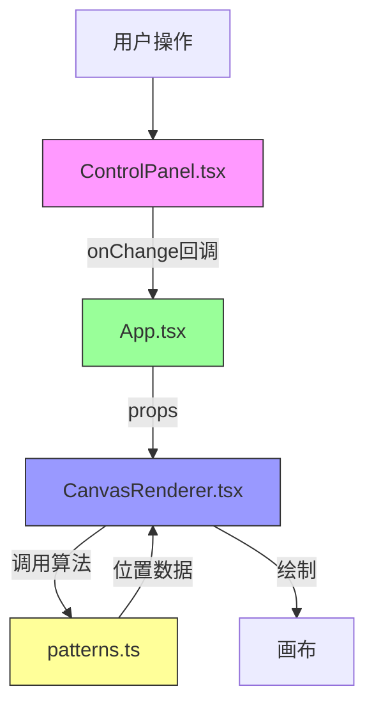

# 桌面图标自动艺术化排列工具 - 技术架构文档

## 1. 技术选型

| 技术 | 版本 | 用途 | 选型理由 |
|------|------|------|----------|
| React | 18.x | UI框架 | 组件化开发，生态成熟 |
| TypeScript | 5.x | 类型系统 | 类型安全，提升代码质量 |
| Vite | 5.x | 构建工具 | 快速开发，热更新，esbuild构建 |
| p5.js | 1.x | 图形绘制 | 强大的2D绘图能力，适合创意编程 |
| react-p5-wrapper | 4.x | React桥接 | 便捷地在React中使用p5.js |

---

## 2. 项目结构

```
auto49/
├── package.json                    # 项目依赖和脚本
├── index.html                      # 入口HTML
├── vite.config.js                  # Vite构建配置
├── tsconfig.json                   # TypeScript配置
└── src/
    ├── App.tsx                     # 根组件，状态管理
    ├── main.tsx                    # React入口
    ├── components/
    │   ├── CanvasRenderer.tsx      # p5.js画布渲染组件
    │   └── ControlPanel.tsx        # 控制面板组件
    ├── utils/
    │   └── patterns.ts             # 排列算法纯函数
    └── types/
        └── index.ts                # 类型定义
```

---

## 3. 模块职责与调用关系

### 3.1 文件职责说明

| 文件 | 职责 | 输入 | 输出 |
|------|------|------|------|
| [App.tsx](file:///c:/Users/Administrator/Desktop/P/tasks/auto49/src/App.tsx) | 根组件，状态管理，组件协调 | 无 | 渲染ControlPanel和CanvasRenderer |
| [ControlPanel.tsx](file:///c:/Users/Administrator/Desktop/P/tasks/auto49/src/components/ControlPanel.tsx) | 用户交互界面，图标上传，参数调节 | onChange回调函数 | 用户操作通过回调更新App状态 |
| [CanvasRenderer.tsx](file:///c:/Users/Administrator/Desktop/P/tasks/auto49/src/components/CanvasRenderer.tsx) | p5.js画布绘制，动画处理，交互响应 | iconList, pattern, theme, density, iconSize | 绘制帧，点击/悬停交互 |
| [patterns.ts](file:///c:/Users/Administrator/Desktop/P/tasks/auto49/src/utils/patterns.ts) | 纯函数排列算法 | iconCount, width, height, density | 每个图标的位置、旋转、透明度数组 |

### 3.2 调用关系图



### 3.3 数据流向

```
1. 用户上传图标 → ControlPanel → handleIconsChange → App.iconList
2. 用户选择模式 → ControlPanel → handlePatternChange → App.pattern
3. 用户切换主题 → ControlPanel → handleThemeChange → App.theme
4. 用户调节滑块 → ControlPanel → handleDensityChange/handleSizeChange → App.density/App.iconSize
5. App状态变化 → CanvasRenderer接收新props → 调用patterns算法 → p5.js重绘画布
```

---

## 4. 核心数据结构

### 4.1 类型定义

```typescript
// src/types/index.ts

export type PatternType = 'wave' | 'spiral' | 'random';
export type ThemeType = 'warm' | 'cool' | 'neon';

export interface IconItem {
  id: string;
  name: string;
  type: 'emoji' | 'image';
  content: string; // emoji字符或图片dataURL
}

export interface PatternPoint {
  x: number;
  y: number;
  rotation?: number;
  alpha?: number;
  scale?: number;
}

export interface ThemeConfig {
  background: string;
  primaryColors: string[];
  accentColor: string;
}

export interface AppState {
  iconList: IconItem[];
  pattern: PatternType;
  theme: ThemeType;
  density: number;
  iconSize: number;
}
```

---

## 5. 关键算法设计

### 5.1 波浪排列算法 (generateWavePattern)

```
输入：图标数量N，画布宽W，高H，密度D
输出：N个PatternPoint

1. 计算波浪参数：
   - 振幅A = H * 0.3
   - 波长λ = W / (N * (D/100))
   - 角速度ω = 2π / λ

2. 对每个图标i (0到N-1)：
   - x = (W / (N+1)) * (i+1)
   - y = H/2 + A * sin(ω * x)
   - rotation = random(-15°, +15°)
   - alpha = 1.0
```

### 5.2 螺旋排列算法 (generateSpiralPattern)

```
输入：图标数量N，画布宽W，高H，密度D
输出：N个PatternPoint

1. 计算螺旋参数：
   - 中心(cx, cy) = (W/2, H/2)
   - 最大半径R = min(W, H) * 0.45
   - 圈数turns = 2.5
   - 每圈点数 = N / turns

2. 对每个图标i (0到N-1)：
   - 角度θ = (i / 每圈点数) * 2π
   - 半径r = R * (i / N) * (D/100)
   - x = cx + r * cos(θ)
   - y = cy + r * sin(θ)
   - rotation = θ * 180/π （切线方向）
   - scale = 1.0 - 0.4 * (i / N) （从1.0递减到0.6）
```

### 5.3 随机散点算法 (generateRandomPattern)

```
输入：图标数量N，画布宽W，高H，密度D
输出：N个PatternPoint

1. 初始化点列表为空
2. 计算最小间距 = 60 + (200 - D) / 2 （密度越大间距越小）
3. 目标覆盖面积 = W * H * 0.6
4. 尝试放置N个点：
   - 随机生成(x, y)，边界内缩30px
   - 检查与已有所有点的距离 > 最小间距
   - 如果冲突，最多重试100次
   - 成功则加入点列表
5. 如果放置点数 < N，适当减小最小间距重试
6. 验证覆盖面积 >= 目标值，不足则扩大分布范围
```

---

## 6. 动画与交互设计

### 6.1 过渡动画实现

| 动画 | 实现方式 | 时长 | 缓动函数 |
|------|----------|------|----------|
| 图标位置移动 | p5.js lerp插值 | 0.5s | ease-in-out |
| 图标点击弹起 | CSS transform + scale | 0.3s | ease-out |
| 鼠标悬停放大 | p5.js map插值 | 0.15s | ease-out |
| 背景色过渡 | CSS transition | 1s | ease-in-out |
| 图标颜色变化 | 延迟执行 | 1s | 即时 |

### 6.2 性能优化策略

1. **帧动画优化**：
   - 使用p5.js的requestAnimationFrame
   - 仅在状态变化时重新计算排列
   - 位置插值使用lerp而非重算

2. **重绘优化**：
   - 缓存图标图像对象
   - 离屏画布预渲染圆形图标
   - 避免在draw()中创建新对象

3. **FPS监控**：
   - 开发环境显示FPS计数器
   - 复杂动画时降级处理

---

## 7. 响应式设计

### 7.1 断点设计

| 屏幕宽度 | 布局 |
|----------|------|
| >= 1024px | 左侧75%画布 + 右侧300px控制面板 |
| < 1024px | 画布100%宽度 + 可折叠抽屉控制面板 |

### 7.2 抽屉实现

- 控制面板默认隐藏
- 右上角齿轮按钮切换显示
- 抽屉滑入动画0.3s ease-out
- 遮罩层点击关闭

---

## 8. 构建与部署

### 8.1 构建命令

```json
{
  "scripts": {
    "dev": "vite",
    "build": "tsc && vite build",
    "preview": "vite preview"
  }
}
```

### 8.2 构建输出

```
dist/
├── index.html
├── assets/
│   ├── index-[hash].js
│   └── index-[hash].css
```
