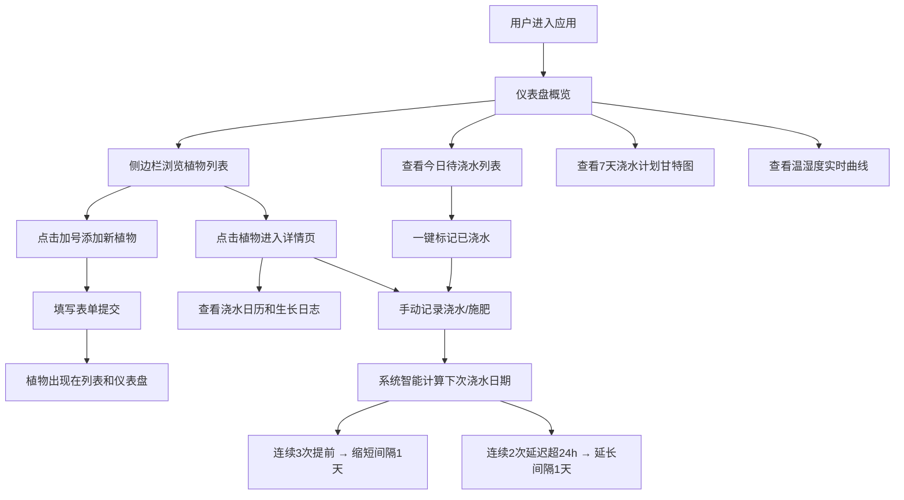

## 1. 产品概述

智能绿植管家 - 一款在线室内植物养护与智慧灌溉提醒应用，帮助用户科学管理家中植物。通过登记植物信息、结合模拟传感器数据，系统自动生成个性化浇水计划并推送提醒，同时记录养护历史生成生长日志。

- 核心目标：让每位用户都能轻松养护植物，降低养护门槛，提升植物存活率
- 目标用户：室内植物爱好者、养植新手、忙碌的都市人群
- 市场价值：填补智能化植物养护管理工具的空白，提供数据驱动的科学养护方案

## 2. 核心功能

### 2.1 用户角色

| 角色 | 注册方式 | 核心权限 |
|------|----------|----------|
| 普通用户 | 无需注册，本地使用 | 添加/管理植物、记录浇水施肥、查看仪表盘数据 |

### 2.2 功能模块

1. **侧边栏导航**：植物列表（按浇水时间排序）、添加植物按钮、智能提醒状态
2. **植物列表页**：植物卡片网格、下次浇水倒计时、土壤湿度指示
3. **植物详情页**：信息卡片、浇水日历、生长日志时间线、手动记录入口
4. **智慧灌溉仪表盘**：今日待浇水列表、7天浇水计划甘特图、温湿度实时曲线

### 2.3 页面详情

| 页面名称 | 模块名称 | 功能描述 |
|----------|----------|----------|
| 侧边栏 | 植物列表 | 按下次浇水时间排序，显示名称、品种图标、剩余天数，逾期显示红色动画感叹号 |
| 侧边栏 | 添加植物 | 弹出表单：名称、品种、盆器尺寸、位置、浇水/施肥间隔、照片上传 |
| 植物列表 | 卡片网格 | 两列布局，每张卡片含植物名、品种、倒计时、土壤湿度条，悬停微动效 |
| 植物详情 | 信息卡片 | 照片、名称、品种、盆器尺寸、位置、智能调整提示文案 |
| 植物详情 | 浇水日历 | 月视图，已浇水绿点、计划蓝圈、今日需浇水橙色脉动动画，点击日期补录 |
| 植物详情 | 生长日志 | 垂直时间线，浇水/施肥记录，时间倒序，近7天浅蓝色边框高亮，支持编辑删除 |
| 仪表盘 | 今日待浇水 | 卡片列表，植物缩略图、距上次浇水天数、建议浇水量，缺水程度渐变色背景 |
| 仪表盘 | 7天计划甘特图 | 每植物一横条，长度代表区间，颜色标识品种，悬停显示时间区间 |
| 仪表盘 | 温湿度曲线 | 24小时折线图，温度红线湿度蓝线，浇水适宜度笑脸emoji指示 |
| 仪表盘 | 一键浇水 | 标记已浇水，自动更新下次日期、写入日志，智能调整间隔 |

## 3. 核心流程

用户从进入应用开始，首先看到仪表盘概览。通过左侧边栏浏览或添加植物，点击植物进入详情页查看养护历史并记录操作。系统后台根据传感器数据和历史记录自动智能调整浇水间隔。

## 4. 用户界面设计

### 4.1 设计风格

- **主色系**：自然绿植主题，叶片绿#2d8a4e，木质棕#8b5e3c，浅米白背景#f5f0e8
- **文字主色**：深灰#2c2c2c
- **按钮样式**：主色填充白字，圆角20px，悬停深绿#1e6e3a，放大1.02倍，0.2s过渡
- **卡片样式**：圆角12px，4px偏移8px模糊半透明阴影，内边距16px
- **布局**：左右分栏（侧边栏240px + 主区域），响应式768px断点
- **图标风格**：使用emoji和Lucide图标，水滴💧、肥料🌱、植物🌿等自然元素
- **动效**：所有过渡300ms ease-out，呼吸脉动动画0.5s周期，悬停左移2px微动效

### 4.2 页面设计概述

| 页面名称 | 模块名称 | UI元素 |
|----------|----------|--------|
| 侧边栏 | 植物列表项 | 圆角8px，悬停背景#e8f5e9 + 左移2px，逾期红色感叹号脉冲动画 |
| 植物列表 | 植物卡片 | 240px宽两列网格，4:3图片圆角8px，倒计时+湿度条 |
| 植物详情 | 浇水日历 | 月视图表格，绿点/蓝圈/橙色脉动圆点标记 |
| 植物详情 | 生长日志 | 垂直时间线，图标+时间+用量，近7天浅蓝色左边框 |
| 仪表盘 | 待浇水卡片 | 浅绿→橙红渐变背景，缩略图+名称+建议水量 |
| 仪表盘 | 甘特图 | 圆角6px横条，品种配色，悬停tooltip |
| 仪表盘 | 折线图 | 红/蓝双线，灰#888轴标签，半透明#ddd网格线 |

### 4.3 响应式设计

- 桌面优先（≥768px）：左侧240px固定侧边栏 + 右侧主区域
- 移动端（<768px）：侧边栏收起到顶部，变为横向标签式菜单
- 卡片布局：桌面端两列（480px+间距），移动端单列自适应
- 触控优化：按钮最小高度44px，手势友好的点击区域

### 4.4 性能指标

- 植物列表100条以内首次加载 < 1秒
- 折线图数据刷新频率：每5秒
- 页面滚动帧率：稳定60fps
- 状态管理：Zustand轻量方案，避免不必要重渲染
