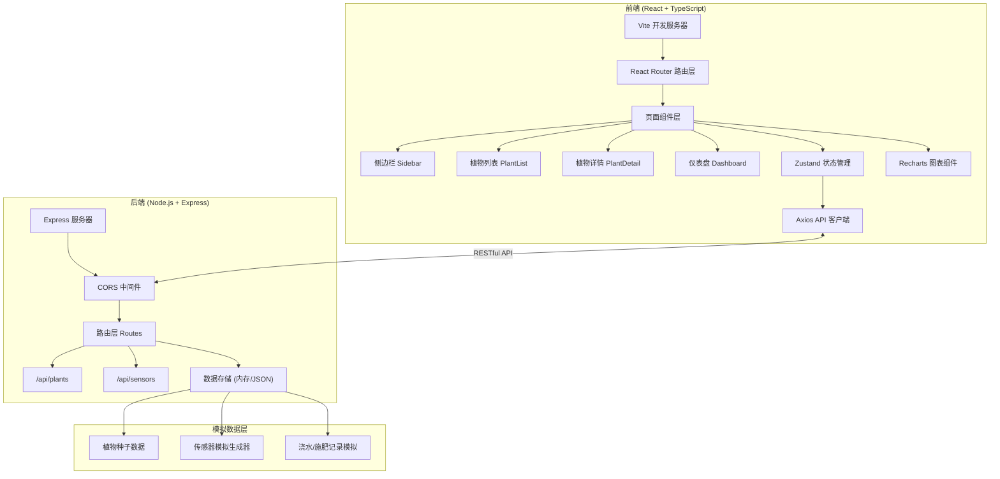

## 1. 架构设计



## 2. 技术描述

- **前端**：React@18 + TypeScript@5 + Vite@5
  - 状态管理：zustand@4
  - 路由：react-router-dom@6
  - HTTP客户端：axios@1
  - 图表库：recharts@2
  - 图标：lucide-react
- **初始化工具**：vite-init（react-express-ts模板）
- **后端**：Express@4 + TypeScript
  - 跨域：cors@2
  - ID生成：uuid@9
- **数据库**：内存存储 + JSON文件持久化（模拟场景）
- **构建工具**：Vite（前端） + ts-node/tsc（后端）

## 3. 路由定义

| 路由路径 | 页面组件 | 用途 |
|----------|----------|------|
| / | PlantList | 植物列表页（首页） |
| /plants | PlantList | 植物列表页 |
| /plants/:id | PlantDetail | 植物详情页 |
| /dashboard | Dashboard | 智慧灌溉仪表盘 |

## 4. API 定义

### 4.1 类型定义

```typescript
// 植物品种枚举
type PlantSpecies = '绿萝' | '虎皮兰' | '多肉' | '龟背竹' | '发财树' | '吊兰' | '文竹' | '仙人掌' | '芦荟' | '常春藤';

// 摆放位置枚举
type PlantLocation = '客厅' | '卧室' | '书房