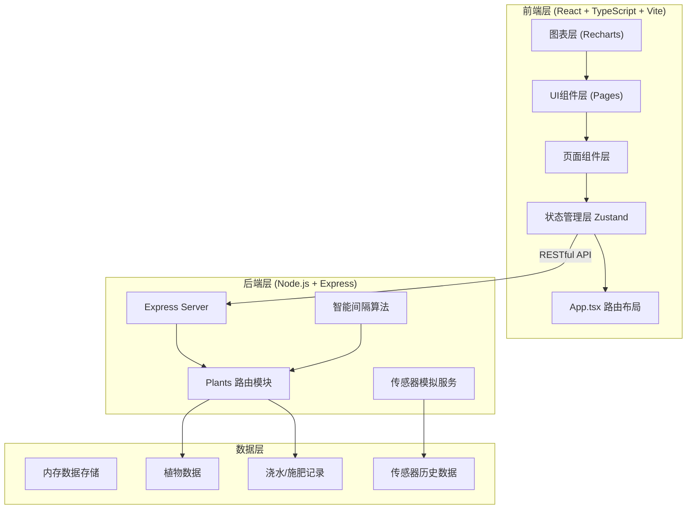
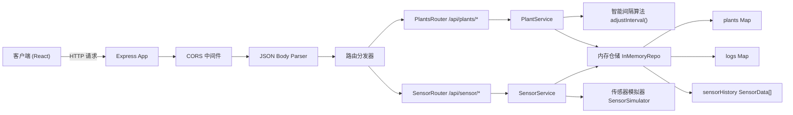
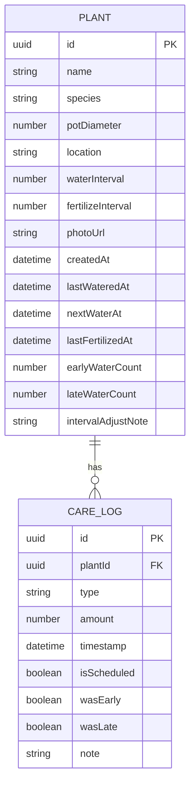

## 1. 架构设计



## 2. 技术描述

- **前端框架**：React 18 + TypeScript 5
- **构建工具**：Vite 5（HMR热更新）
- **路由管理**：react-router-dom 6
- **状态管理**：Zustand 4（轻量级，支持持久化可选）
- **HTTP客户端**：Axios
- **图表库**：Recharts 2
- **UI图标**：lucide-react
- **后端框架**：Express 4 + CORS中间件
- **ID生成**：uuid
- **数据存储**：内存存储（启动时初始化Mock数据）

## 3. 路由定义

| 前端路由 | 页面组件 | 用途 |
|----------|----------|------|
| `/` | Dashboard | 智慧灌溉仪表盘（默认首页） |
| `/plants` | PlantList | 植物列表网格页 |
| `/plants/:id` | PlantDetail | 单株植物详情页 |

## 4. API 定义

### 4.1 接口总览

| 方法 | 路径 | 说明 |
|------|------|------|
| GET | `/api/plants` | 获取所有植物列表（含下次浇水时间计算） |
| POST | `/api/plants` | 添加新植物 |
| POST | `/api/plants/:id/water` | 记录浇水（自动触发智能间隔调整） |
| POST | `/api/plants/:id/fertilize` | 记录施肥 |
| GET | `/api/plants/:id/logs` | 获取生长日志（浇水+施肥记录） |
| PUT | `/api/plants/:id/logs/:logId` | 编辑日志记录 |
| DELETE | `/api/plants/:id/logs/:logId` | 删除日志记录 |
| GET | `/api/sensor/current` | 获取当前温湿度模拟数据 |
| GET | `/api/sensor/history` | 获取过去24小时传感器历史数据 |

### 4.2 数据类型定义 (TypeScript)

```typescript
// 植物品种枚举
type PlantSpecies = '绿萝' | '虎皮兰' | '多肉' | '龟背竹' | '仙人掌' | '吊兰' | '发财树' | '其他';

// 摆放位置枚举
type PlantLocation = '客厅' | '卧室' | '书房' | '阳台' | '厨房' | '卫生间';

// 植物实体
interface Plant {
  id: string;                  // UUID
  name: string;                // 植物昵称
  species: PlantSpecies;       // 品种
  potDiameter: number;         // 盆器直径(cm)
  location: PlantLocation;     // 摆放位置
  waterInterval: number;       // 浇水间隔天数
  fertilizeInterval: number;   // 施肥间隔天数
  photoUrl?: string;           // 照片URL
  createdAt: string;           // 创建时间 ISO
  lastWateredAt?: string;      // 上次浇水时间
  nextWaterAt: string;         // 下次计划浇水时间
  lastFertilizedAt?: string;   // 上次施肥时间
  earlyWaterCount: number;     // 连续提前浇水次数
  lateWaterCount: number;      // 连续延迟浇水次数
  intervalAdjustNote?: string; // 智能调整提示文案
}

// 日志类型
type LogType = 'water' | 'fertilize';

// 生长日志记录
interface CareLog {
  id: string;                  // UUID
  plantId: string;             // 关联植物ID
  type: LogType;               // 类型
  amount: number;              // 用量：水ml / 肥料g
  timestamp: string;           // 操作时间 ISO
  isScheduled: boolean;        // 是否为计划时间内
  wasEarly?: boolean;          // 是否提前于计划
  wasLate?: boolean;           // 是否晚于计划超过24h
  note?: string;               // 备注
}

// 传感器数据点
interface SensorData {
  timestamp: string;           // 时间点 ISO
  temperature: number;         // 温度 °C
  humidity: number;            // 湿度 %
}

// API响应包装
interface ApiResponse<T> {
  success: boolean;
  data: T;
  message?: string;
}
```

## 5. 服务器架构图



## 6. 数据模型

### 6.1 实体关系图



### 6.2 智能间隔调整算法逻辑

```
函数 adjustInterval(plant: Plant, actualWaterTime: Date):
    scheduledTime = new Date(plant.nextWaterAt)
    diffHours = (actualWaterTime - scheduledTime) / (1000 * 3600)
    
    IF diffHours < -24:  // 提前超过24小时
        plant.lateWaterCount = 0
        plant.earlyWaterCount += 1
        IF plant.earlyWaterCount >= 3 AND plant.waterInterval > 1:
            plant.waterInterval -= 1
            plant.intervalAdjustNote = `检测到连续3次提前浇水，已自动将浇水间隔从${plant.waterInterval + 1}天缩短至${plant.waterInterval}天 💡`
            plant.earlyWaterCount = 0
        ENDIF
    ELIF diffHours > 24:  // 延迟超过24小时
        plant.earlyWaterCount = 0
        plant.lateWaterCount += 1
        IF plant.lateWaterCount >= 2:
            plant.waterInterval += 1
            plant.intervalAdjustNote = `检测到连续2次延迟浇水，已自动将浇水间隔从${plant.waterInterval - 1}天延长至${plant.waterInterval}天 💡`
            plant.lateWaterCount = 0
        ENDIF
    ELSE:  // 在24小时范围内，正常
        plant.earlyWaterCount = 0
        plant.lateWaterCount = 0
    ENDIF
```

### 6.3 品种与颜色映射（甘特图用）

| 品种 | 颜色代码 | 建议浇水量(ml/次) | 图标emoji |
|------|----------|-------------------|-----------|
| 绿萝 | #4CAF50 | 200 | 🌿 |
| 虎皮兰 | #8BC34A | 150 | 🪴 |
| 多肉 | #FF9800 | 80 | 🌵 |
| 龟背竹 | #2196F3 | 300 | 🍃 |
| 仙人掌 | #F44336 | 50 | 🌵 |
| 吊兰 | #9C27B0 | 180 | 🌱 |
| 发财树 | #795548 | 250 | 🌳 |
| 其他 | #607D8B | 150 | 🌺 |

### 6.4 缺水程度背景渐变计算

```
缺水天数 = (当前时间 - lastWateredAt) / 天
阈值 = waterInterval

缺水程度 = min(缺水天数 / 阈值, 1.0)  // 0~1
颜色从 HSL(120, 60%, 90%) → HSL(15, 80%, 75%)

即：浅绿 → 橙红 线性插值
```
