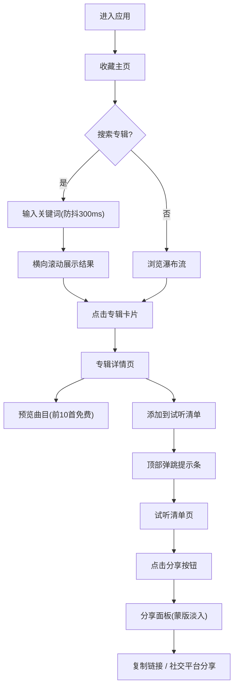

## 1. 产品概述

音乐专辑收藏管理应用，帮助音乐爱好者按个人偏好组织专辑收藏并生成可分享的试听清单。解决流媒体平台缺乏个性化整理工具的问题，支持按厂牌、发行年份、格式（磁带/黑胶/数字）分类管理。

- **目标用户**: 音乐爱好者、收藏家、黑胶/磁带发烧友
- **核心价值**: 个性化专辑整理、多格式分类、试听清单分享

## 2. 核心功能

### 2.1 用户角色
| 角色 | 注册方式 | 核心权限 |
|------|---------|---------|
| 普通用户 | 默认登录 | 浏览、收藏、管理专辑、创建试听清单、分享 |

### 2.2 功能模块
1. **收藏主页**: 瀑布流专辑展示、防抖搜索、收藏切换、自定义标签
2. **专辑详情页**: 封面大图、曲目列表（前10首免费预览）、添加到试听清单
3. **试听清单页**: 多清单管理、分享功能（链接+社交平台）
4. **标签管理页**: 标签增删改、颜色管理

### 2.3 页面详情
| 页面名称 | 模块名称 | 功能描述 |
|---------|---------|---------|
| 收藏主页 | 瀑布流网格 | 每行4列自适应，200x200封面，8px圆角，心形收藏按钮带脉冲动画 |
| 收藏主页 | 防抖搜索 | 300ms延迟，横向滚动结果容器(320px高)，加载动画，空结果提示 |
| 收藏主页 | 自定义标签 | 圆角胶囊，8种随机柔和色，删除时缩小旋转90度动画 |
| 专辑详情页 | 封面与曲目 | 400x400封面，前10首30秒预览，后20首发灰锁定 |
| 专辑详情页 | 添加提示条 | 顶部固定60px，半透明白色毛玻璃，上滑微弹跳0.4s |
| 试听清单页 | 分享面板 | 半透明蒙版淡入0.15s，400px宽白色面板18px圆角，可复制链接，社交图标悬停上浮3px |
| 全局导航 | 侧边栏 | 240px宽磨砂玻璃，3个菜单项，4px琥珀色激活指示，0.2s过渡；移动端底部Tab栏64px |

## 3. 核心流程

用户打开应用 → 浏览收藏主页的专辑瀑布流 → 点击搜索框输入关键词(防抖300ms) → 点击专辑卡片进入详情页 → 预览前10首曲目 → 点击"添加到试听清单" → 切换到试听清单页面 → 点击分享按钮 → 复制链接或选择社交平台分享

## 4. 用户界面设计

### 4.1 设计风格
- **主色调**: 琥珀橙 #f59e0b（按钮、高亮、激活指示）
- **深色主题**: 背景 #111827，卡片 #1f2937，主文字 #f9fafb，次要文字 #9ca3af
- **格式标签色**: 磁带-蓝 #3b82f6，黑胶-红 #ef4444，数字-灰 #6b7280
- **按钮效果**: 悬停亮度+20%，translateY(-2px)，0.15s过渡
- **字体**: 现代无衬线字体，清晰的层次结构

### 4.2 页面设计概览
| 页面名称 | 模块名称 | UI元素 |
|---------|---------|--------|
| 收藏主页 | 专辑卡片 | 200x200封面、专辑名、艺人名、格式标签、心形按钮(脉冲动画)、标签胶囊 |
| 收藏主页 | 搜索区域 | 输入框、旋转加载环(24px红色渐变)、横向滚动容器、困惑表情空状态 |
| 专辑详情页 | 布局 | 左右分栏(左400x400封面，右曲目列表) |
| 专辑详情页 | 曲目 | 前10首可点击，后20首发灰锁定+付费提示 |
| 专辑详情页 | 提示条 | 固定顶部60px，毛玻璃效果，弹跳动画 |
| 试听清单页 | 分享面板 | 蒙版淡入，白色圆角面板，链接输入框(自动选中)，社交图标悬停变色上浮 |
| 全局导航 | 侧边栏/Tab栏 | 半透明磨砂玻璃，激活态指示，平滑过渡 |

### 4.3 响应式设计
- **桌面端**: 左侧240px固定导航栏，主内容区瀑布流4列
- **移动端(<768px)**: 单列布局，底部64px Tab栏（图标+文字）
- **触摸优化**: 横向滚动支持触摸滑动，卡片点击区域足够大

### 4.4 性能要求
- 首次加载(含10张封面)渲染时间 ≤ 1.5秒
- 专辑详情页切换响应 ≤ 800毫秒
