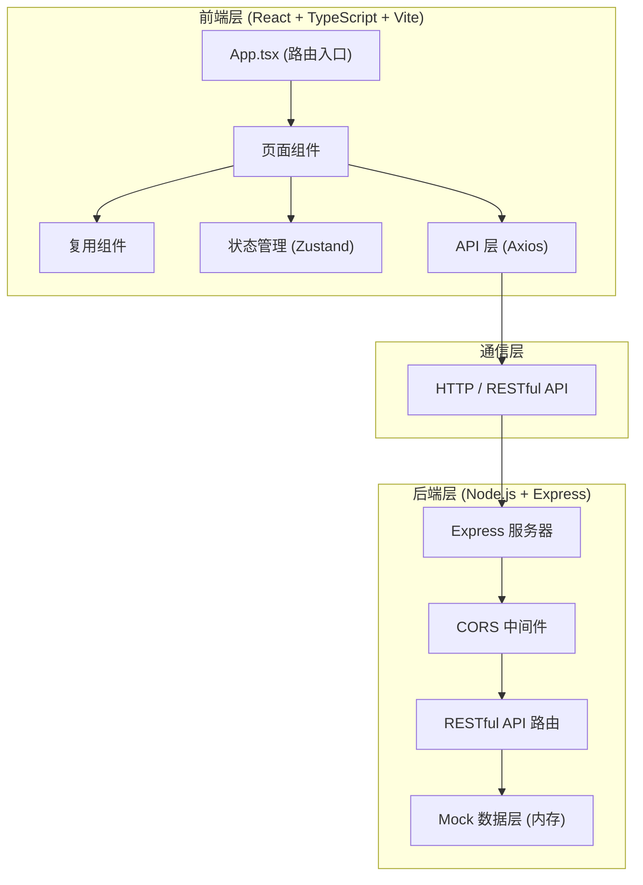
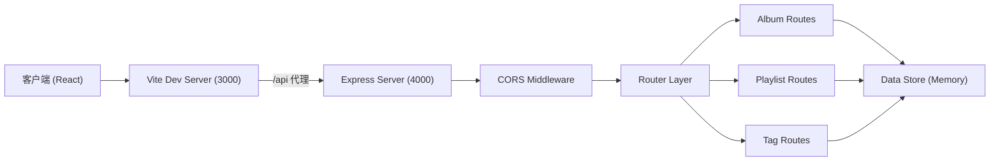
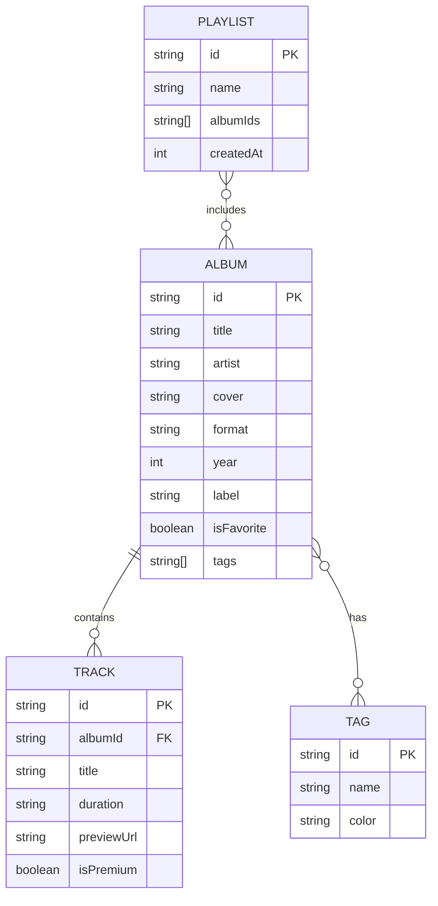

## 1. 架构设计



## 2. 技术说明

- **前端框架**: React 18 + TypeScript
- **构建工具**: Vite (端口 3000，代理 /api 到 4000)
- **状态管理**: Zustand
- **路由**: React Router DOM v6
- **HTTP 客户端**: Axios
- **图表库**: Recharts
- **后端框架**: Express 4
- **跨域**: CORS 中间件
- **唯一ID**: uuid
- **数据存储**: 内存 Mock 数据（无需数据库）

## 3. 路由定义

| 路由 | 用途 |
|------|------|
| /home | 收藏主页 - 瀑布流展示专辑、搜索、收藏 |
| /album/:id | 专辑详情页 - 封面、曲目列表、添加到试听清单 |
| /playlist | 试听清单页 - 多清单管理、分享功能 |
| /tags | 标签管理页 - 标签增删改 |

## 4. API 定义

### 类型定义

```typescript
type AlbumFormat = 'cassette' | 'vinyl' | 'digital';

interface Album {
  id: string;
  title: string;
  artist: string;
  cover: string;
  format: AlbumFormat;
  year: number;
  label: string;
  isFavorite: boolean;
  tags: string[];
  tracks: Track[];
}

interface Track {
  id: string;
  title: string;
  duration: string;
  previewUrl?: string;
  isPremium: boolean;
}

interface Playlist {
  id: string;
  name: string;
  albumIds: string[];
  createdAt: number;
}

interface Tag {
  id: string;
  name: string;
  color: string;
}
```

### API 接口

| 方法 | 路径 | 描述 | 响应 |
|------|------|------|------|
| GET | /api/albums | 获取专辑列表（支持搜索） | Album[] |
| GET | /api/albums/:id | 获取单个专辑详情 | Album |
| PUT | /api/albums/:id/favorite | 切换收藏状态 | { isFavorite: boolean } |
| PUT | /api/albums/:id/tags | 更新专辑标签 | Album |
| GET | /api/playlists | 获取所有试听清单 | Playlist[] |
| POST | /api/playlists | 创建新清单 | Playlist |
| PUT | /api/playlists/:id | 更新清单 | Playlist |
| DELETE | /api/playlists/:id | 删除清单 | { success: boolean } |
| POST | /api/playlists/:id/share | 生成分享链接 | { shareUrl: string } |
| GET | /api/tags | 获取所有标签 | Tag[] |
| POST | /api/tags | 创建标签 | Tag |
| PUT | /api/tags/:id | 更新标签 | Tag |
| DELETE | /api/tags/:id | 删除标签 | { success: boolean } |

## 5. 服务器架构图



## 6. 数据模型

### 6.1 数据模型定义



### 6.2 初始数据

应用启动时会加载 10+ 张示例专辑数据，包含各种格式（磁带、黑胶、数字）、预设标签和完整曲目列表（30首，前10首免费，后20首付费）。
