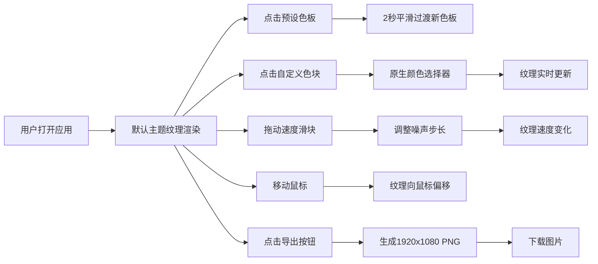

## 1. 产品概述

动态水彩纹理背景生成器是一款面向个人网页创作者和设计师的在线工具，能够实时生成随时间和鼠标位置自然流动的柔和有机水彩纹理，为作品集、个人主页增添独特的艺术氛围。

- 核心用途：为个人网页、作品集提供动态艺术化背景，替代静态图片或纯色背景
- 目标用户：网页设计师、前端开发者、创意从业者、个人站长
- 产品价值：降低动态艺术背景的制作门槛，提供可交互、可导出的专业级水彩纹理效果

## 2. 核心功能

### 2.1 用户角色
| 角色 | 注册方式 | 核心权限 |
|------|----------|----------|
| 普通用户 | 无需注册 | 使用所有纹理生成、自定义、导出功能 |

### 2.2 功能模块
1. **主界面**：全屏纹理画布 + 底部磨砂玻璃控制面板
2. **预设色板模块**：5组主题色板缩略图，点击切换
3. **自定义色板模块**：6个可编辑色块，支持原生颜色选择器
4. **速度控制模块**：0x-3x倍速滑块，带渐变轨道指示
5. **导出模块**：1920x1080 PNG导出按钮，带加载动画

### 2.3 页面详情
| 页面名称 | 模块名称 | 功能描述 |
|---------|----------|----------|
| 主页面 | 纹理画布 | p5.js实时渲染水彩纹理，支持鼠标交互偏移 |
| 主页面 | 预设色板 | 5组主题（暮光紫橙、深海蓝绿、花园粉黄、极光青紫、熔岩红金），2秒平滑过渡 |
| 主页面 | 自定义色板 | 6个色块，点击打开颜色选择器，0.3秒脉动动画反馈 |
| 主页面 | 速度滑块 | 0x-3x倍速控制，轨道浅绿到深红渐变，实时调整噪声步长 |
| 主页面 | 导出按钮 | 导出1920x1080 PNG，0.6秒旋转加载动画 |

## 3. 核心流程

用户打开应用后，默认展示预设主题的动态水彩纹理。用户可以通过点击预设色板切换主题，或点击自定义色块调整单个颜色。拖动速度滑块可以控制纹理流动速度。移动鼠标时纹理会向鼠标位置偏移聚集。点击导出按钮可下载当前纹理为高清PNG图片。

## 4. 用户界面设计

### 4.1 设计风格
- **主色调**：深色基调 #1a1a2e
- **文字颜色**：暖白 #f0e6d3
- **玻璃面板**：backdrop-filter: blur(12px)，背景 rgba(255,255,255,0.1)，边框 1px solid rgba(255,255,255,0.2)，圆角 20px
- **交互元素**：hover时放大1.05倍，增加投影
- **色块高亮**：选中预设主题边框 2px solid #fff
- **字体**：使用优雅的衬线+无衬线组合，标题使用 Playfair Display，正文使用 Inter

### 4.2 页面设计概述
| 页面名称 | 模块名称 | UI元素 |
|---------|----------|--------|
| 主页面 | 纹理画布 | position: fixed，z-index: 0，全屏覆盖 |
| 主页面 | 控制面板 | position: fixed，bottom，z-index: 10，min-width 600px，max-width 1200px，三行布局 |
| 主页面 | 预设色板行 | 5个 60x30 圆角矩形缩略图，间距均匀 |
| 主页面 | 自定义色板行 | 6个 35x35 圆形/方形色块，点击脉动动画 |
| 主页面 | 控制行 | 左侧速度滑块（渐变轨道），右侧导出按钮 |

### 4.3 响应式设计
- **桌面端**：控制面板横向三行布局，色块 35x35
- **移动端**：控制面板改为竖向排列，色块缩小至 40x40，宽度自适应屏幕
- **触摸优化**：增大触控区域，色块最小 40px 触控尺寸

### 4.4 视觉效果
- **水彩纹理**：边缘羽化、色彩半透明叠加、颜料扩散、沉淀颗粒感
- **多层叠加**：多图层 p5 Graphics 叠加，blendMode(MULTIPLY)，透明度 0.2-0.6 随机
- **鼠标交互**：纹理向鼠标位置偏移聚集，快速移动偏移量达30px，0.2秒平滑跟随，静止2秒恢复
- **过渡动画**：色板切换2秒渐变，色块修改0.3秒脉动缩放
