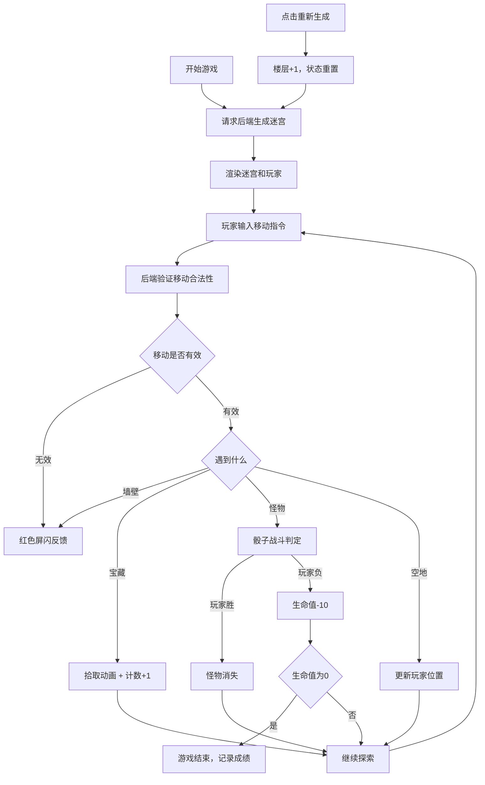

## 1. 产品概述

地下城迷宫生成与探索冒险游戏，玩家在程序化生成的地牢中探索、战斗并收集宝藏。每局迷宫随机生成，提供无限重玩价值。

- 核心玩法：迷宫探索 + 回合制战斗 + 宝藏收集
- 目标用户：休闲游戏玩家、地牢探险爱好者
- 市场价值：结合Roguelike元素，提供可重玩性和探索乐趣

## 2. 核心功能

### 2.1 用户角色

| 角色 | 注册方式 | 核心权限 |
|------|---------|----------|
| 玩家 | 无需注册 | 游戏游玩、查看排行榜 |

### 2.2 功能模块

1. **迷宫页面**：Canvas迷宫渲染、玩家控制、战斗系统、宝藏收集、迷雾效果
2. **排行榜页面**：成绩展示、历史记录

### 2.3 页面详情

| 页面名称 | 模块名称 | 功能描述 |
|---------|---------|----------|
| 迷宫页面 | 迷宫渲染 | Canvas绘制25x25网格迷宫，包含墙壁、路径、玩家、怪物、宝藏 |
| 迷宫页面 | 角色控制 | WASD/方向键控制移动，遇墙阻挡反馈 |
| 迷宫页面 | 战斗系统 | 骰子机制战斗，失败扣减生命值 |
| 迷宫页面 | 迷雾效果 | 3x3可见范围，已探索区域半透明显示 |
| 迷宫页面 | HUD面板 | 生命值、楼层、宝藏计数、背包显示 |
| 排行榜页面 | 成绩列表 | 展示历史最佳成绩 |

## 3. 核心流程

## 4. 用户界面设计

### 4.1 设计风格

- **主色调**：深棕背景 (#2a1a0a)，深灰墙壁 (#3a3a3a)，浅灰路径 (#5a5a5a)
- **强调色**：玩家亮蓝 (#00aaff)，宝藏金色 (#ffaa00)，怪物暗红 (#aa0000)
- **按钮风格**：圆角矩形 (8px)，深灰背景，亮灰文字，悬停变亮
- **字体**：使用 Press Start 2P 或等宽字体营造复古游戏氛围
- **布局**：顶部状态栏 + 中央Canvas + 右侧HUD面板

### 4.2 页面设计概述

| 页面名称 | 模块名称 | UI元素 |
|---------|---------|--------|
| 迷宫页面 | 顶部状态栏 | 楼层数、生命值条、导航按钮 |
| 迷宫页面 | 中央Canvas | 800x800像素迷宫，1:1比例，四周10px留白 |
| 迷宫页面 | 右侧HUD | 半透明深色背景，背包列表、宝藏计数、操作提示 |
| 排行榜页面 | 成绩列表 | 卡片式布局，显示玩家名、楼层、宝藏数、日期 |

### 4.3 响应式

- Desktop-first设计，主容器固定宽度1200px
- 移动端自适应布局，Canvas等比缩放
- 触摸操作支持虚拟方向键

### 4.4 动画效果

- 玩家移动：平滑过渡动画 (100ms)
- 墙壁碰撞：红色半透明屏闪 (200ms)
- 宝藏拾取：中央弹出"+1宝藏"放大淡出 (500ms)
- 战斗结果：HUD滚动文字显示
- 迷雾更新：渐变过渡效果
