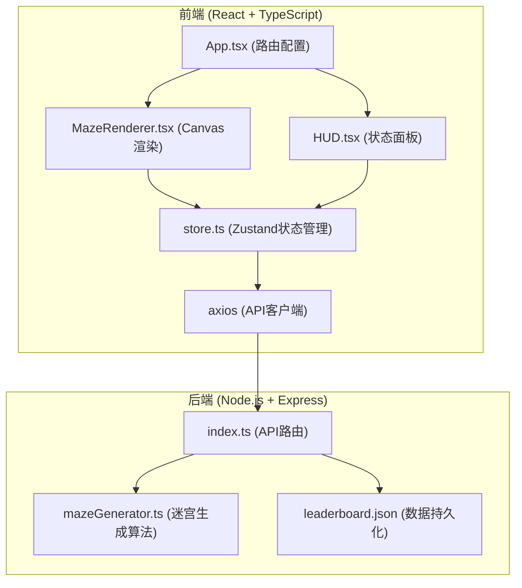
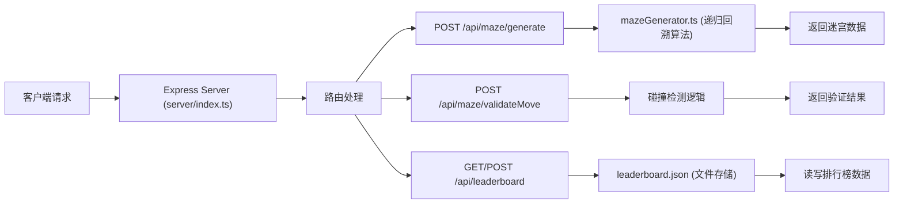
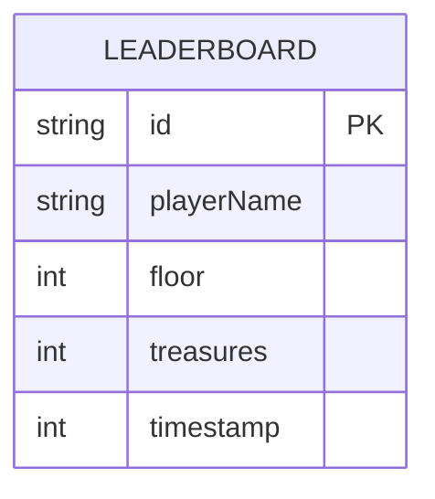

## 1. 架构设计



## 2. 技术描述

- **前端**：React 18 + TypeScript + Vite + Zustand + Axios
- **后端**：Node.js + Express + TypeScript + CORS
- **初始化工具**：vite-init (react-express-ts模板)
- **数据存储**：JSON文件持久化排行榜数据
- **构建工具**：Vite

## 3. 路由定义

| 路由 | 用途 |
|------|------|
| / | 迷宫游戏主页面 |
| /leaderboard | 排行榜页面 |

## 4. API 定义

```typescript
// 迷宫数据类型
interface MazeData {
  walls: Array<{ x: number; y: number }>;
  treasures: Array<{ x: number; y: number }>;
  monsters: Array<{ x: number; y: number }>;
  start: { x: number; y: number };
  end: { x: number; y: number };
  size: number;
}

// 移动验证请求
interface MoveRequest {
  maze: MazeData;
  playerPos: { x: number; y: number };
  direction: 'up' | 'down' | 'left' | 'right';
}

// 移动验证响应
interface MoveResponse {
  valid: boolean;
  newPosition: { x: number; y: number };
  type: 'empty' | 'wall' | 'treasure' | 'monster';
  monsterIndex?: number;
  treasureIndex?: number;
}

// 战斗结果
interface BattleResult {
  playerRoll: number;
  monsterRoll: number;
  playerWins: boolean;
  damage: number;
}

// 排行榜条目
interface LeaderboardEntry {
  id: string;
  playerName: string;
  floor: number;
  treasures: number;
  timestamp: number;
}
```

### 4.1 接口列表

| 方法 | 路径 | 描述 | 请求体 | 响应 |
|------|------|------|--------|------|
| POST | /api/maze/generate | 生成新迷宫 | { seed?: number } | MazeData |
| POST | /api/maze/validateMove | 验证移动 | MoveRequest | MoveResponse |
| GET | /api/leaderboard | 获取排行榜 | - | LeaderboardEntry[] |
| POST | /api/leaderboard | 提交成绩 | LeaderboardEntry | LeaderboardEntry |

## 5. 服务器架构图



## 6. 数据模型

### 6.1 数据模型定义



### 6.2 迷宫生成算法

- 使用递归回溯算法生成25x25网格
- 外围墙壁封闭
- 随机放置5-8个宝藏
- 随机放置3-5个怪物
- 起点(1,1)，终点(23,23)（考虑墙壁偏移）
- 保证至少一条通路

## 7. 项目文件结构

```
.
├── package.json
├── index.html
├── vite.config.js
├── tsconfig.json
├── server/
│   ├── index.ts
│   └── mazeGenerator.ts
├── src/
│   ├── App.tsx
│   ├── main.tsx
│   ├── store.ts
│   └── components/
│       ├── MazeRenderer.tsx
│       └── HUD.tsx
└── data/
    └── leaderboard.json
```
