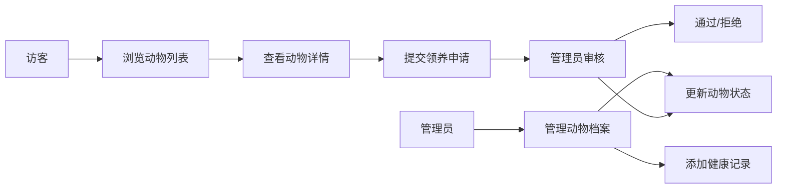

## 1. 产品概述

宠物健康档案与领养管理系统，面向小型宠物店和流浪动物救助站，提供动物健康档案管理与领养流程数字化解决方案。解决纸质记录易丢失、无法远程查看的痛点，提升管理效率并促进动物领养。

- 目标用户：宠物店员工、救助站志愿者（管理员）、潜在领养人（访客）
- 核心价值：数字化健康档案追踪 + 公开领养展示 + 申请审核流程

## 2. 核心功能

### 2.1 用户角色

| 角色 | 登录方式 | 核心权限 |
|------|----------|----------|
| 管理员 (admin) | 硬编码账号登录 | 动物档案增删改查、健康记录管理、领养申请审核 |
| 访客 (visitor) | 无需登录 | 浏览可领养动物、提交领养申请 |

### 2.2 功能模块

1. **动物档案管理**：添加/编辑/下架动物，记录基本信息与状态
2. **健康记录追踪**：疫苗/驱虫/体检/伤病治疗记录，体重变化曲线
3. **领养展示页**：公开可领养动物列表，支持品种/年龄筛选
4. **领养申请管理**：用户提交申请、管理员审批与备注
5. **权限控制**：前端路由守卫、后端 Token 校验

### 2.3 页面详情

| 页面名称 | 模块名称 | 功能描述 |
|----------|----------|----------|
| 公开首页 | 动物列表 | 卡片网格展示可领养动物，品种/年龄筛选，hover动效 |
| 公开详情页 | 动物详情 | 照片、基本资料、性格描述、领养申请按钮 |
| 管理员登录页 | 登录表单 | 管理员登录入口 |
| 管理后台-动物列表 | 动物管理 | 全部动物列表，状态标签，增删改操作入口 |
| 管理后台-动物详情 | 档案详情 | 完整健康档案，健康时间线，体重曲线图，编辑功能 |
| 管理后台-新增动物 | 表单 | 录入新动物基本信息 |
| 管理后台-申请管理 | 申请列表 | 领养申请列表，审批操作，状态标签 |

## 3. 核心流程

### 3.1 访客浏览与申请流程
访客进入首页 → 浏览可领养动物列表 → 筛选/搜索 → 点击查看详情 → 填写领养申请表 → 提交申请 → 等待审核

### 3.2 管理员管理流程
管理员登录 → 进入管理后台 → 查看/添加动物 → 添加健康记录 → 查看领养申请 → 审批通过/拒绝 → 填写审批备注

## 4. 用户界面设计

### 4.1 设计风格

- **主色调**：浅米色 (#faf3e0) 作为背景，橄榄绿 (#6b8e23) 作为强调色
- **辅助色**：深橄榄绿 (#556b2f) 用于侧边栏，状态标签色（绿/橙/灰/黄/红）
- **字体**：系统无衬线体
- **卡片风格**：白色背景、8px 圆角、柔和阴影 (rgba(0,0,0,0.08) 0 2px 8px)
- **按钮风格**：橄榄绿背景白色文字，hover 变深橄榄绿，0.2秒过渡
- **输入框**：聚焦时浅绿色边界光晕 (box-shadow: 0 0 0 2px rgba(107,142,35,0.3))

### 4.2 页面设计概览

| 页面名称 | 模块名称 | UI 元素 |
|----------|----------|---------|
| 公开首页 | 动物卡片网格 | 卡片悬停阴影+上浮动效，状态标签，响应式布局 |
| 公开详情页 | 详情展示 | 大图、基本信息栏、性格描述、申请按钮 |
| 管理后台 | 侧边导航栏 | 250px 宽深橄榄绿，白色文字，激活项左侧4px白边高亮 |
| 管理后台-动物详情 | 健康时间线 | 左侧圆形图标点+竖线连接，记录类型背景色区分，可展开详情 |
| 管理后台-动物详情 | 体重曲线图 | recharts 折线图，响应式宽度 |

### 4.3 响应式设计

- 桌面端（768px 以上）：侧边栏固定 250px，卡片 3 列网格
- 移动端（768px 以下）：侧边栏折叠为汉堡菜单，卡片 1 列
- 页面切换：0.3 秒淡入过渡效果（CSS opacity）

### 4.4 动效与交互

- 卡片 hover：浅色阴影 + 上浮动效（0.2秒）
- 健康记录展开/收起：流畅动画
- 页面切换：0.3秒淡入过渡
- 按钮/输入框：0.2秒颜色过渡

## 5. 性能指标

- 动物列表首次加载时间 ≤ 1.5 秒（50只动物模拟数据）
- 列表滚动保持 60fps
- 健康时间线展开/收起动画流畅无卡顿
