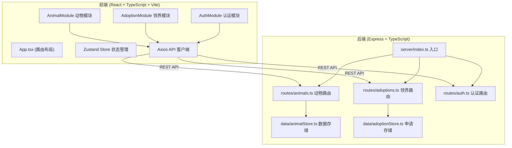
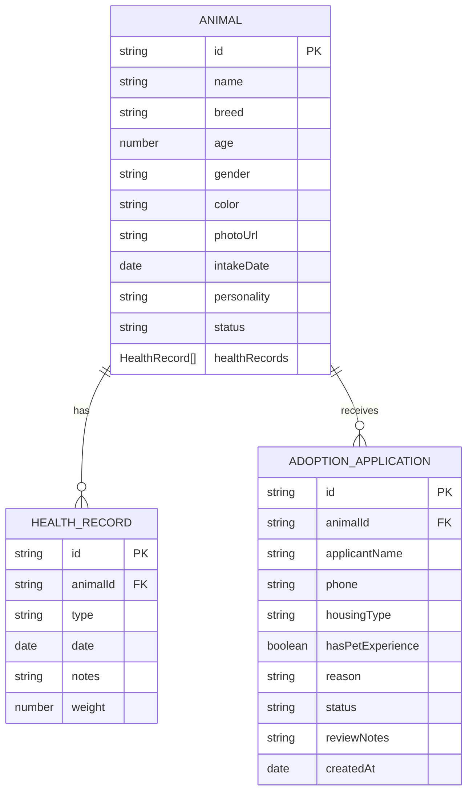

## 1. 架构设计



## 2. 技术选型

- **前端框架**：React 18 + TypeScript
- **构建工具**：Vite
- **路由**：react-router-dom v6
- **状态管理**：zustand
- **HTTP 客户端**：axios
- **图表库**：recharts
- **后端框架**：Express 4
- **数据库**：内存数据库（Map 模拟）
- **其他**：uuid、cors

## 3. 路由定义

### 前端路由

| 路由路径 | 页面组件 | 权限 | 说明 |
|----------|----------|------|------|
| `/` | AnimalList (公开) | 访客 | 可领养动物列表 |
| `/animals/:id` | AnimalDetail (公开) | 访客 | 动物公开详情页 |
| `/login` | Login | 访客 | 管理员登录页 |
| `/admin/animals` | AdminAnimalList | 管理员 | 管理后台-动物列表 |
| `/admin/animals/:id` | AdminAnimalDetail | 管理员 | 管理后台-动物详情 |
| `/admin/animals/new` | AnimalForm | 管理员 | 新增动物 |
| `/admin/adoptions` | AdoptionList | 管理员 | 领养申请管理 |

### 后端 API 路由

| 方法 | 路径 | 说明 | 权限 |
|------|------|------|------|
| GET | `/api/animals` | 获取动物列表（可筛选） | 公开 |
| GET | `/api/animals/:id` | 获取单只动物详情 | 公开 |
| POST | `/api/animals` | 新增动物 | 管理员 |
| PUT | `/api/animals/:id` | 更新动物信息 | 管理员 |
| DELETE | `/api/animals/:id` | 删除动物 | 管理员 |
| POST | `/api/animals/:id/health-record` | 添加健康记录 | 管理员 |
| POST | `/api/adoptions` | 提交领养申请 | 公开 |
| GET | `/api/adoptions` | 获取领养申请列表 | 管理员 |
| PUT | `/api/adoptions/:id` | 更新申请状态（审批） | 管理员 |
| POST | `/api/auth/login` | 管理员登录 | 公开 |

## 4. 数据模型

### 4.1 数据模型定义



### 4.2 TypeScript 类型定义

```typescript
type AnimalStatus = 'available' | 'reserved' | 'adopted';
type HealthRecordType = 'vaccine' | 'deworming' | 'checkup' | 'treatment';
type AdoptionStatus = 'pending' | 'approved' | 'rejected';

interface HealthRecord {
  id: string;
  animalId: string;
  type: HealthRecordType;
  date: string;
  notes: string;
  weight: number;
}

interface Animal {
  id: string;
  name: string;
  breed: string;
  age: number;
  gender: 'male' | 'female';
  color: string;
  photoUrl: string;
  intakeDate: string;
  personality: string;
  status: AnimalStatus;
  healthRecords: HealthRecord[];
}

interface AdoptionApplication {
  id: string;
  animalId: string;
  applicantName: string;
  phone: string;
  housingType: 'own' | 'rental';
  hasPetExperience: boolean;
  reason: string;
  status: AdoptionStatus;
  reviewNotes: string;
  createdAt: string;
}
```

## 5. 项目文件结构

```
.
├── package.json
├── vite.config.ts
├── tsconfig.json
├── index.html
├── src/
│   ├── main.tsx              # 前端入口
│   ├── App.tsx               # 根组件 + 路由 + 全局通知
│   ├── AnimalModule/         # 动物模块
│   │   ├── AnimalList.tsx    # 动物列表页
│   │   ├── AnimalDetail.tsx  # 动物详情页
│   │   ├── AnimalCard.tsx    # 动物卡片组件
│   │   ├── AnimalForm.tsx    # 动物表单
│   │   └── HealthTimeline.tsx # 健康时间线
│   ├── AdoptionModule/       # 领养模块
│   │   ├── AdoptionForm.tsx  # 领养申请表单
│   │   └── AdoptionList.tsx  # 申请管理列表
│   ├── AuthModule/           # 认证模块
│   │   └── Login.tsx         # 登录页
│   ├── components/           # 通用组件
│   │   ├── Sidebar.tsx       # 侧边栏
│   │   ├── StatusTag.tsx     # 状态标签
│   │   └── WeightChart.tsx   # 体重曲线图
│   ├── store/                # 状态管理
│   │   └── useAuthStore.ts   # 认证状态
│   ├── api/                  # API 封装
│   │   ├── animals.ts        # 动物相关 API
│   │   └── adoptions.ts      # 领养相关 API
│   ├── types/                # 类型定义
│   │   └── index.ts
│   └── utils/                # 工具函数
├── server/
│   ├── index.ts              # Express 入口
│   ├── routes/
│   │   ├── animals.ts        # 动物路由
│   │   ├── adoptions.ts      # 领养路由
│   │   └── auth.ts           # 认证路由
│   ├── data/
│   │   ├── animalStore.ts    # 动物数据存储
│   │   └── adoptionStore.ts  # 申请数据存储
│   └── middleware/
│       └── auth.ts           # 认证中间件
```

## 6. 数据流说明

### 6.1 前端数据流

1. **页面组件** → 调用 `api/*` 模块 → axios 发送请求 → 后端 API
2. **后端响应** → axios 接收 → 页面组件 setState 或 zustand 更新
3. **Zustand Store**：管理全局认证状态、通知状态
4. **React Context**：全局通知状态（Toast）

### 6.2 后端数据流

1. **路由层 (routes/*.ts)**：接收请求、参数校验、调用数据层
2. **数据层 (data/*Store.ts)**：内存数据库 CRUD 操作
3. **中间件 (middleware/auth.ts)**：Token 校验

### 6.3 权限控制

- **前端**：路由守卫（检查 zustand 中的 auth 状态），未登录跳转登录页
- **后端**：非 GET 请求校验 Authorization header（Bearer token）
