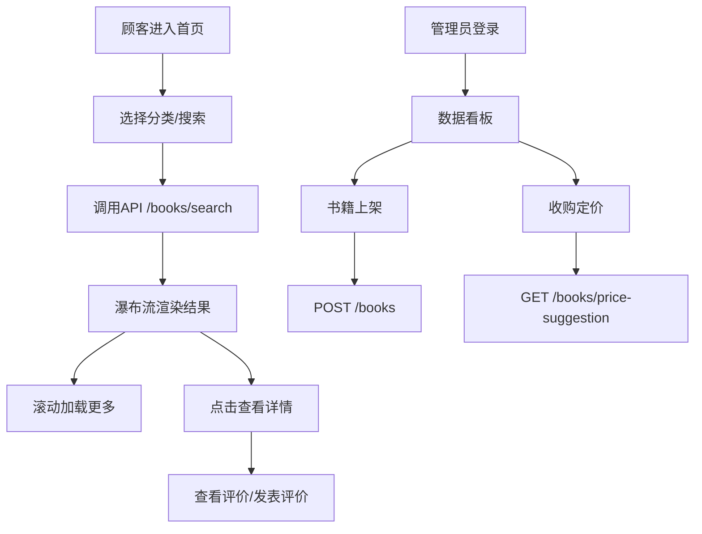

## 1. 产品概述
本系统为独立旧书店打造线上循环生态平台，连接淘书顾客与书店管理者。顾客可在线浏览、搜索、评价二手书籍，店主可管理库存、根据品相智能定价收购旧书，形成完整的书籍循环经济链。

## 2. 核心功能

### 2.1 用户角色
| 角色 | 注册方式 | 核心权限 |
|------|----------|----------|
| 顾客 | 默认访问 | 书籍搜索、分类浏览、查看详情、撰写评价、上传晒图 |
| 管理员 | 后台登录 | 书籍上架/下架、库存管理、收购价格建议、查看流通数据看板 |

### 2.2 功能模块
1. **顾客端首页**：分类导航、搜索框、书籍瀑布流展示
2. **书籍详情页**：完整信息展示、评价列表、评价表单、晒图Lightbox
3. **管理员登录页**：身份验证入口
4. **管理员看板**：库存统计、订单数据、销量折线图、实时数据刷新
5. **书籍上架模块**：表单验证、提交处理
6. **收购定价模块**：智能价格建议、脉冲动画提示

### 2.3 页面详情
| 页面名称 | 模块名称 | 功能描述 |
|----------|----------|----------|
| 顾客首页 | 导航栏 | 固定高度64px，分类标签（文学/历史/科技/艺术/生活），搜索框居中 |
| 顾客首页 | 瀑布流网格 | 卡片宽度300px，间距16px，圆角12px，悬停上浮4px，分类渐变封面 |
| 书籍详情 | 信息展示 | 出版年份、出版社、ISBN、品相描述、大图占位 |
| 书籍详情 | 评价区域 | 首字母头像、评级星标、晒图最多3张、Lightbox放大查看 |
| 书籍详情 | 评价表单 | 登录后可撰写评价、上传图片（服务端压缩至1200px） |
| 管理员看板 | 数据统计 | 库存总数、待处理订单、近7日访问量 |
| 管理员看板 | 销量折线图 | Canvas绘制，网格线#E0E0E0，数据点tooltip，每10秒刷新 |
| 上架表单 | 表单验证 | 书名作者必填、价格正数，0.2s淡入红色错误提示 |
| 收购定价 | 智能计算 | 品相每星+15%，超20年折旧60%，绿色#2E7D32脉冲动画显示 |

## 3. 核心流程

### 3.1 顾客搜索购书流程
顾客进入首页 → 选择分类或输入关键词 → 后端API查询（SQLite索引优化，≤800ms） → 返回分页数据（每页20条） → 瀑布流渲染 → 滚动到底部自动加载下一页（IntersectionObserver） → 点击卡片进入详情 → 查看评价/撰写评价 → 上传晒图

### 3.2 管理员库存管理流程
管理员登录 → 进入看板查看数据 → 点击上架 → 填写表单（实时验证） → 提交POST /books → 刷新库存列表 → 点击收购建议 → 输入书籍信息 → GET /books/price-suggestion → 显示智能定价

## 4. 用户界面设计

### 4.1 设计风格
- **主色调**：#8D6E63（橡木棕）
- **辅助色**：#A1887F（浅棕）
- **强调色**：#FF7043（陶土橙）用于按钮、图标、交互元素
- **背景色**：#FAF0E6（亚麻白）
- **深色侧边栏**：#4E342E
- **成功色**：#2E7D32（价格建议）
- **错误色**：红色（表单验证提示）
- **字体**：衬线体搭配无衬线体，体现书店人文气息
- **按钮风格**：圆角6px，悬停微放大，过渡0.3s ease
- **卡片风格**：圆角12px，多层阴影，悬停上浮4px加深阴影

### 4.2 页面设计概述
| 页面名称 | 模块名称 | UI元素 |
|----------|----------|--------|
| 顾客首页 | 导航栏 | 固定定位、分类标签下划线动画、搜索框圆角聚焦效果 |
| 顾客首页 | 书籍卡片 | 渐变色分类封面（文学红棕/历史深蓝/科技青蓝/艺术紫色/生活墨绿）、星级评分、流通次数徽章 |
| 书籍详情 | 评价卡片 | 首字母圆形头像、星级点亮动画、晒图缩略图网格 |
| 管理员看板 | 侧边栏 | 深色背景、悬停左侧#FF7043边框高亮 |
| 管理员看板 | 统计卡片 | 渐变背景、数据大字展示、图标动画 |
| 表单模块 | 输入框 | 底部边框动画、错误状态红色边框、0.2s错误文字淡入 |

### 4.3 响应式
- **桌面端**（≥1200px）：三列瀑布流
- **平板端**（≥768px）：两列瀑布流
- **手机端**（<768px）：单列全宽，导航栏汉堡菜单，0.3s滑入动画cubic-bezier(0.4,0,0.2,1)

### 4.4 动效细节
- 价格建议出现：脉冲动画（scale 1→1.05→1）
- 卡片悬停：translateY(-4px) + box-shadow加深，0.3s ease
- 评价星星：hover时依次点亮
- 数据刷新：数字滚动过渡效果
- 侧边菜单：滑入滑出动画
