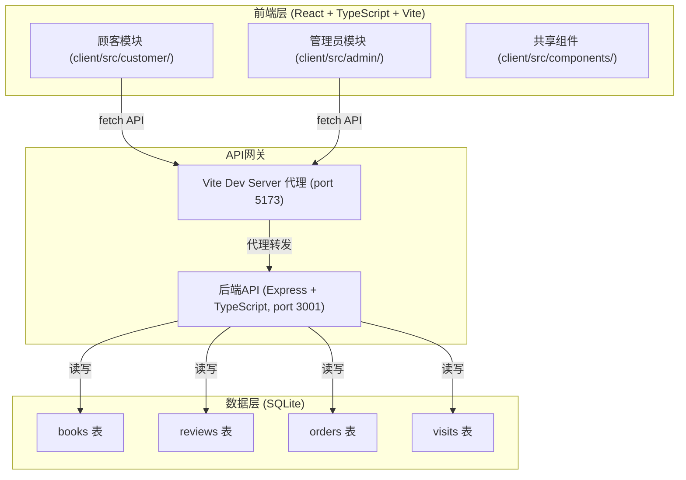
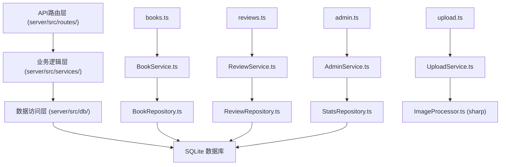
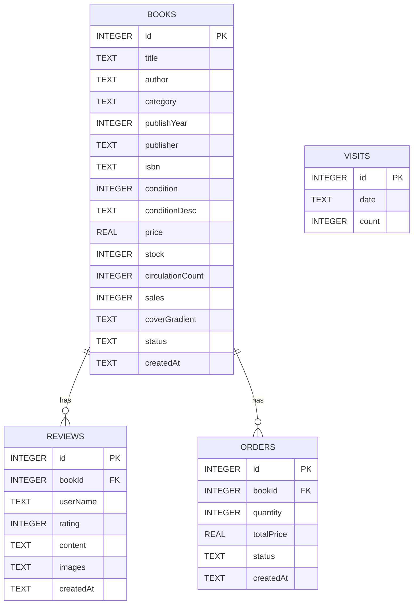

## 1. 架构设计



## 2. 技术描述
- **前端框架**：React@18 + TypeScript@5 + Vite@5
- **前端路由**：react-router-dom@6
- **前端样式**：CSS Modules + CSS Variables（不使用Tailwind）
- **构建工具**：Vite + @vitejs/plugin-react
- **后端框架**：Express@4 + TypeScript@5
- **数据库**：SQLite3 + 索引优化
- **中间件**：cors、express.json、multer（图片上传）
- **图片处理**：sharp（服务端压缩至1200px）
- **初始化方式**：npm install && npm run dev（同时启动前后端）

## 3. 路由定义

| 路由 | 页面 | 模块 |
|------|------|------|
| `/` | 顾客首页 - 书籍搜索与瀑布流 | CustomerPage |
| `/book/:id` | 书籍详情页 - 信息与评价 | BookDetail |
| `/admin/login` | 管理员登录 | AdminLogin |
| `/admin` | 管理员看板 - 数据统计 | AdminDashboard |
| `/admin/books` | 库存管理与上架 | BookInventory |
| `/admin/pricing` | 收购价格建议 | PriceSuggestion |

## 4. API 定义

### 4.1 书籍相关API

```typescript
// 书籍类型定义
interface Book {
  id: number;
  title: string;
  author: string;
  category: '文学' | '历史' | '科技' | '艺术' | '生活';
  publishYear: number;
  publisher: string;
  isbn: string;
  condition: number; // 1-5 品相评分
  conditionDesc: string;
  price: number;
  stock: number;
  circulationCount: number;
  coverGradient: string;
  createdAt: string;
  sales: number;
  status: 'on' | 'off';
}

interface Review {
  id: number;
  bookId: number;
  userName: string;
  rating: number;
  content: string;
  images: string[];
  createdAt: string;
}

// 搜索请求
GET /api/books/search?keyword=xxx&category=xxx&page=1&pageSize=20
Response: { data: Book[], total: number }

// 书籍详情
GET /api/books/:id
Response: Book

// 上架书籍
POST /api/books
Request: Omit<Book, 'id' | 'circulationCount' | 'sales' | 'createdAt'>
Response: Book

// 更新书籍状态
PUT /api/books/:id/status
Request: { status: 'on' | 'off' }
Response: Book

// 价格建议
GET /api/books/price-suggestion?title=xxx&author=xxx&year=xxx&condition=5
Response: { suggestedPrice: number, originalPrice: number, factors: { conditionBonus: number, yearDepreciation: number } }
```

### 4.2 评价相关API

```typescript
// 获取评价列表
GET /api/books/:id/reviews?page=1&pageSize=10
Response: { data: Review[], total: number }

// 提交评价
POST /api/books/:id/reviews
Request: { userName: string, rating: number, content: string, images?: File[] }
Response: Review
```

### 4.3 数据统计API

```typescript
// 获取看板数据
GET /api/admin/stats
Response: {
  totalStock: number;
  pendingOrders: number;
  visits7d: number;
  sales7d: { date: string; count: number }[];
}
```

### 4.4 图片上传

```
POST /api/upload
Content-Type: multipart/form-data
Request: { image: File }
Response: { url: string }
```

## 5. 服务端架构图



## 6. 数据模型

### 6.1 ER图



### 6.2 DDL与索引

```sql
-- 书籍表
CREATE TABLE IF NOT EXISTS books (
  id INTEGER PRIMARY KEY AUTOINCREMENT,
  title TEXT NOT NULL,
  author TEXT NOT NULL,
  category TEXT NOT NULL,
  publishYear INTEGER,
  publisher TEXT,
  isbn TEXT,
  condition INTEGER NOT NULL,
  conditionDesc TEXT,
  price REAL NOT NULL,
  stock INTEGER DEFAULT 1,
  circulationCount INTEGER DEFAULT 0,
  sales INTEGER DEFAULT 0,
  coverGradient TEXT,
  status TEXT DEFAULT 'on',
  createdAt TEXT DEFAULT CURRENT_TIMESTAMP
);

-- 索引优化搜索性能
CREATE INDEX IF NOT EXISTS idx_books_title ON books(title);
CREATE INDEX IF NOT EXISTS idx_books_author ON books(author);
CREATE INDEX IF NOT EXISTS idx_books_category ON books(category);
CREATE INDEX IF NOT EXISTS idx_books_status ON books(status);
CREATE INDEX IF NOT EXISTS idx_books_sales_created ON books(sales DESC, createdAt DESC);

-- 评价表
CREATE TABLE IF NOT EXISTS reviews (
  id INTEGER PRIMARY KEY AUTOINCREMENT,
  bookId INTEGER NOT NULL,
  userName TEXT NOT NULL,
  rating INTEGER NOT NULL,
  content TEXT,
  images TEXT,
  createdAt TEXT DEFAULT CURRENT_TIMESTAMP,
  FOREIGN KEY (bookId) REFERENCES books(id)
);

CREATE INDEX IF NOT EXISTS idx_reviews_bookId ON reviews(bookId);

-- 订单表
CREATE TABLE IF NOT EXISTS orders (
  id INTEGER PRIMARY KEY AUTOINCREMENT,
  bookId INTEGER NOT NULL,
  quantity INTEGER DEFAULT 1,
  totalPrice REAL NOT NULL,
  status TEXT DEFAULT 'pending',
  createdAt TEXT DEFAULT CURRENT_TIMESTAMP,
  FOREIGN KEY (bookId) REFERENCES books(id)
);

CREATE INDEX IF NOT EXISTS idx_orders_status ON orders(status);

-- 访问量表
CREATE TABLE IF NOT EXISTS visits (
  id INTEGER PRIMARY KEY AUTOINCREMENT,
  date TEXT UNIQUE NOT NULL,
  count INTEGER DEFAULT 0
);

-- 初始化测试数据
INSERT INTO books (title, author, category, publishYear, publisher, isbn, condition, conditionDesc, price, circulationCount, sales, coverGradient) VALUES
('百年孤独', '加西亚·马尔克斯', '文学', 2011, '南海出版公司', '9787544253994', 4, '封面轻微磨损，内页干净', 45.00, 3, 12, 'linear-gradient(135deg, #8B4513, #A0522D)'),
('人类简史', '尤瓦尔·赫拉利', '历史', 2014, '中信出版社', '9787508647357', 5, '几乎全新', 68.00, 2, 8, 'linear-gradient(135deg, #1E3A5F, #2E5077)'),
('代码大全', 'Steve McConnell', '科技', 2006, '电子工业出版社', '9787121024481', 3, '书脊有折痕，笔记较多', 89.00, 5, 15, 'linear-gradient(135deg, #0D7377, #14A7A0)'),
('艺术的故事', '贡布里希', '艺术', 2015, '广西美术出版社', '9787549413140', 4, '封面完好，彩图清晰', 128.00, 1, 6, 'linear-gradient(135deg, #6B4E71, #8B5F8F)'),
('家常菜大全', '美食生活工作室', '生活', 2018, '青岛出版社', '9787555256335', 5, '全新未翻阅', 35.00, 0, 4, 'linear-gradient(135deg, #2D5A27, #3D7A37)');
```

## 7. 文件结构与调用关系

```
auto6/
├── package.json              # 根依赖配置，concurrently启动前后端
├── vite.config.js            # Vite配置，代理/api到3001端口
├── tsconfig.json             # TS严格模式配置
├── index.html                # React入口HTML
├── server/
│   └── src/
│       ├── index.ts          # Express入口，挂载路由，监听3001
│       ├── routes/
│       │   ├── books.ts      # 书籍CRUD + 搜索 + 价格建议
│       │   ├── reviews.ts    # 评价CRUD
│       │   ├── admin.ts      # 统计数据接口
│       │   └── upload.ts     # 图片上传接口
│       ├── services/
│       │   ├── BookService.ts      # 书籍业务逻辑，调用Repository
│       │   ├── ReviewService.ts    # 评价业务逻辑
│       │   ├── AdminService.ts     # 统计计算逻辑
│       │   └── PricingService.ts   # 定价算法
│       └── db/
│           ├── index.ts      # SQLite连接初始化 + 建表
│           ├── BookRepository.ts    # 书籍数据访问
│           └── ReviewRepository.ts  # 评价数据访问
└── client/
    └── src/
        ├── main.tsx          # React入口，路由配置
        ├── customer/
        │   ├── CustomerPage.tsx     # 顾客首页入口，调用API搜索
        │   ├── components/
        │   │   ├── SearchBar.tsx    # 搜索栏组件
        │   │   ├── BookCard.tsx     # 书籍卡片组件
        │   │   ├── WaterfallGrid.tsx # 瀑布流布局组件
        │   │   └── CategoryTabs.tsx # 分类标签组件
        │   └── BookDetail.tsx       # 书籍详情页
        ├── admin/
        │   ├── AdminDashboard.tsx   # 管理员看板入口
        │   ├── components/
        │   │   ├── Sidebar.tsx      # 侧边栏导航
        │   │   ├── BookForm.tsx     # 上架表单
        │   │   ├── InventoryList.tsx # 库存列表
        │   │   ├── PricingForm.tsx  # 定价表单
        │   │   └── StatsChart.tsx   # Canvas折线图
        │   └── AdminLogin.tsx       # 登录页
        ├── shared/
        │   ├── components/
        │   │   ├── StarRating.tsx   # 星级评分组件
        │   │   ├── ReviewCard.tsx   # 评价卡片
        │   │   └── Lightbox.tsx     # 图片放大查看
        │   ├── hooks/
        │   │   ├── useInfiniteScroll.ts # 无限滚动Hook
        │   │   └── useApi.ts        # API请求封装
        │   └── types/
        │       └── index.ts         # 共享类型定义
        └── App.css                  # 全局样式变量
```

### 核心数据流说明

1. **顾客搜索流程**：
   - `CustomerPage.tsx` → 调用 `useApi` → `GET /api/books/search` → 后端 `books.ts` 路由 → `BookService.search()` → `BookRepository.findByQuery()` → SQLite（使用索引）
   - 返回数据 → `WaterfallGrid.tsx` 渲染 → `BookCard.tsx` 展示

2. **评价提交流程**：
   - `BookDetail.tsx` → 选择图片上传 `POST /api/upload` → `UploadService` 压缩图片 → 返回图片URL
   - 提交评价 `POST /api/books/:id/reviews` → `ReviewService.create()` → `ReviewRepository.insert()`

3. **书籍上架流程**：
   - `BookForm.tsx` 表单验证 → `POST /api/books` → `BookService.create()` → `BookRepository.insert()`
   - 成功后触发 `InventoryList.tsx` 刷新

4. **价格建议流程**：
   - `PricingForm.tsx` → `GET /api/books/price-suggestion` → `PricingService.calculate()` → 应用品相+年份折旧算法 → 返回建议价
