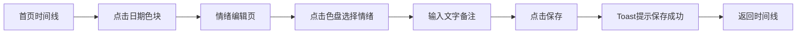

## 1. 产品概述
个人情绪日记应用，通过可视化色盘记录每日心情，生成彩色时间线便于回顾情绪变化。
- 解决传统文字日记单调乏味的问题，用色彩和图形化表达情绪，帮助用户觉察自身情绪模式。

## 2. 核心功能

### 2.1 功能模块
1. **情绪记录页**：月度彩色时间线 + 悬停交互 + 情绪编辑
2. **数据分析页**：饼状图展示情绪占比 + 条形图展示情绪频率
3. **我的页面**：提醒时间设置 + 色盘自定义

### 2.2 页面详情
| 页面名称 | 模块名称 | 功能描述 |
|---------|---------|---------|
| 情绪记录页 | 月度时间线 | 水平排列当月每日色块(40x40)，色块颜色取自情绪色盘，白色边框2px，圆角8px，悬停上移5px，显示日期和情绪标签，过渡动画0.2s ease-out |
| 情绪编辑页 | 圆形色盘 | 直径300px，12个HSL均匀分布扇形区块，点击脉冲闪烁0.3s，自动显示情绪名称和提示文案，右侧280x120px毛玻璃文本框，保存toast提示 |
| 数据分析页 | 图表展示 | 饼状图展示各情绪占比，条形图展示情绪频率统计 |
| 我的页面 | 设置中心 | 设置每日提醒时间，自定义色盘情绪映射 |

## 3. 核心流程
用户打开应用 → 浏览当月情绪时间线 → 点击某天色块进入编辑页 → 点击色盘选择情绪 → 输入文字备注 → 点击保存 → 返回时间线查看更新

## 4. 用户界面设计
### 4.1 设计风格
- 主色调：浅米色 #faf0e6
- 文字色：深棕色 #4a3728
- 按钮色：暖橙色 #f4a460 圆角按钮
- 字体：优雅衬线体 + 现代无衬线体组合
- 整体风格：温暖治愈、简约雅致
- 图标风格：柔和圆润

### 4.2 页面设计概览
| 页面名称 | 模块名称 | UI元素 |
|---------|---------|---------|
| 情绪记录页 | 时间线 | 水平色块网格，色块悬停动效，月份切换导航 |
| 情绪编辑页 | 色盘编辑器 | 圆形HSL色盘，脉冲点击反馈，毛玻璃文本框，渐变Toast |
| 数据分析页 | 统计图表 | 渐变饼图，彩色条形图 |
| 我的页面 | 设置面板 | 时间选择器，自定义色盘映射 |

### 4.3 响应式
桌面端优先设计，移动端（<768px）自动纵向堆叠，时间线色块缩小为30x30px。

### 4.4 动效规范
- 页面切换：0.3s 平滑渐变过渡
- 色块悬停：0.2s ease-out 上移5px
- 色盘点击：0.3s 脉冲放大闪烁
- Toast提示：1s 渐变进入消失动画
- 页面首次可交互时间 ≤1.5s
- 页面切换响应 ≤0.5s
