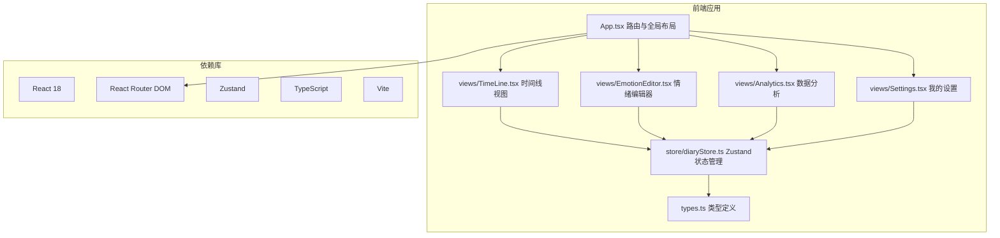

## 1. 架构设计



## 2. 技术栈说明
- 前端框架：React 18 + TypeScript
- 构建工具：Vite 5
- 路由管理：React Router DOM 6
- 状态管理：Zustand 4
- 样式方案：原生 CSS + CSS Variables
- 图表方案：原生 SVG 实现饼状图与条形图
- 数据持久化：localStorage 持久化日记数据
- 初始化方式：手动搭建项目结构

## 3. 路由定义
| 路由路径 | 页面用途 |
|----------|---------|
| / | 情绪记录时间线（首页） |
| /edit/:date | 情绪编辑页（date格式：YYYY-MM-DD） |
| /analytics | 数据分析统计页 |
| /settings | 我的设置页 |

## 4. 数据模型

### 4.1 类型定义

```typescript
// 情绪类型
interface Emotion {
  id: string;
  label: string;        // 情绪标签（快乐、平静等）
  hsl: string;       // HSL颜色值
  hint: string;      // 默认提示文案
}

// 日记条目
interface DiaryEntry {
  date: string;        // YYYY-MM-DD
  emotionId: string;   // 情绪ID
  note: string;       // 文字备注
  createdAt: number;  // 时间戳
}

// Diary Store
interface DiaryStore {
  entries: DiaryEntry[];
  saveEntry: (entry: DiaryEntry) => void;
  getEntryByDate: (date: string) => DiaryEntry | undefined;
  getMonthEntries: (year: number, month: number) => DiaryEntry[];
}
```

### 4.2 12种情绪色盘映射
HSL色环均匀分布（间隔30度）：
1. 快乐 (HSL 0°) - 热情 (30°) - 满足 (60°) - 平静 (90°) - 活力 (120°) - 安心 (150°) - 希望 (180°) - 期待 (210°) - 忧郁 (240°) - 焦虑 (270°) - 愤怒 (300°) - 疲惫 (330°)

## 5. 文件结构

```
auto60/
├── package.json
├── index.html
├── vite.config.js
├── tsconfig.json
├── src/
│   ├── App.tsx
│   ├── main.tsx
│   ├── types.ts
│   ├── index.css
│   ├── store/
│   │   └── diaryStore.ts
│   ├── views/
│   │   ├── TimeLine.tsx
│   │   ├── EmotionEditor.tsx
│   │   ├── Analytics.tsx
│   │   └── Settings.tsx
│   └── components/
│       ├── BottomNav.tsx
│       └── Toast.tsx
│       └── ColorWheel.tsx
```

## 6. 性能优化策略
- 路由懒加载减少首屏体积
- 组件 memo 优化不必要渲染
- CSS 动画（transform/opacity 优先
- localStorage 读写使用节流优化
- 图表组件按需渲染
- 首屏资源预加载关键路由
