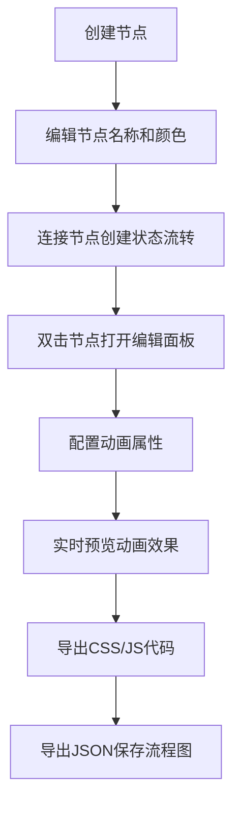

## 1. 产品概述

交互流程图协作评审工具，解决UI设计师与前端开发在设计还原阶段，动效和交互时序描述仅靠静态标注难以传达的问题。通过可视化的交互流程图设计，让设计师能够直观定义各状态间的动画过渡，开发者可直接查看配置并导出代码，实现设计与开发的高效协作。

## 2. 核心功能

### 2.1 用户角色
| 角色 | 注册方式 | 核心权限 |
|------|----------|----------|
| 设计师 | 无需注册 | 创建、编辑流程图，配置动画属性 |
| 开发者 | 无需注册 | 查看流程图，导出动画代码 |

### 2.2 功能模块
1. **流程图画布**：节点创建、拖拽、连线、缩放平移
2. **节点卡片**：状态名称编辑、背景色自定义、双击编辑
3. **连线系统**：带箭头贝塞尔曲线连线、标签编辑
4. **详情编辑面板**：动画属性配置、实时预览、代码导出
5. **工具栏**：添加节点、删除节点、清空画布
6. **导入导出**：JSON格式导入导出流程图数据

### 2.3 页面详情
| 页面名称 | 模块名称 | 功能描述 |
|-----------|-------------|---------------------|
| 主应用页 | 页头栏 | 应用名称、导入/导出按钮、帮助图标 |
| 主应用页 | 画布区 | 网格背景、节点和连线渲染、缩放平移交互 |
| 主应用页 | 工具栏 | 添加节点、删除节点、清空画布按钮 |
| 主应用页 | 详情编辑面板 | 动画配置、实时预览、代码导出 |

## 3. 核心流程

用户创建交互流程图，添加代表各交互状态的节点卡片，连接节点表示状态转换。双击节点打开详情面板，配置动画触发器、持续时间、缓动函数等属性，实时预览动画效果并导出CSS/JS代码。支持JSON格式保存和恢复流程图。

## 4. 用户界面设计

### 4.1 设计风格
- **主色调**：蓝色系，主色#4A90D9，强调色#2C5F8A
- **中性色**：#666、#999、#e0e0e0
- **设计风格**：现代化扁平设计，圆角卡片，柔和阴影
- **字体**：无衬线字体，标题14px粗体，正文12px常规
- **按钮**：圆角按钮，悬停反馈，过渡动画0.2s

### 4.2 页面设计概述
| 页面名称 | 模块名称 | UI元素 |
|-----------|-------------|-------------|
| 主应用页 | 页头栏 | 白色背景，底部1px边框，高度50px |
| 主应用页 | 画布区 | 浅灰网格背景(#e8e8e8)，网格间距20px，线条1px透明度0.3 |
| 主应用页 | 工具栏 | 白色卡片，8px圆角，阴影0 4px 12px rgba(0,0,0,0.1) |
| 主应用页 | 节点卡片 | 100x60px，浅灰#f0f0f0背景，4px圆角，可拖拽 |
| 主应用页 | 连线 | 二次贝塞尔曲线，线宽2px，颜色#888，三角箭头 |
| 主应用页 | 详情面板 | 右侧滑入，宽度400px，白色背景，0.3s ease-out动画 |

### 4.3 响应式设计
- 桌面端（≥900px）：编辑面板右侧滑入，宽度400px
- 移动端（<900px）：编辑面板底部弹出，高度350px，宽度100%
- 画布区域最小高度600px，随窗口自适应

### 4.4 动画与交互
- 所有操作过渡动画0.2s ease-out
- 节点拖拽弹性跟随效果
- 面板滑入滑出0.3s ease-out动画
- 删除节点淡出动画0.3s
- 导入后居中适配动画0.5s
- 预览动画使用requestAnimationFrame驱动，60fps
