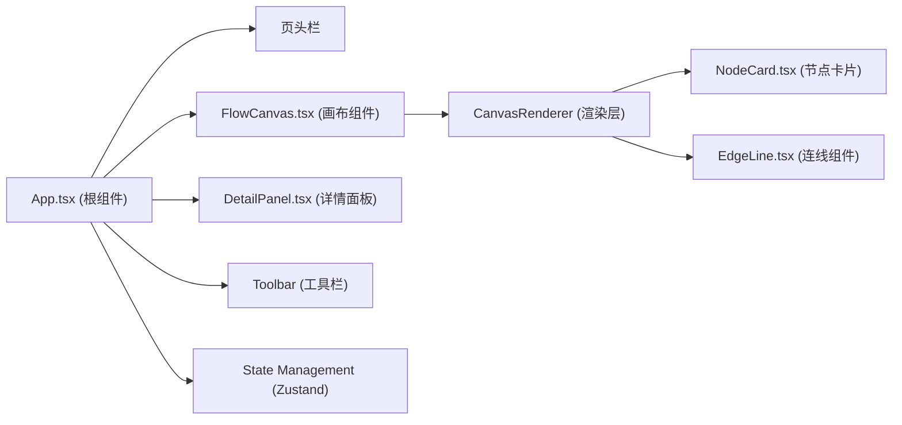

## 1. 架构设计



## 2. 技术描述

- **前端框架**：React@18 + TypeScript + Vite
- **状态管理**：Zustand
- **样式方案**：Tailwind CSS 3
- **图标库**：lucide-react
- **唯一ID**：uuid
- **初始化工具**：vite-init
- **后端**：无（纯前端应用）
- **数据库**：无（JSON本地导入导出）

## 3. 核心数据结构

### 节点数据类型
```typescript
interface FlowNode {
  id: string;
  x: number;
  y: number;
  width: number;
  height: number;
  name: string;
  color: string;
  animation: {
    trigger: 'click' | 'hover' | 'load' | 'timer';
    duration: number;
    easing: 'ease' | 'linear' | 'ease-in' | 'ease-out' | 'cubic-bezier';
  };
}
```

### 连线数据类型
```typescript
interface FlowEdge {
  id: string;
  source: string;
  target: string;
  label: string;
}
```

### 画布状态
```typescript
interface CanvasState {
  nodes: FlowNode[];
  edges: FlowEdge[];
  selectedId: string | null;
  pan: { x: number; y: number };
  zoom: number;
  isPanning: boolean;
  isDragging: boolean;
}
```

## 4. 文件结构

```
├── package.json
├── index.html
├── vite.config.ts
├── tsconfig.json
├── tailwind.config.js
├── postcss.config.js
├── src/
│   ├── App.tsx              # 根组件
│   ├── main.tsx             # 入口文件
│   ├── index.css            # 全局样式
│   ├── store/
│   │   └── useFlowStore.ts  # Zustand状态管理
│   ├── components/
│   │   ├── FlowCanvas.tsx   # 画布核心组件
│   │   ├── NodeCard.tsx     # 节点卡片组件
│   │   ├── EdgeLine.tsx     # 连线组件
│   │   ├── DetailPanel.tsx  # 详情编辑面板
│   │   ├── Toolbar.tsx      # 工具栏组件
│   │   └── Header.tsx       # 页头栏组件
│   ├── types/
│   │   └── index.ts         # 类型定义
│   └── utils/
│       ├── bezier.ts        # 贝塞尔曲线计算
│       ├── export.ts        # 导入导出工具
│       └── animation.ts     # 动画工具函数
```

## 5. 性能优化策略

1. **requestAnimationFrame驱动动画**：所有连续动画（节点拖拽、预览、缩放）使用requestAnimationFrame，避免setTimeout
2. **最小化重渲染**：使用React.memo包裹子组件，状态按需订阅
3. **SVG优化**：连线使用SVG path，避免频繁DOM操作
4. **transform GPU加速**：节点拖拽使用transform translate，开启GPU加速
5. **节流防抖**：滚轮缩放使用节流，窗口resize使用防抖
6. **虚拟渲染**：对于大量节点（>50），考虑视口外节点懒渲染

## 6. 关键实现点

### 贝塞尔曲线计算
```
控制点 = 中点 + 垂直方向偏移
偏移量 = 距离 * 0.2
```

### 缩放平移变换
```
屏幕坐标 = (世界坐标 + 平移) * 缩放
世界坐标 = 屏幕坐标 / 缩放 - 平移
```

### 节点拖拽弹性效果
```
使用弹簧物理模型：
velocity = targetPosition - currentPosition
position += velocity * dampingFactor
```

### 导入适配算法
```
1. 计算所有节点的包围盒
2. 计算画布可视区域
3. 计算缩放比例 = 画布尺寸 / 包围盒尺寸 * 0.8
4. 计算平移使包围盒居中
5. 0.5秒动画过渡到目标位置
```
