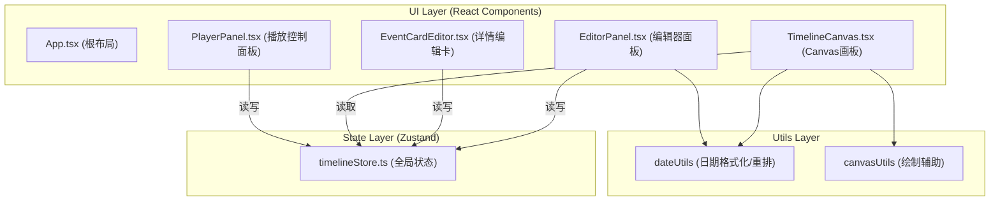
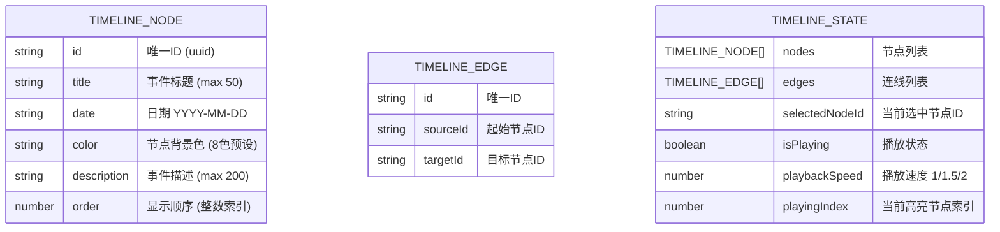

## 1. 架构设计

**数据流原则**：单向数据流，所有组件通过 Zustand Store 共享状态。编辑器和播放器均解耦，通过 Store 间接通信。Canvas 仅读取不写入，保证渲染纯净。

## 2. 技术描述

- **前端框架**：React 18 + TypeScript (strict模式)
- **构建工具**：Vite 5 + @vitejs/plugin-react
- **状态管理**：Zustand 4（单一Store，含actions）
- **渲染技术**：Canvas 2D API（时间轴绘制）+ React DOM（UI面板）
- **交互实现**：HTML5 Drag and Drop API（拖拽排序）、requestAnimationFrame（播放动画）
- **无后端**：纯前端应用，状态保存在内存（可扩展 localStorage 持久化）

## 3. 文件结构与调用关系

| 文件路径 | 职责 | 依赖 / 调用 |
|-----------|------|-------------|
| `package.json` | 项目依赖与脚本声明 | react, react-dom, zustand, typescript, vite |
| `index.html` | Vite入口HTML，挂载根节点 | 加载 src/main.tsx |
| `vite.config.ts` | Vite构建配置 | 启用 React 插件 |
| `tsconfig.json` | TypeScript编译配置 | strict, jsx: react-jsx, moduleResolution: bundler |
| `src/main.tsx` | React应用入口 | 渲染 `<App />` 到 #root |
| `src/App.tsx` | 根组件，整体Flex布局 | 组装 EditorPanel + TimelineCanvas + EventCardEditor + PlayerPanel |
| **src/store/timelineStore.ts** | Zustand全局状态中心 | 定义 nodes/edges/selectedId/isPlaying 状态及增删改actions，被所有模块读写 |
| **src/modules/editor/EditorPanel.tsx** | 左侧编辑器面板 | 读取store的nodes/edges渲染列表；调用addNode/removeNode/reorderNodes/removeEdge/setSelectedNode actions |
| **src/modules/editor/EventCardEditor.tsx** | 右侧详情编辑卡 | 读取store的selectedId和选中节点；调用updateNode action实时同步变更 |
| **src/modules/timeline/TimelineCanvas.tsx** | Canvas时间轴画板 | 仅读取store的nodes/edges/playingIndex；内部管理canvas偏移/缩放/绘制逻辑 |
| **src/modules/player/PlayerPanel.tsx** | 底部播放控制 | 读取和修改store的isPlaying/playbackSpeed/playingProgress；内部管理requestAnimationFrame循环 |
| `src/utils/dateUtils.ts` | 日期工具函数 | formatDate（格式化为"YYYY-MM-DD"）、autoResortDates（拖拽后重排日期） |
| `src/styles/global.css` | 全局样式与滚动条自定义 | 深色主题变量、按钮过渡、滚动条样式 |

## 4. 数据模型

### 4.1 类型定义

### 4.2 Store Actions 定义

| Action 名称 | 参数 | 行为 |
|-------------|------|------|
| `addNode()` | 无 | 新增默认节点（"新事件"+当天日期+随机色），自动创建与上一节点的连线 |
| `removeNode(id)` | nodeId: string | 删除节点及关联连线，更新order |
| `updateNode(id, patch)` | id + 部分字段 | 合并更新节点属性 |
| `reorderNodes(fromIdx, toIdx)` | 拖拽源/目标索引 | 数组重排，调用autoResortDates重排日期 |
| `setSelectedNode(id)` | nodeId 或 null | 更新选中状态 |
| `removeEdge(id)` | edgeId: string | 删除指定连线 |
| `togglePlay()` | 无 | 切换 isPlaying |
| `setPlaybackSpeed(speed)` | 1 \| 1.5 \| 2 | 设置播放速度 |
| `setPlayingIndex(idx)` | number | 设置当前高亮索引 |
| `resetPlayback()` | 无 | 重置到索引0并暂停 |

## 5. 性能保障策略

| 约束场景 | 优化手段 |
|-----------|-------------|
| 50+节点实时交互 | Canvas脏矩形重绘、requestAnimationFrame节流 |
| 拖拽平移/缩放帧率 | 30fps+，避免重计算排序，缓存节点屏幕坐标 |
| 播放每帧<15ms | 仅更新高亮节点，其余帧复用已有绘制 |
| Zustand重渲染 | 使用 shallow selector，组件只订阅需要的字段切片 |
| 画布边界回弹 | CSS transition 或独立 requestAnimationFrame 循环处理 |
