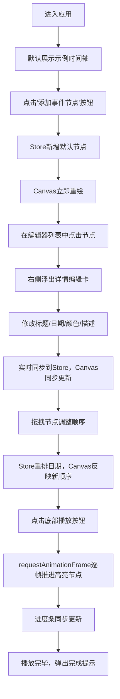

## 1. 产品概述

Timeline Forge 是一款面向在线教育讲师的交互式时间轴制作与展示工具，支持快速创建、编辑和播放由多个事件节点构成的可视化时间轴。

- **目标用户**：在线教育讲师、历史教师、项目经理
- **解决问题**：现有工具要么只能做静态列表过于死板，要么操作复杂不便于快速协作修改
- **核心价值**：提供"拖拽即编辑"的轻量化交互，支持自动播放讲解模式，让教学演示更生动直观

## 2. 核心功能

### 2.1 功能模块

1. **编辑器模块**：节点列表管理、拖拽排序、事件详情编辑、连线管理
2. **时间轴渲染模块**：Canvas 2D 水平时间轴绘制、贝塞尔曲线连线、节点卡片展示
3. **播放器模块**：自动播放控制、进度条拖拽、播放速度切换、高亮动画
4. **画布交互模块**：鼠标拖拽平移、滚轮缩放、边界弹性回弹

### 2.2 页面详情

| 模块名称 | 功能说明 |
|-----------|-------------|
| 编辑器面板 | 左侧固定面板，展示节点列表，支持添加/删除节点、拖拽排序、连线管理 |
| 事件详情编辑卡 | 右侧浮出卡片，编辑节点标题、日期、颜色、描述 |
| 时间轴画板 | Canvas 绘制的水平时间轴，支持平移缩放 |
| 播放控制面板 | 底部播放器，含播放/暂停、进度条、速度切换、重置按钮 |

## 3. 核心流程

用户从创建时间轴到演示的完整流程：

## 4. 用户界面设计

### 4.1 设计风格

- **主题**：深色科技风（Dark Mode）
- **主背景色**：`#1a1a2e` → `#16213e` 深蓝到紫渐变
- **控制面板背景**：`#16213e`
- **卡片/输入框背景**：`#0f3460`
- **强调色**：`#e94560`（红粉）+ `#16c79a`（青绿）
- **选中高亮色**：`#1E90FF`（蓝色边框）
- **播放高亮色**：`#FFD700`（金色外发光）

- **按钮风格**：圆角矩形，悬停0.2s背景过渡，点击scale(0.95)反馈
- **字体**：标题 Verdana 24px 加粗，正文系统默认字体
- **布局**：Flex三栏布局（左编辑器 + 中Canvas + 右编辑卡）+ 底播放器
- **预设节点色板**：`#FF6B6B #4ECDC4 #45B7D1 #96CEB4 #FFEAA7 #DDA0DD #98D8C8 #F7DC6F`

### 4.2 页面设计详情

| 区域 | 模块 | 关键UI元素 |
|-----------|-------------|-------------|
| 顶部左 | 应用标题 | "Timeline Forge"，Verdana，24px，加粗，#e94560 |
| 左侧280px | 编辑器面板 | 节点列表（圆角卡片，悬停显示删除按钮）、连线列表、"添加节点"按钮 |
| 右侧200px | 详情编辑卡 | 标题输入、日期选择、8色色板圆点、描述文本域（字数统计） |
| 中间区域 | Canvas画板 | 水平基线 + 圆角矩形卡片 + 贝塞尔曲线 + 平移缩放交互 |
| 底部60px | 播放面板 | 播放/暂停按钮、range进度条、速度切换（1x/1.5x/2x）、重置按钮 |

### 4.3 响应式设计

- **桌面优先**：默认三栏布局 + 底栏
- **移动端 < 768px**：编辑器面板折叠为顶部抽屉，点击左上角汉堡菜单展开/收起
- **触摸优化**：按钮最小触控区 44×44px

### 4.4 动画与微交互

- 节点悬停：scale(1.02) + 阴影增强
- 拖拽中节点：opacity 0.4 半透明
- 选中节点：2px 蓝色 `#1E90FF` 边框
- 播放高亮：金色 `#FFD700` 外发光正弦波动（4px~8px，1Hz）
- 按钮：悬停0.2s ease-in-out过渡，点击scale(0.95)
- 画布边界：超出50px后弹性回弹动画
- 滚动条：8px宽，滑块#16c79a，轨道#0f3460
