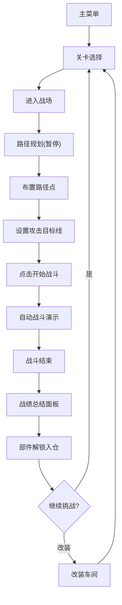

## 1. 产品概述

太空飞船即时战术对战游戏，核心解决传统太空射击游戏只强调手速反应、缺乏战术深度的问题。玩家在暂停状态下布置飞船移动路径和攻击顺序，然后执行观看AI自动战斗，每场战斗结束后根据战损评分并解锁新飞船部件。目标用户为喜欢策略规划、太空题材的中度玩家。

## 2. 核心功能

### 2.2 功能模块

1. **战场页面**：星空粒子背景、旗舰模型渲染、路径点拖拽布置、攻击目标线绘制、自动战斗演示、受击反馈动画
2. **战绩总结页面**：战绩面板弹窗、评分动画、部件卡片解锁、自动添加到仓库
3. **改装车间页面**：左侧部件列表、右侧飞船外观展示、装备/更换部件、属性实时更新
4. **关卡选择页面**：3种星域关卡卡片、悬停浮起效果、关卡简介

### 2.3 页面详情

| 页面名称 | 模块名称 | 功能描述 |
|----------|----------|----------|
| 战场页面 | 星空背景 | 1200x800深色渐变画布，300颗闪烁星光粒子(1-3px) |
| 战场页面 | 旗舰展示 | 敌我旗舰以Canvas几何图形组合绘制，位于上方中间区域 |
| 战场页面 | 路径规划 | 拖拽布置移动路径点(白色半透明8px圆点)，虚线2px连线 |
| 战场页面 | 攻击目标 | 路径点间单击添加攻击目标线(红色1px实线带箭头) |
| 战场页面 | 自动战斗 | 点击"开始战斗"按钮，飞船沿路径移动并自动攻击 |
| 战场页面 | 受击反馈 | 掉血时闪烁红色0.2秒并微向上抖动 |
| 战绩总结 | 战绩面板 | 渐变蓝紫半透明背景400x350px，12px圆角，显示击毁次数/受损百分比/时长/评分 |
| 战绩总结 | 评分动画 | 数字从0滚动到最终值，1秒ease-out |
| 战绩总结 | 部件解锁 | 120x160px部件卡片，含名称/属性加成/小型图标，自动添加到仓库 |
| 改装车间 | 部件列表 | 左侧竖排已解锁部件(引擎/护盾/武器/装甲)，高度500px可滚动，每项50px |
| 改装车间 | 飞船展示 | 右侧旗舰外观，装备部位彩色标注，未装备灰色虚线框 |
| 改装车间 | 属性栏 | 攻击/防御/速度/能量四属性，滑动数值条+数字实时更新 |
| 关卡选择 | 关卡卡片 | 3张220x300px卡片，红/蓝/绿星空主题色背景 |
| 关卡选择 | 悬停效果 | 卡片向上浮起10px并显示关卡简介 |

## 3. 核心流程

玩家进入游戏 → 选择关卡 → 进入战场 → 暂停状态下拖拽布置路径点和攻击目标 → 点击"开始战斗" → 飞船沿路径自动移动和攻击 → 战斗结束弹出战绩面板 → 查看评分和解锁部件 → 部件自动入仓 → 可前往改装车间装备部件 → 提升属性后挑战更高难度关卡

## 4. 用户界面设计

### 4.1 设计风格

- 主背景色：深空蓝 #0b0e2a
- 高亮色：电光蓝 #4488ff、霓虹紫 #9944ff
- 文字色：浅灰白 #d0d4e4
- 按钮：电光蓝到霓虹紫斜向渐变，16px圆角，悬停亮度+10%，点击缩放0.95
- 过渡动画：0.25秒 ease-in-out
- 伤害数字：+12px字体淡出效果，持续0.6秒
- 整体风格：深空科幻，霓虹辉光

### 4.2 页面设计概览

| 页面名称 | 模块名称 | UI要素 |
|----------|----------|--------|
| 战场页面 | 星空画布 | 深色渐变背景，300颗1-3px闪烁粒子 |
| 战场页面 | 路径控制 | 白色半透明圆点8px，2px虚线连线，红色1px箭头实线 |
| 战场页面 | 战斗按钮 | 渐变按钮，底部居中 |
| 战绩总结 | 面板弹窗 | 400x350px，渐变蓝紫半透明，12px圆角 |
| 改装车间 | 左侧列表 | 500px可滚动，每项50px，引擎/护盾/武器/装甲分类 |
| 改装车间 | 右侧展示 | 飞船外观+四属性滑动条 |
| 关卡选择 | 卡片组 | 3张220x300px，红蓝绿主题色，悬停浮起10px |

### 4.3 响应式

桌面优先设计，战场画布固定1200x800，其他页面适配常见桌面分辨率。

## 5. 敌人AI策略

| 关卡 | 星域主题 | AI策略 | 描述 |
|------|----------|--------|------|
| 关卡1 | 红色星域 | 绕后偷袭型 | 敌人尝试绕到玩家背后攻击 |
| 关卡2 | 蓝色星域 | 正面强攻型 | 敌人直接正面冲锋，高火力 |
| 关卡3 | 绿色星域 | 包围阵型型 | 多个敌人从不同方向包围 |
