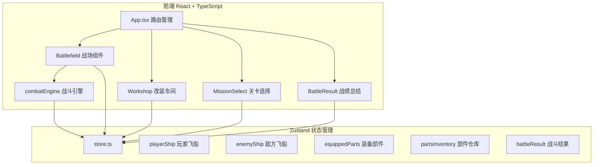
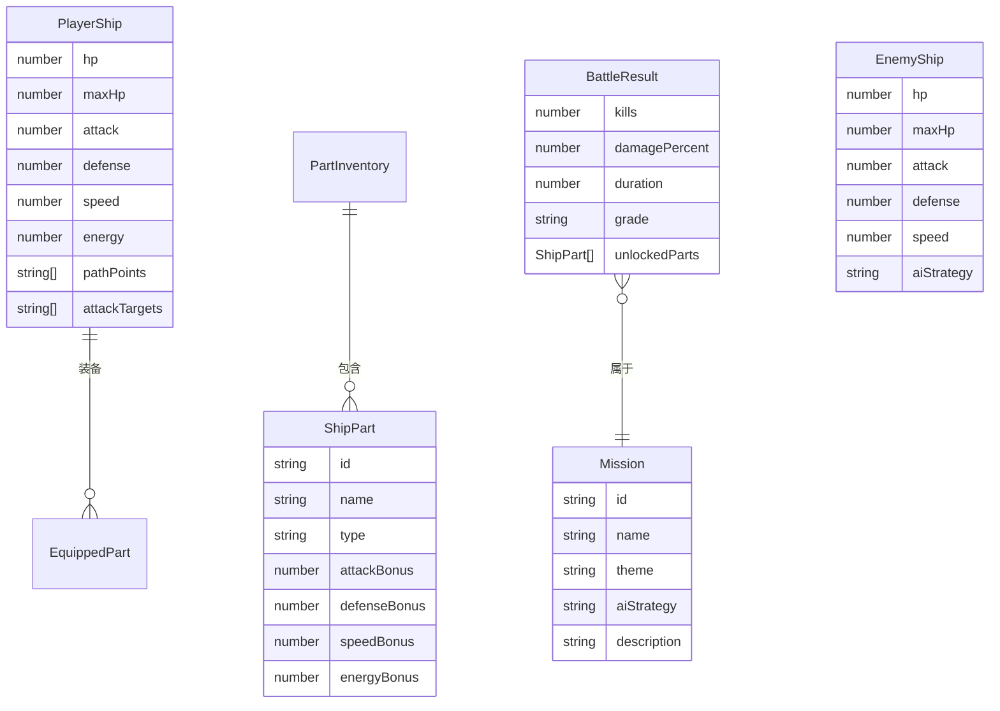

## 1. 架构设计



## 2. 技术说明

- 前端：React@18 + TypeScript + Vite + Zustand
- 初始化工具：vite-init (react-ts 模板)
- 后端：无
- 数据库：无，所有数据使用 Zustand 内存状态管理
- 渲染：Canvas 2D API 绘制战场、飞船、路径和战斗动画

## 3. 路由定义

| 路由 | 用途 |
|------|------|
| / | 主菜单/关卡选择页面 |
| /battle | 战场页面（路径规划+自动战斗） |
| /workshop | 飞船改装车间 |

## 4. 文件组织

```
├── package.json
├── index.html
├── vite.config.ts
├── tsconfig.json
├── src/
│   ├── App.tsx              # 主组件，路由管理
│   ├── store.ts             # Zustand 状态仓库
│   ├── components/
│   │   ├── Battlefield.tsx   # 战场场景组件
│   │   ├── Workshop.tsx      # 飞船改装车间
│   │   ├── MissionSelect.tsx # 关卡选择
│   │   └── BattleResult.tsx  # 战绩总结面板
│   └── utils/
│       └── combatEngine.ts   # 战斗引擎
```

## 5. 数据模型

### 5.1 数据模型定义



### 5.2 状态定义

```typescript
interface GameState {
  playerShip: PlayerShip;
  enemyShip: EnemyShip;
  equippedParts: Record<PartType, ShipPart | null>;
  partsInventory: ShipPart[];
  battleResult: BattleResult | null;
  currentMission: Mission | null;
  gamePhase: 'menu' | 'planning' | 'battle' | 'result' | 'workshop';
  
  // Actions
  setPathPoints: (points: Point[]) => void;
  setAttackTargets: (targets: AttackTarget[]) => void;
  startBattle: () => void;
  endBattle: (result: BattleResult) => void;
  equipPart: (part: ShipPart) => void;
  unequipPart: (partType: PartType) => void;
  selectMission: (mission: Mission) => void;
  setGamePhase: (phase: GamePhase) => void;
}
```

## 6. 战斗引擎设计

`combatEngine.ts` 导出 `computeFrame` 函数：

- 输入：双方飞船数据、玩家路径点、攻击目标线、敌方AI策略、当前帧索引
- 输出：帧数据（飞船位置、血量、攻击动画、受击反馈）
- 每帧更新逻辑：
  1. 根据路径点插值计算玩家飞船位置
  2. 根据AI策略计算敌方飞船位置
  3. 检查攻击目标线是否在射程内，触发攻击
  4. 计算伤害（攻击-防御），扣减HP
  5. 返回受击标记用于渲染闪烁效果
