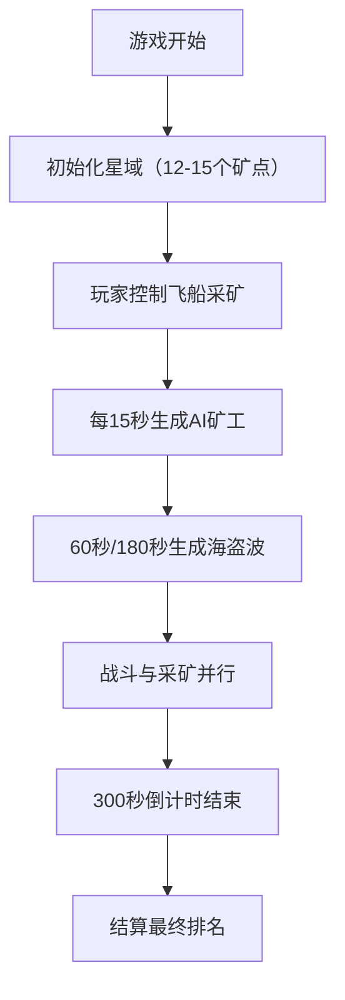

## 1. 产品概述

太空矿工挖矿争霸赛是一款2D太空采矿竞技游戏，玩家驾驶采矿飞船在随机生成的星域中穿梭，采集不同品级的矿石，同时提防AI矿工的偷袭和宇宙海盗的抢劫。游戏限时5分钟，最终按采集矿石总价值排名。

- **目标用户**：休闲游戏玩家、竞技类游戏爱好者
- **核心玩法**：采矿、战斗、排名竞技
- **产品价值**：提供快节奏、紧张刺激的太空采矿竞技体验

## 2. 核心功能

### 2.1 游戏角色

| 角色 | 控制方式 | 核心能力 |
|------|----------|----------|
| 玩家飞船 | 键盘WASD + 空格 + E | 移动、采矿、发射防御导弹 |
| AI矿工 | 自动AI | 自动采集矿石、靠近玩家时攻击 |
| 宇宙海盗 | 自动AI | 编队移动、向最近飞船开火 |

### 2.2 功能模块

1. **游戏主场景**：星空背景、小行星矿点、飞船渲染
2. **玩家控制系统**：WASD移动、空格采矿激光、E键防御导弹
3. **AI系统**：AI矿工自动采矿与攻击、海盗编队与射击
4. **碰撞与战斗系统**：激光采矿、导弹攻击、子弹伤害判定
5. **粒子特效系统**：引擎尾焰、爆炸效果、矿石掉落
6. **UI界面系统**：HUD信息、倒计时、实时排行榜

### 2.3 游戏机制

| 机制名称 | 详细描述 |
|----------|----------|
| 矿石品级 | 普通(#aa8855)、稀有(#55aaff)、传说(#ff66aa)，价值递增 |
| 采矿机制 | 激光命中后小行星闪烁3次消失，矿石自动存入仓库 |
| 战斗机制 | AI矿工距离<150px时主动靠近，击沉掉落一半矿石 |
| 海盗机制 | 60秒和180秒各一波，3-5艘V形编队，击沉需5次命中 |
| 排名机制 | 实时计算玩家与3个AI矿工的矿值排名，前三名金银铜标识 |

## 3. 核心流程

## 4. 用户界面设计

### 4.1 设计风格

- **主色调**：#0a0a1a（深空背景）
- **辅色调**：#2299ff（科技蓝）、#ff6622（警戒橙）
- **高光色**：#ffaa00（发光效果）
- **UI风格**：深色科幻风，半透明面板带2px高光边框，6px圆角
- **按钮效果**：悬停时有#ffaa00光晕（40%强度）发光效果
- **字体**：无衬线等宽字体，突出科幻感

### 4.2 界面布局

| 区域 | 位置 | 内容 | UI元素 |
|------|------|------|--------|
| HUD面板 | 左上角 | 矿石数量、总价值 | 半透明面板，白色文字，圆角6px |
| 倒计时 | 右上角 | 300秒倒计时，缩放弹跳动画 | 白色36px大字 |
| 排名面板 | 右上角倒计时下方 | 实时排名1-4名，金银铜色标识 | 绿色#44ff44闪烁效果提示排名变化 |
| 游戏画布 | 中央 | 800x600 Canvas游戏区域 | 深空背景、星星视差、飞船、小行星、粒子 |

### 4.3 响应式设计

- 桌面优先设计，支持1024x768及以上分辨率
- UI面板根据屏幕尺寸自动调整边距和缩放比例
- Canvas保持800x600内部分辨率，自适应缩放显示

### 4.4 视觉特效

- **星空背景**：500颗闪烁星点，大小1-4px，运动视差效果
- **小行星**：不规则多边形，轻微旋转动画，悬停显示品级标签（延迟0.2秒弹入）
- **引擎尾焰**：渐变粒子模拟
- **采矿激光**：白色细线，长度100px
- **防御导弹**：橙色圆点，直径8px，带拖尾粒子
- **矿石爆炸**：金色粒子20个，大小4-6px，重力下落0.2秒后消失
- **文字动画**：倒计时缩放弹跳0.3秒，排名变化绿色闪烁
