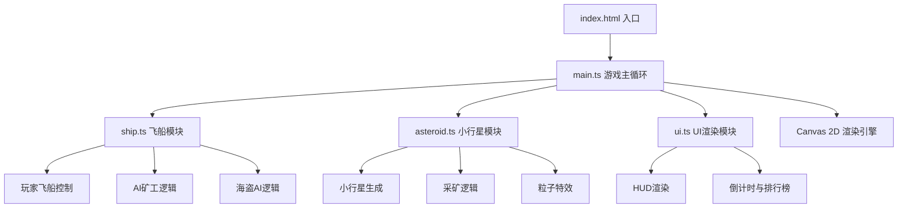
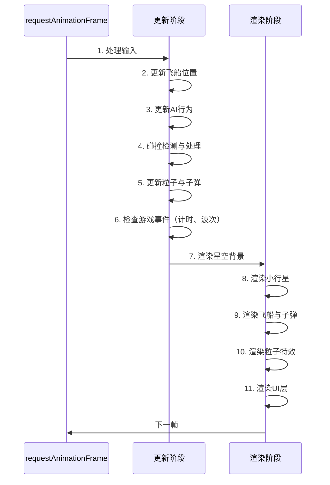

## 1. 架构设计



## 2. 技术描述

- **前端框架**：Vanilla TypeScript（无UI框架，纯Canvas渲染）
- **构建工具**：Vite 5.x + TypeScript 5.x
- **渲染引擎**：HTML5 Canvas 2D API
- **依赖库**：仅 typescript 和 vite，无其他第三方库
- **目标浏览器**：ES2020 兼容的现代浏览器

## 3. 项目结构

| 文件路径 | 作用 |
|----------|------|
| `/package.json` | 项目依赖与脚本配置 |
| `/tsconfig.json` | TypeScript strict模式配置 |
| `/vite.config.ts` | Vite构建配置 |
| `/index.html` | 入口HTML，包含Canvas与UI布局 |
| `/src/main.ts` | 游戏初始化、主循环、状态管理 |
| `/src/ship.ts` | 玩家/AI/海盗飞船的移动、碰撞、攻击逻辑 |
| `/src/asteroid.ts` | 小行星生成、采矿、粒子特效系统 |
| `/src/ui.ts` | HUD面板、倒计时、排行榜渲染 |
| `/src/types.ts` | 全局类型定义（自动创建） |

## 4. 核心数据结构

### 4.1 类型定义

```typescript
// 矿石品级
type OreGrade = 'common' | 'rare' | 'legendary';

// 飞船类型
type ShipType = 'player' | 'ai_miner' | 'pirate';

// 向量
interface Vector2 {
  x: number;
  y: number;
}

// 飞船
interface Ship {
  id: string;
  type: ShipType;
  position: Vector2;
  velocity: Vector2;
  angle: number;
  health: number;
  inventory: { [grade in OreGrade]: number };
  totalValue: number;
  lastAttackTime: number;
  nickname: string;
}

// 小行星
interface Asteroid {
  id: string;
  position: Vector2;
  radius: number;
  grade: OreGrade;
  rotation: number;
  rotationSpeed: number;
  vertices: Vector2[];
  flashCount: number;
  isFlashing: boolean;
}

// 粒子
interface Particle {
  position: Vector2;
  velocity: Vector2;
  life: number;
  maxLife: number;
  size: number;
  color: string;
  gravity: number;
}

// 激光/子弹/导弹
interface Projectile {
  id: string;
  position: Vector2;
  velocity: Vector2;
  type: 'laser' | 'missile' | 'pirate_bullet';
  damage: number;
  life: number;
  ownerId: string;
}
```

## 5. 性能约束

- **帧率目标**：55-60 FPS 稳定
- **粒子上限**：峰值不超过200个
- **对象池**：粒子和子弹使用对象池复用，避免频繁GC
- **碰撞检测**：使用空间网格优化，O(n)复杂度
- **渲染优化**：离屏缓存静态背景元素

## 6. 游戏循环



## 7. 构建与运行

- **开发命令**：`npm run dev`
- **依赖安装**：`npm install`
- **开发服务器**：Vite 内置 HMR 支持
- **入口文件**：index.html 引用 src/main.ts
