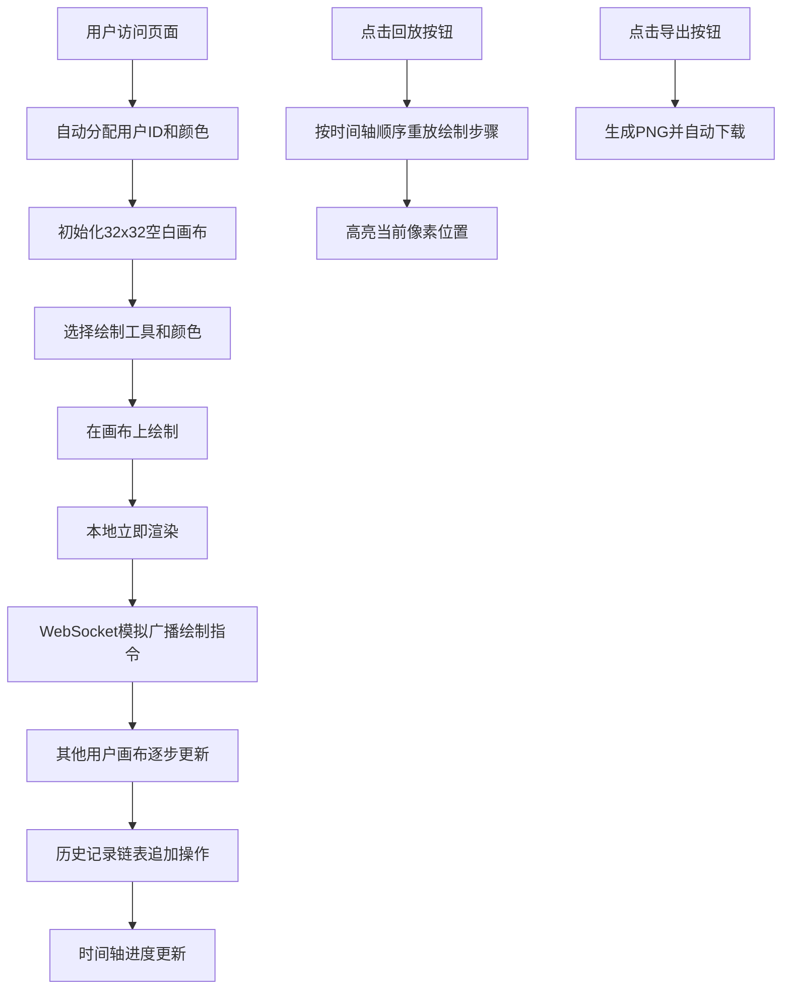

## 1. 产品概述

像素画协作与回放应用是一款支持多人实时协作绘制像素艺术的Web应用。用户可以在同一32x32像素画布上同时创作，查看其他用户的光标和绘制过程，并通过时间轴回放完整的绘制历史。

- 核心价值：提供低门槛、高趣味性的多人像素画协作体验，支持创作过程的完整记录与回放
- 目标用户：像素艺术爱好者、教育场景下的协作绘画、休闲社交用户

## 2. 核心功能

### 2.1 用户角色
| 角色 | 接入方式 | 核心权限 |
|------|----------|----------|
| 普通用户 | 直接访问即可加入 | 绘制、取色、回放、导出 |

### 2.2 功能模块
1. **协作画布模块**：32x32像素网格画布，支持缩放、平移、多光标显示
2. **绘制工具模块**：铅笔、填充、吸管三种工具，支持颜色选择
3. **历史回放模块**：时间轴控制，支持播放/暂停、速度调节、逐帧跳转
4. **用户列表模块**：显示在线用户，不同颜色光标区分
5. **导出分享模块**：一键导出PNG图片

### 2.3 页面详情
| 页面名称 | 模块名称 | 功能描述 |
|---------|---------|----------|
| 主页面 | 顶部工具栏 | 工具切换、颜色选择、导出按钮 |
| 主页面 | 左侧用户列表 | 在线用户展示、窄屏折叠为汉堡菜单 |
| 主页面 | 中央画布区 | 像素画布渲染、交互绘制、多光标同步 |
| 主页面 | 底部时间轴 | 播放控制、速度滑块、进度条、逐帧控制 |

## 3. 核心流程

用户进入页面后自动分配用户标识和颜色，可直接在画布上绘制。绘制操作通过WebSocket模拟实时同步到所有用户。用户可随时切换工具、选择颜色，并通过底部时间轴回放完整绘制过程。

## 4. 用户界面设计

### 4.1 设计风格
- 主题风格：深色科技感主题，搭配鲜明的像素色彩
- 主色调：背景 #1e1e2e，文字 #cdd6f4，画布白色网格
- 强调色：深蓝色 #1a73e8（导出按钮），金色闪烁边框（回放高亮）
- 按钮风格：圆角8px，0.2秒ease-out过渡动画
- 字体：现代无衬线字体，清晰易读
- 布局：顶部工具栏 + 左侧用户列表 + 中央画布 + 底部时间轴
- 动效：工具切换0.3秒淡入动画，色块选中外扩描边，回放像素金色闪烁

### 4.2 页面设计概览
| 页面名称 | 模块名称 | UI元素 |
|---------|---------|--------|
| 主页面 | 顶部工具栏 | 半透明深色背景(rgba(30,30,46,0.9))，高50px，工具图标20px间距8px，颜色选择区 |
| 主页面 | 用户列表 | 宽150px竖排，彩色圆点(直径12px)+昵称，窄屏折叠为汉堡菜单 |
| 主页面 | 画布区域 | 白色网格，1px浅灰边框，四边10px阴影，居中显示 |
| 主页面 | 时间轴 | 背景#181825，高度60px，圆角上角8px，播放/暂停按钮、速度滑块、进度条、逐帧按钮 |
| 主页面 | 导出按钮 | 90x36像素，#1a73e8背景，白色16px字体，圆角8px |

### 4.3 响应式设计
- 设计优先：桌面端优先
- 窄屏适配：最小宽度600px，窄屏时左侧用户列表变为顶部横向折叠菜单（汉堡图标触发）
- 触控优化：支持鼠标和触控两种交互方式

### 4.4 性能指标
- 回放10800步以上历史时FPS不低于55
- 画布渲染延迟低于16ms
- 绘制同步延迟不超过100ms（本地模拟）
