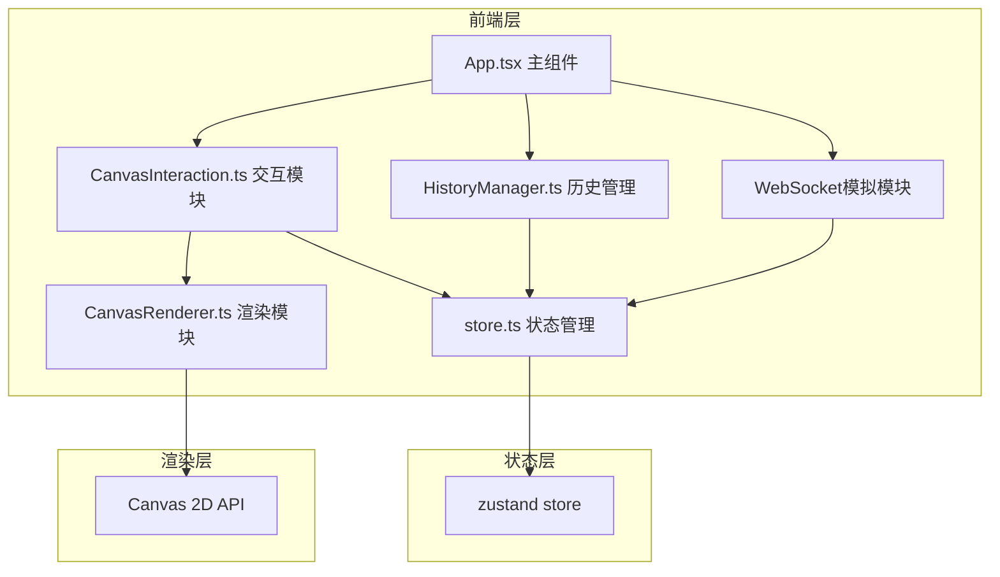

## 1. 架构设计



## 2. 技术栈说明
- 前端框架：React 18 + TypeScript
- 构建工具：Vite 5 + @vitejs/plugin-react
- 状态管理：zustand
- 渲染技术：HTML5 Canvas 2D API
- 协作模拟：setTimeout/setInterval模拟WebSocket实时同步
- 无后端依赖，纯前端单页应用

## 3. 文件结构

```
├── package.json
├── index.html
├── vite.config.ts
├── tsconfig.json
└── src/
    ├── App.tsx              # 主组件，组合所有模块
    ├── store.ts             # zustand状态管理
    ├── CanvasRenderer.ts    # 画布渲染核心模块
    ├── CanvasInteraction.ts # 鼠标/触控交互处理
    ├── HistoryManager.ts    # 时间轴回放模块
    └── components/          # UI组件
        ├── Toolbar.tsx      # 顶部工具栏
        ├── UserList.tsx     # 用户列表
        ├── Timeline.tsx     # 底部时间轴
        ├── ColorPalette.tsx # 颜色选择面板
        └── CanvasView.tsx   # 画布视图组件
```

## 4. 核心模块设计

### 4.1 CanvasRenderer 渲染模块
- 职责：纯渲染逻辑，负责像素绘制、缩放变换、网格渲染、光标渲染
- 输入：像素数据、视口参数（缩放、平移）、绘制指令
- 输出：Canvas渲染结果
- 关键方法：
  - `render(pixels, viewport, cursors)` - 完整渲染
  - `drawPixel(x, y, color)` - 绘制单个像素
  - `setZoom(scale)` - 设置缩放
  - `setPan(offsetX, offsetY)` - 设置平移

### 4.2 CanvasInteraction 交互模块
- 职责：处理鼠标/触控事件，转换为绘制指令
- 输入：DOM事件、当前工具状态
- 输出：派发绘制事件、调用渲染器
- 支持交互：点击涂色、拖动平移、滚轮缩放、触控手势

### 4.3 HistoryManager 历史管理模块
- 数据结构：双向链表存储每一步绘制操作
- 操作类型：像素绘制、填充操作
- 控制方法：play() / pause() / seek(step) / next() / prev() / setSpeed(speed)
- 回调：onStep 用于每步更新画布

### 4.4 Store 状态管理
- 画布状态：32x32像素数据（Uint8ClampedArray或二维数组）
- 工具状态：当前工具、当前颜色
- 历史状态：当前步骤、播放状态、播放速度
- 用户状态：在线用户列表、本地用户ID
- 连接状态：WebSocket连接状态

### 4.5 WebSocket模拟模块
- 模拟3个虚拟用户
- 随机生成绘制操作
- 每50ms推送一步绘制动画
- 本地绘制100ms内"同步"回显

## 5. 数据模型

### 5.1 像素数据
```typescript
// 32x32 像素数据，每个像素存储颜色索引或透明
type PixelData = string[][]; // [y][x] = color hex
```

### 5.2 绘制操作
```typescript
interface DrawAction {
  id: string;
  userId: string;
  type: 'pixel' | 'fill';
  x: number;
  y: number;
  color: string;
  timestamp: number;
  // 填充操作专用
  pixels?: { x: number; y: number; color: string }[];
}
```

### 5.3 用户信息
```typescript
interface User {
  id: string;
  name: string;
  color: string;
  cursorX?: number;
  cursorY?: number;
}
```

### 5.4 历史链表节点
```typescript
interface HistoryNode {
  action: DrawAction;
  prev: HistoryNode | null;
  next: HistoryNode | null;
}
```

## 6. 性能优化策略

1. **Canvas分层渲染**：背景网格层 + 像素层 + 光标层 + 高亮层，减少重绘区域
2. **离屏渲染**：像素数据变化时先绘制到离屏Canvas，再一次性绘制到显示Canvas
3. **历史回放优化**：使用requestAnimationFrame，批量绘制，避免每步都完全重绘
4. **数据结构优化**：使用TypedArray存储像素数据，减少GC压力
5. **节流与防抖**：鼠标移动事件节流，缩放变换防抖
