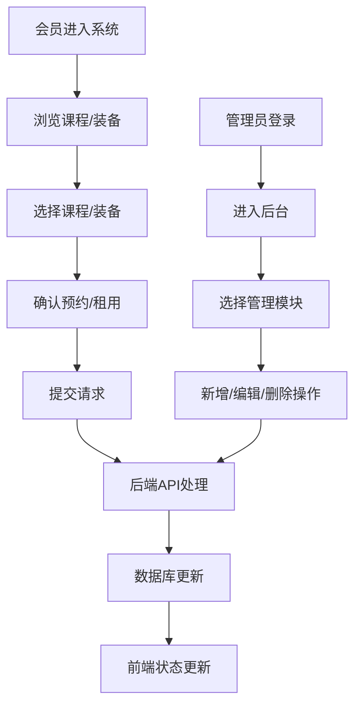

## 1. 产品概述

社区运动俱乐部管理系统，旨在帮助小型独立社区运动俱乐部实现数字化管理。系统为会员提供在线浏览课程表、预约课程、租用运动装备的一站式服务，同时为管理员提供会员管理、课程安排、装备库存管理等后台功能。

- **目标用户**：社区运动俱乐部会员及俱乐部管理员
- **核心价值**：提升运营效率，优化会员体验，降低人工管理成本

## 2. 核心功能

### 2.1 用户角色

| 角色 | 登录方式 | 核心权限 |
|------|----------|---------|
| 会员 | 系统登录 | 浏览课程、预约课程、浏览装备、租用装备、查看个人记录 |
| 管理员 | 管理员登录 | 会员管理、课程管理、装备管理、数据查看 |

### 2.2 功能模块

1. **会员首页**：课程日历展示、运动类型筛选、热门装备推荐
2. **课程预约页面**：课程列表展示、按类型筛选、预约操作
3. **装备租用页面**：装备分类展示、租用表单、租用历史
4. **管理员后台**：会员管理、课程管理、装备管理

### 2.3 页面详情

| 页面名称 | 模块名称 | 功能描述 |
|---------|---------|----------|
| 会员首页 | 导航栏 | 固定顶部导航，包含logo、页面切换、用户信息 |
| 会员首页 | 课程日历区 | 按运动类型筛选标签、课程卡片网格、课程卡片（时间、时长、教练、预约人数、预约状态） |
| 会员首页 | 热门装备区 | 按租用次数排序Top5装备推荐卡片 |
| 课程预约页 | 筛选区 | 运动类型筛选器、课程列表、预约确认弹窗 |
| 装备租用页 | 分类Tab栏 | 球拍/球类/护具/瑜伽垫四个分类 |
| 装备租用页 | 装备卡片区 | 装备信息展示、租用按钮、渐变占位图、悬停动效 |
| 装备租用页 | 租用表单弹窗 | 租用天数选择、自动计算总价、提交租用 |
| 装备租用页 | 租用历史区 | 个人租用记录列表 |
| 管理员后台 | 左侧导航栏 | 深蓝背景垂直导航、三个管理模块切换 |
| 管理员后台 | 会员管理Tab | 会员列表、姓名模糊搜索、编辑/封禁操作 |
| 管理员后台 | 课程管理Tab | 课程列表、新增课程表单、删除确认弹窗 |
| 管理员后台 | 装备管理Tab | 装备列表、新增装备表单、库存编辑 |

## 3. 核心流程

### 3.1 课程预约流程

会员进入首页 → 选择运动类型筛选 → 浏览课程卡片 → 点击未满课程卡片 → 弹出预约确认弹窗（缩放动画） → 确认预约 → 人数更新、显示"已预约"状态 → 记录到预约列表

### 3.2 装备租用流程

会员进入租用页面 → 选择装备分类Tab → 浏览装备卡片 → 点击"租用"按钮 → 弹出租用表单 → 填写租用天数（1-14天） → 自动计算总价 → 提交租用 → 库存减1、生成租用记录

### 3.3 管理员课程管理流程

管理员登录后台 → 进入课程管理Tab → 点击"新增课程" → 填写课程信息 → 保存到数据库 → 列表刷新显示新课程；或点击已有课程"删除" → 弹出确认弹窗 → 确认删除 → 数据删除并刷新

## 4. 用户界面设计

### 4.1 设计风格

- **主色调**：活力橙 `#FF5722`
- **辅色调**：深蓝 `#1A237E`
- **背景色**：浅灰 `#F5F5F5`
- **卡片背景**：白色 `#FFFFFF`
- **文字主色**：深灰 `#212121`
- **副文字色**：`#757575`
- **按钮样式**：圆角按钮，悬停背景色加深（0.2s ease）
- **字体**：Google Fonts Inter
- **布局风格**：卡片式布局、顶部导航（首页）、左侧垂直导航（后台）
- **图标风格**：简洁线性图标

### 4.2 页面设计概览

| 页面名称 | 模块名称 | UI元素 |
|---------|---------|--------|
| 会员首页 | 导航栏 | 白色背景、64px固定高度、底部浅阴影 |
| 会员首页 | 内容区 | 左右两列布局（左60%课程，右40%装备） |
| 会员首页 | 课程卡片 | 圆角12px、间距16px、日历卡片样式、人数进度条、状态标签 |
| 会员首页 | 装备推荐卡片 | 圆角8px、小尺寸、渐变材质图 |
| 课程预约页 | 课程列表 | 网格布局、筛选标签栏 |
| 装备租用页 | 分类Tab | 下划线样式、活力橙激活态 |
| 装备租用页 | 装备卡片 | 悬停上浮4px、投影放大（0.25s ease）、渐变占位图 |
| 通用弹窗 | 预约/租用确认 | 居中缩放出现（0.3s ease）、半透明黑色背景遮罩 |
| 管理员后台 | 左侧导航 | 宽度240px、深蓝背景、白色文字、激活项活力橙背景、hover浅蓝背景 |
| 通用表单 | 输入框 | 聚焦外发光活力橙 `box-shadow 0 0 0 3px rgba(255,87,34,0.2)` |
| 通用加载 | 骨架屏 | 渐变色脉冲动画（1.5s infinite） |

### 4.3 响应式设计

- **设计原则**：桌面优先，移动端自适应
- **断点**：宽度 < 768px 触发移动端布局
- **导航栏**：移动端折叠为汉堡菜单
- **内容布局**：左右两列变为上下堆叠排列
- **卡片尺寸**：自适应容器宽度
- **触摸优化**：按钮最小触摸区域、合理间距

### 4.4 装备渐变材质配色

| 装备类型 | 渐变起始色 | 渐变结束色 |
|---------|----------|----------|
| 球拍 | `#FF6F00` | `#E65100` |
| 球类 | `#1565C0` | `#0D47A1` |
| 护具 | `#424242` | `#212121` |
| 瑜伽垫 | `#2E7D32` | `#1B5E20` |
