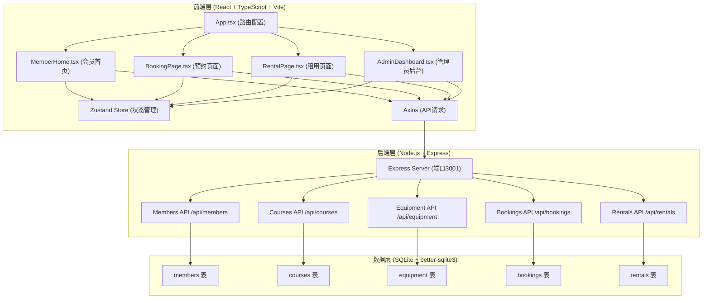
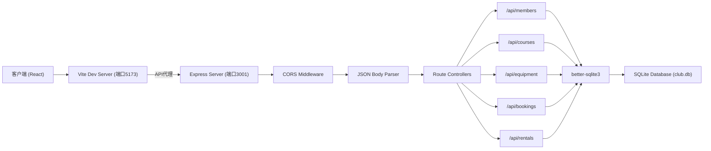
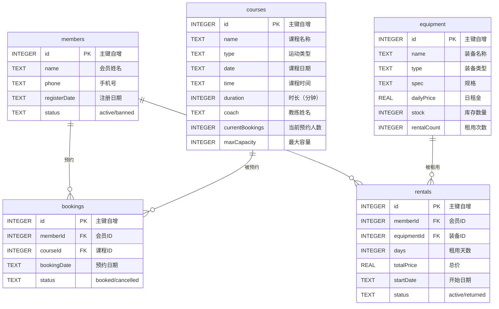

## 1. 架构设计



## 2. 技术说明

- **前端框架**：React 18 + TypeScript
- **构建工具**：Vite 5
- **路由管理**：React Router DOM 6
- **状态管理**：Zustand 4
- **HTTP客户端**：Axios 1
- **后端框架**：Express 4
- **数据库**：SQLite（better-sqlite3驱动）
- **跨域处理**：CORS
- **开发工具**：concurrently（同时启动前后端）
- **样式方案**：原生CSS + CSS变量（全局样式在App.tsx中导入）

## 3. 路由定义

| 路由路径 | 页面组件 | 用途 |
|---------|---------|------|
| `/` | MemberHome.tsx | 会员首页：课程日历 + 热门装备 |
| `/booking` | BookingPage.tsx | 课程预约页面 |
| `/rental` | RentalPage.tsx | 装备租用页面 |
| `/admin` | AdminDashboard.tsx | 管理员后台仪表盘 |

## 4. API定义

### 4.1 类型定义

```typescript
// 会员
interface Member {
  id: number;
  name: string;
  phone: string;
  registerDate: string;
  status: 'active' | 'banned';
}

// 课程
interface Course {
  id: number;
  name: string;
  type: 'basketball' | 'badminton' | 'yoga' | 'swimming';
  date: string;
  time: string;
  duration: 60 | 90;
  coach: string;
  currentBookings: number;
  maxCapacity: number;
}

// 装备
interface Equipment {
  id: number;
  name: string;
  type: 'racket' | 'ball' | 'protector' | 'mat';
  spec: string;
  dailyPrice: number;
  stock: number;
  rentalCount: number;
}

// 预约记录
interface Booking {
  id: number;
  memberId: number;
  courseId: number;
  bookingDate: string;
  status: 'booked' | 'cancelled';
}

// 租用记录
interface Rental {
  id: number;
  memberId: number;
  equipmentId: number;
  days: number;
  totalPrice: number;
  startDate: string;
  status: 'active' | 'returned';
}
```

### 4.2 RESTful API端点

| 方法 | 端点 | 请求体 | 响应 | 说明 |
|------|-----|--------|------|------|
| GET | `/api/members` | - | `Member[]` | 获取所有会员列表 |
| GET | `/api/members?search=xxx` | - | `Member[]` | 按姓名模糊搜索会员 |
| PUT | `/api/members/:id` | `{name, phone, status}` | `Member` | 更新会员信息 |
| GET | `/api/courses` | - | `Course[]` | 获取所有课程 |
| GET | `/api/courses?type=xxx` | - | `Course[]` | 按类型筛选课程 |
| POST | `/api/courses` | `{name, type, date, time, duration, coach}` | `Course` | 新增课程 |
| DELETE | `/api/courses/:id` | - | `{success: true}` | 删除课程 |
| GET | `/api/equipment` | - | `Equipment[]` | 获取所有装备 |
| GET | `/api/equipment?type=xxx` | - | `Equipment[]` | 按类型筛选装备 |
| POST | `/api/equipment` | `{name, type, spec, dailyPrice, stock}` | `Equipment` | 新增装备 |
| PUT | `/api/equipment/:id` | `{stock}` | `Equipment` | 更新装备库存 |
| GET | `/api/bookings` | - | `Booking[]` | 获取所有预约记录 |
| GET | `/api/bookings?memberId=xxx` | - | `Booking[]` | 获取会员的预约 |
| POST | `/api/bookings` | `{memberId, courseId}` | `Booking` | 创建预约 |
| GET | `/api/rentals` | - | `Rental[]` | 获取所有租用记录 |
| GET | `/api/rentals?memberId=xxx` | - | `Rental[]` | 获取会员的租用历史 |
| POST | `/api/rentals` | `{memberId, equipmentId, days}` | `Rental` | 创建租用记录 |

## 5. 服务器架构图



## 6. 数据模型

### 6.1 ER图



### 6.2 初始化数据

#### 课程数据（50条）
- 篮球课程：15条
- 羽毛球课程：15条
- 瑜伽课程：10条
- 游泳课程：10条
- 日期范围：未来14天
- 时长：60/90分钟各占约50%
- 教练：8-10个不同名字
- 预约人数：0-20随机

#### 装备数据（30种）
- 球拍类：8种
- 球类：8种
- 护具类：7种
- 瑜伽垫类：7种
- 日租金范围：10-100元
- 库存范围：5-50件
- 租用次数：用于热门排序

#### 会员数据（200人）
- 姓名：常见中文姓名随机组合
- 手机号：13/15/18开头随机号码
- 注册日期：过去1年内随机
- 状态：95% active, 5% banned

### 6.3 文件结构

```
auto8/
├── package.json
├── index.html
├── tsconfig.json
├── vite.config.js
├── src/
│   ├── App.tsx
│   ├── pages/
│   │   ├── MemberHome.tsx
│   │   ├── BookingPage.tsx
│   │   ├── RentalPage.tsx
│   │   └── AdminDashboard.tsx
│   └── store/
│       └── index.ts (zustand store)
└── server/
    └── index.ts
```
