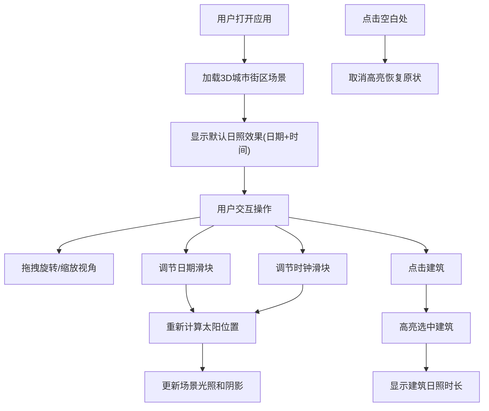

## 1. 产品概述

交互式3D城市街区与日照分析可视化应用，帮助设计师在概念阶段向非专业人士直观展示建筑设计方案的空间体量、采光条件与周边环境的动态关系。通过实时调节日期和时间，观察太阳位置变化对建筑阴影分布的影响，解决传统2D平面图难以传达建筑与光影、环境动态关系的痛点。

- **目标用户**：城市规划师、建筑设计师、项目决策者及相关非专业利益相关者
- **核心价值**：通过沉浸式3D交互体验，直观呈现日照分析结果，提升设计方案沟通效率

## 2. 核心功能

### 2.1 用户角色
本应用无需用户注册登录，所有访问者均可使用全部功能。

| 角色 | 注册方式 | 核心权限 |
|------|----------|----------|
| 访客用户 | 无需注册 | 浏览3D场景、调节日照参数、查看建筑日照信息 |

### 2.2 功能模块
1. **3D场景模块**：城市街区3D渲染、建筑网格、地面网格、动态太阳光源、阴影投射
2. **控制面板模块**：日期滑块、时钟滑块、建筑信息展示面板
3. **日照计算模块**：太阳高度角/方位角计算、太阳位置向量转换
4. **状态管理模块**：全局状态共享、参数同步更新
5. **太阳位置指示器**：2D画布实时显示太阳在天空中的位置

### 2.3 页面详情
| 页面名称 | 模块名称 | 功能描述 |
|---------|----------|----------|
| 主页面 | 3D场景渲染 | 渲染5栋以上不同高度建筑、50x50地面网格、可拖拽旋转缩放视角 |
| 主页面 | 动态日照系统 | 黄色点光源实时阴影投射、根据日期时间更新太阳位置、阴影贴图2048x2048 |
| 主页面 | 控制面板 | 日期滑块(1月1日-12月31日)、时钟滑块(6:00-18:00)、实时显示当前时间 |
| 主页面 | 建筑交互 | 点击建筑高亮显示(黄色边框+半透明其他建筑)、显示日照时长统计 |
| 主页面 | 太阳位置指示器 | 左下角2D画布实时显示太阳方位角和高度角 |

## 3. 核心流程

用户打开应用 → 查看默认3D城市街区场景 → 拖拽旋转/缩放视角观察建筑布局 → 拖动日期滑块选择季节 → 拖动时钟滑块观察一天中阴影变化 → 点击任意建筑查看其日照时长统计 → 点击空白处取消高亮 → 继续调节参数或切换观察视角

## 4. 用户界面设计

### 4.1 设计风格
- **整体风格**：深色科技感主题，专业数据可视化风格
- **主色调**：背景#1a1a2e，控制面板#2d2d44，强调色#ffaa00（滑块按钮）、#ffff00（建筑高亮）
- **字体**：现代无衬线字体，标题18px字重500，标签14px字重400，数据文字14px字重400
- **布局**：CSS Grid响应式布局，桌面端左右分栏，移动端上下分栏
- **交互反馈**：滑块按钮悬停变亮#ffcc44，过渡动画0.2秒ease-out，建筑高亮切换0.1秒

### 4.2 页面设计概述
| 页面名称 | 模块名称 | UI元素 |
|---------|----------|--------|
| 主页面 | 3D场景区域 | 70%宽度（桌面端），深色背景，支持鼠标拖拽旋转、滚轮缩放 |
| 主页面 | 控制面板区域 | 30%宽度（桌面端），深灰色背景#2d2d44，10px内边距，8px圆角 |
| 主页面 | 日期滑块 | 轨道#555，按钮#ffaa00，悬停#ffcc44，显示格式"2025-01-15" |
| 主页面 | 时钟滑块 | 轨道#555，按钮#ffaa00，悬停#ffcc44，显示格式"10:30" |
| 主页面 | 建筑信息卡片 | 背景#333355，12px圆角，半透明效果，显示"该建筑可接受日照: X.X小时" |
| 主页面 | 太阳位置指示器 | 左下角60px直径圆形画布，半透明黑底，黄色圆点标记太阳位置 |

### 4.3 响应式设计
- **桌面端（≥900px）**：CSS Grid左右布局，3D场景70%宽度，控制面板30%宽度
- **移动端（<900px）**：CSS Grid上下布局，3D场景100%宽度、50%高度，控制面板折叠到底部
- **触摸优化**：支持触摸手势旋转缩放，滑块触摸区域适当放大

### 4.4 3D场景设计
- **环境**：深色天空背景，无HDRI，保持简洁专业
- **光照**：黄色点光源模拟太阳，开启实时阴影，阴影贴图2048x2048
- **相机**：透视相机，初始位置可俯视整个街区，轨道控制器支持环绕观察
- **构图**：建筑分布在50x50网格中心区域，留出充足空间观察阴影投射
- **交互**：OrbitControls控制器，支持阻尼平滑效果，限制垂直视角避免穿模
- **性能**：帧率≥45fps，阴影更新≤每帧一次，建筑材质使用简单MeshStandardMaterial
