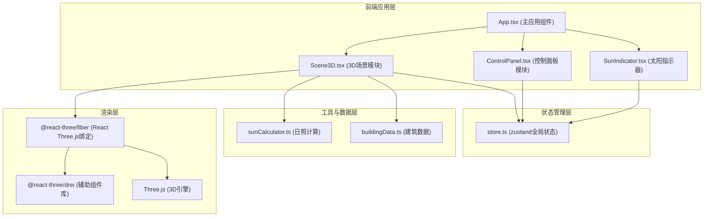
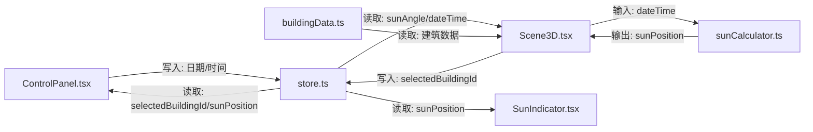

## 1. 架构设计



## 2. 技术描述

- **前端框架**：React 18 + TypeScript
- **构建工具**：Vite 5 + @vitejs/plugin-react
- **3D渲染**：Three.js r160 + @react-three/fiber v8 + @react-three/drei v9
- **状态管理**：zustand v4
- **样式方案**：原生CSS + CSS变量 + CSS Grid响应式布局
- **项目初始化**：使用npm create vite@latest创建React TypeScript项目

## 3. 目录结构

```
auto80/
├── package.json          # 项目依赖与脚本
├── index.html            # 入口HTML文件
├── vite.config.ts        # Vite配置
├── tsconfig.json         # TypeScript配置
└── src/
    ├── App.tsx           # 主应用组件，布局整合
    ├── main.tsx          # 应用入口
    ├── index.css         # 全局样式
    ├── scene/
    │   └── Scene3D.tsx   # 3D场景渲染模块
    ├── controls/
    │   ├── ControlPanel.tsx    # 控制面板模块
    │   └── SunIndicator.tsx    # 太阳位置指示器
    ├── store/
    │   └── store.ts      # zustand全局状态管理
    ├── data/
    │   └── sunCalculator.ts    # 日照计算工具
    └── utils/
        └── buildingData.ts     # 建筑预设数据
```

## 4. 模块调用关系与数据流向

### 4.1 数据流向图


### 4.2 文件职责说明

| 文件路径 | 核心职责 | 输入 | 输出 |
|---------|----------|------|------|
| [src/scene/Scene3D.tsx](file:///c:/Users/Administrator/Desktop/P/tasks/auto80/src/scene/Scene3D.tsx) | 初始化Three.js场景、相机、轨道控制器，渲染建筑网格、地面网格、动态太阳光源和阴影投射 | store: sunAngle, dateTime, selectedBuildingId<br>buildingData: 建筑数据<br>sunCalculator: 太阳位置 | store: selectedBuildingId（点击建筑时更新） |
| [src/controls/ControlPanel.tsx](file:///c:/Users/Administrator/Desktop/P/tasks/auto80/src/controls/ControlPanel.tsx) | 渲染日期滑块、时钟滑块、建筑信息面板 | store: selectedBuildingId, sunPosition | store: dateTime（滑块更新时写入） |
| [src/controls/SunIndicator.tsx](file:///c:/Users/Administrator/Desktop/P/tasks/auto80/src/controls/SunIndicator.tsx) | 左下角2D太阳位置指示器 | store: sunPosition | Canvas绘制 |
| [src/data/sunCalculator.ts](file:///c:/Users/Administrator/Desktop/P/tasks/auto80/src/data/sunCalculator.ts) | 根据日期时间计算太阳高度角、方位角和位置向量 | dateTime: {dayOfYear, hours} | sunPosition: {altitude, azimuth, vector} |
| [src/store/store.ts](file:///c:/Users/Administrator/Desktop/P/tasks/auto80/src/store/store.ts) | 全局状态管理 | 各模块set方法调用 | 各模块状态读取 |
| [src/utils/buildingData.ts](file:///c:/Users/Administrator/Desktop/P/tasks/auto80/src/utils/buildingData.ts) | 提供预设城市街区建筑数据 | 无 | BuildingData数组 |
| [src/App.tsx](file:///c:/Users/Administrator/Desktop/P/tasks/auto80/src/App.tsx) | 整合场景和控制面板布局，响应式Grid布局 | 无 | 组件渲染 |

### 4.3 状态类型定义

```typescript
// store.ts 状态接口
interface AppState {
  // 日期时间 (1-365天, 6-18小时)
  dateTime: {
    dayOfYear: number;
    hours: number;
  };
  // 太阳角度 (高度角0-90°, 方位角0-360°)
  sunAngle: {
    altitude: number;
    azimuth: number;
  };
  // 太阳位置向量 (Three.js场景坐标)
  sunPosition: {
    x: number;
    y: number;
    z: number;
  };
  // 选中的建筑ID
  selectedBuildingId: string | null;
  
  // setter方法
  setDateTime: (dateTime: { dayOfYear: number; hours: number }) => void;
  setSelectedBuildingId: (id: string | null) => void;
}
```

### 4.4 建筑数据类型

```typescript
// buildingData.ts
interface BuildingData {
  id: string;
  position: { x: number; y: number; z: number };
  size: { width: number; height: number; depth: number };
  color: string; // #c0c0c0 ~ #a0a0a0
  sunHours: number; // 8-12小时
}
```

## 5. 性能优化策略

1. **阴影优化**：阴影贴图尺寸2048x2048，使用PCFSoftShadowMap，滑块拖动时限制阴影更新频率
2. **渲染优化**：使用@react-three/fiber的自动渲染管线，避免不必要的重渲染
3. **材质优化**：建筑使用简单MeshStandardMaterial，减少着色器复杂度
4. **状态优化**：zustand状态按需订阅，避免全组件重渲染
5. **帧率保证**：目标帧率≥45fps，使用OrbitControls的enableDamping实现平滑交互

## 6. 核心技术实现要点

### 6.1 太阳位置计算
- 基于简化的太阳位置算法，根据一年中的第几天计算太阳赤纬角
- 根据小时计算时角，推导高度角和方位角
- 转换为Three.js场景的3D坐标向量

### 6.2 建筑高亮效果
- 点击建筑时，为选中建筑添加EdgesGeometry黄色边框
- 其他建筑材质透明度设为0.3，transparent设为true
- 点击空白处时，恢复所有建筑不透明度为1

### 6.3 响应式布局
- 使用CSS Grid的grid-template-columns和grid-template-rows
- 媒体查询@media (max-width: 900px)切换布局方向
- 3D场景容器使用position: relative，自适应父容器尺寸
