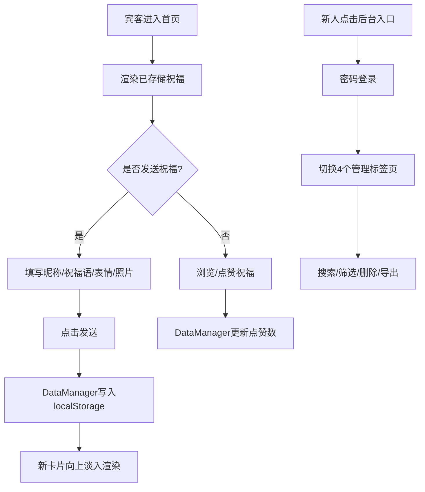

## 1. 产品概述

婚礼宾客祝福留言墙是一款轻量级前端应用，旨在解决传统纸质签到本形式单一、互动性弱、难以长久保存的问题。新人和宾客可在婚礼前后随时通过网页发送文字祝福、上传照片、表情标记，所有内容持久化存储于浏览器本地。

- 核心目标：提供温暖浪漫、流畅易用的数字化婚礼祝福收集体验
- 目标用户：准备结婚的新人（管理者）及参与婚礼的宾客（参与者）
- 市场价值：零成本、零部署、即时可用的婚礼互动记忆留存工具

## 2. 核心功能

### 2.1 用户角色

| 角色 | 登录方式 | 核心权限 |
|------|----------|----------|
| 宾客 | 无需登录 | 浏览祝福墙、发送文字祝福、上传照片、选择表情、点赞祝福 |
| 新人/管理员 | 密码登录（默认admin） | 管理祝福（搜索/筛选/删除/导出JSON）、浏览照片墙（瀑布流+大图预览）、查看签到记录（导出CSV）、查看统计报告 |

### 2.2 功能模块

1. **首页（宾客页面）**：婚礼标题主视觉区、倒计时牌、祝福留言表单、祝福留言墙
2. **管理后台**：祝福管理、照片墙、签到记录、统计报告
3. **数据管理层**：localStorage增删查改、JSON/CSV导出、图片Base64存储

### 2.3 页面详情

| 页面名称 | 模块名称 | 功能描述 |
|----------|----------|----------|
| 首页 | 标题主视觉区 | 展示新人姓名大标题 + 主视觉照片（圆角24px、柔和阴影） |
| 首页 | 倒计时牌 | 距离婚礼日期X天X小时X分钟实时更新，字体36px，亮粉色#ff6b9d数字，磨砂白卡片，0.8s过渡 |
| 首页 | 留言输入区 | 昵称输入框、200字限制祝福语、单张≤5MB照片上传、4种表情圆形选择器（开心/感动/搞笑/温馨）、金色渐变发送按钮 |
| 首页 | 留言墙 | 时间倒序卡片列表，每张含昵称/时间/文字/图片网格(≤3张)/表情标签/点赞心形，新卡片0.5s向上淡入，点赞缩放脉冲动画 |
| 管理后台 | 祝福管理 | 昵称搜索、表情分类筛选、多选批量删除、一键导出JSON |
| 管理后台 | 照片墙 | 瀑布流布局、占位旋转加载动画、0.5s渐显、点击放大左右滑动浏览 |
| 管理后台 | 签到记录 | 交替斑马纹表格（昵称/签到时间/IP属地）、行高40px、导出CSV |
| 管理后台 | 统计报告 | 3张指标卡片（左侧彩色边框）：总祝福数、照片总数、平均字数，数值36px粗体、0.8s计数递增动画 |

## 3. 核心流程

宾客进入首页 → 浏览已有祝福墙 → 填写昵称、祝福语、上传照片（可选）、选择表情 → 点击发送祝福 → 新卡片向上淡入到留言墙顶部 → 可点赞任意祝福（心形变满+脉冲）

新人点击后台入口 → 输入密码登录 → 切换祝福管理/照片墙/签到记录/统计报告四个标签页 → 执行搜索、筛选、删除、导出等操作

## 4. 用户界面设计

### 4.1 设计风格

- 主色调：淡粉色#ffe8ec、香槟金#f7d794、白色#ffffff
- 按钮：金色渐变背景（从#f7d794到#e9c46a），圆角12px，悬停亮度+5%，点击内阴影0.2s
- 字体：-apple-system, BlinkMacSystemFont, 'Segoe UI', Roboto（无衬线系统字体）
- 布局：PC端左右两栏倒计时+表单，移动端上下折叠；卡片式容器统一圆角12px
- 图标/emoji：表情用4种预设按钮（开心😊/感动🥹/搞笑😂/温馨💖），点赞用心形SVG
- 背景：从淡粉#ffe8ec到奶白#fffaf0的线性渐变，营造温暖浪漫氛围

### 4.2 页面设计概述

| 页面名称 | 模块名称 | UI元素 |
|----------|----------|--------|
| 首页 | 主视觉区 | 居中大标题42px粗体深灰、主视觉图（24px圆角、0 8px 32px阴影、宽度90% max-width 1000px） |
| 首页 | 倒计时 | 磨砂玻璃卡片（backdrop-filter: blur(10px)、白色70%透明度、12px圆角），数字亮粉色粗体36px，0.8s transition |
| 首页 | 表单区 | 白色卡片、输入框浅灰边框focus变金粉色、表情圆形按钮48px、选中scale(1.2)+背景变色、照片预览缩略图 |
| 首页 | 留言墙 | 卡片16px圆角、12px间距、表情小标签圆角8px、点赞心悬浮scale(1.1)、点击后fill #ff4757 + 0.2s pulse |
| 管理后台 | 导航栏 | 宽220px深蓝#2c3e50固定侧栏、白色文字、选中项左侧3px白色边框高亮+背景加深 |
| 管理后台 | 数据表格 | 表头#555背景#f8f9fa、斑马行交替白/浅蓝#ebf5ff、40px行高 |
| 管理后台 | 指标卡 | 宽200px圆角12px、左侧4px彩色边（粉/金/蓝）、数值36px粗体+countUp动画 |

### 4.3 响应式

PC端优先设计，断点768px：
- ≥768px：倒计时+表单左右两栏（各占50%），留言墙两列网格
- <768px：倒计时在上、表单在下、留言墙单列，所有模块100%宽度，最小支持320px
- 触控优化：触摸目标≥44px，手势滑动浏览照片墙大图

### 4.4 动效规范

- 新祝福卡片：0.5s ease-out 向上淡入（translateY(20px) + opacity 0→1）
- 倒计时数字变化：0.8s 缓动过渡
- 点赞心形：0.2s 缩放脉冲（scale 1→1.3→1）+ 颜色从#ccc到#ff4757
- 标签页切换：0.3s opacity过渡
- 照片加载：0.5s渐显（opacity 0→1）
- 按钮悬停/点击：0.2s ease-in-out
