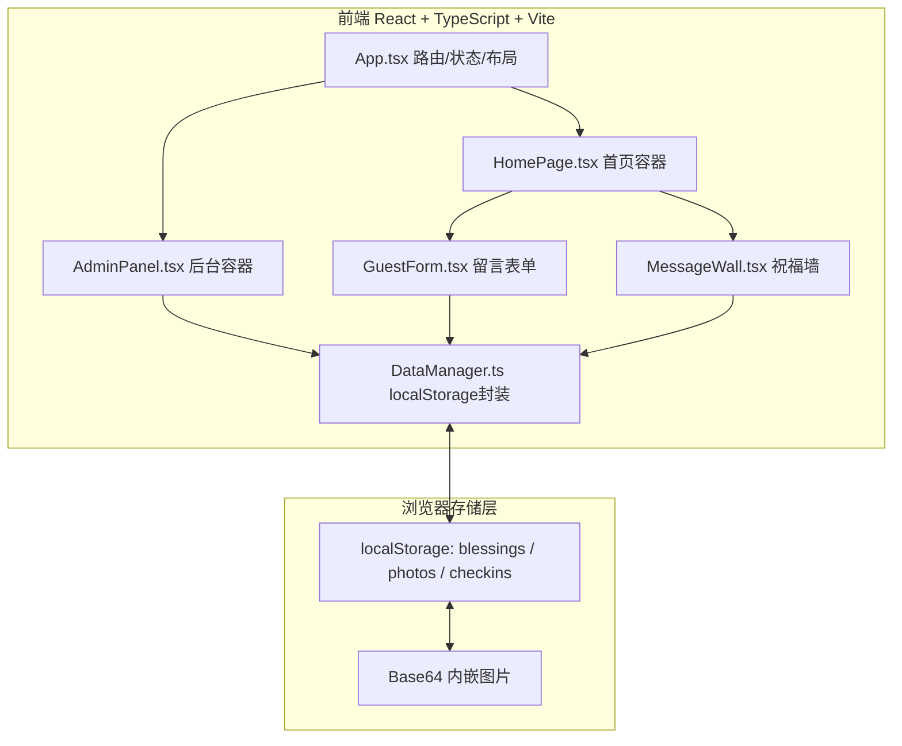

## 1. 架构设计



## 2. 技术说明

- 前端框架：React 18 + TypeScript（strict模式）
- 构建工具：Vite 5 + @vitejs/plugin-react
- 样式方案：原生CSS + CSS变量，全局注入index.css
- 状态管理：React useState/useEffect（无外部状态库，保持轻量）
- 路由：内部状态切换（非URL路由，仅首页与后台两个视图）
- 数据持久化：window.localStorage（JSON序列化 + Base64图片内嵌）
- 图标：内联SVG（心形）+ Unicode表情，无外部图标依赖
- 无后端服务、无第三方CDN资源，确保离线可用与首屏<1.5s

## 3. 视图定义

| 视图 | 触发条件 | 内容 |
|------|----------|------|
| 首页（宾客视图） | 默认显示，App.currentView === 'home' | 标题区 + 倒计时 + 留言表单 + 留言墙 |
| 后台登录框 | 点击右下角⚙图标，App.showAdminLogin === true | 密码输入框 + 登录按钮（默认密码'admin'） |
| 管理后台 | 登录成功后，App.currentView === 'admin' | 左侧导航 + 四个标签页内容区 |

## 4. 数据模型与存储接口

### 4.1 数据结构定义

```typescript
// 表情类型
type EmotionType = 'happy' | 'moved' | 'funny' | 'warm';

// 祝福留言
interface Blessing {
  id: string;               // 时间戳+随机数唯一ID
  nickname: string;         // 宾客昵称
  content: string;          // 祝福文字（≤200字）
  photos: string[];         // Base64图片数组（≤3张）
  emotion: EmotionType;     // 选中表情
  likes: number;            // 点赞数
  createdAt: number;        // 创建时间戳
  ip: string;               // 模拟IP属地
}

// 签到记录
interface CheckinRecord {
  id: string;
  nickname: string;
  createdAt: number;
  ip: string;
}

// 应用配置
interface AppConfig {
  brideName: string;        // 新娘姓名
  groomName: string;        // 新郎姓名
  weddingDate: string;      // 婚礼日期 ISO YYYY-MM-DD
  adminPassword: string;    // 后台密码
  heroImage: string;        // 主视觉图(默认占位渐变)
}
```

### 4.2 localStorage Key 约定

| Key | 类型 | 说明 |
|-----|------|------|
| wedding_blessings | Blessing[] | 所有祝福留言 |
| wedding_checkins | CheckinRecord[] | 所有签到记录（首次发送祝福时写入） |
| wedding_config | AppConfig | 应用配置 |

### 4.3 DataManager 公开接口

```typescript
class DataManager {
  // 配置
  static getConfig(): AppConfig
  static saveConfig(cfg: Partial<AppConfig>): void

  // 祝福 CRUD
  static getBlessings(): Blessing[]
  static addBlessing(b: Omit<Blessing, 'id'|'likes'|'createdAt'|'ip'>): Blessing
  static deleteBlessings(ids: string[]): void
  static searchBlessings(keyword: string, emotion?: EmotionType): Blessing[]
  static likeBlessing(id: string): void

  // 签到
  static getCheckins(): CheckinRecord[]
  static addCheckin(nickname: string): CheckinRecord

  // 导出
  static exportBlessingsJSON(): string
  static exportCheckinsCSV(): string

  // 统计
  static getStats(): { totalBlessings: number; totalPhotos: number; avgWords: number }

  // 图片
  static fileToBase64(file: File): Promise<string>
}
```

## 5. 组件结构

```
src/
├── App.tsx                  # 根组件，管理视图切换（home/admin）+ 全局数据
├── main.tsx                 # React 渲染入口
├── index.css                # 全局样式、CSS变量、动画关键帧
├── components/
│   ├── HomePage.tsx         # 首页：标题+倒计时+表单+留言墙
│   ├── GuestForm.tsx        # 留言表单：输入验证/表情选择/图片上传
│   ├── MessageWall.tsx      # 留言墙：卡片列表+点赞+大图预览
│   ├── CountdownTimer.tsx   # 倒计时牌组件
│   ├── ImageLightbox.tsx    # 图片大图浏览（左右滑动）
│   └── AdminPanel.tsx       # 后台：四标签页导航+内容
└── utils/
    └── DataManager.ts       # localStorage 封装 + 导出/统计工具
```

## 6. 性能与约束

- 首屏性能：无外部HTTP请求，CSS<10KB，JS打包<150KB gzip，目标FCP<1.5s
- 存储性能：单条localStorage读写≤10ms，列表倒序渲染O(n)
- 交互响应：点赞≤100ms，发送祝福≤200ms（含Base64图片处理，5MB图片上限）
- 内存安全：图片显示完后不在组件内存缓存多余副本，依赖浏览器渲染缓存
- 严格TypeScript：启用 strict / noImplicitAny / strictNullChecks
