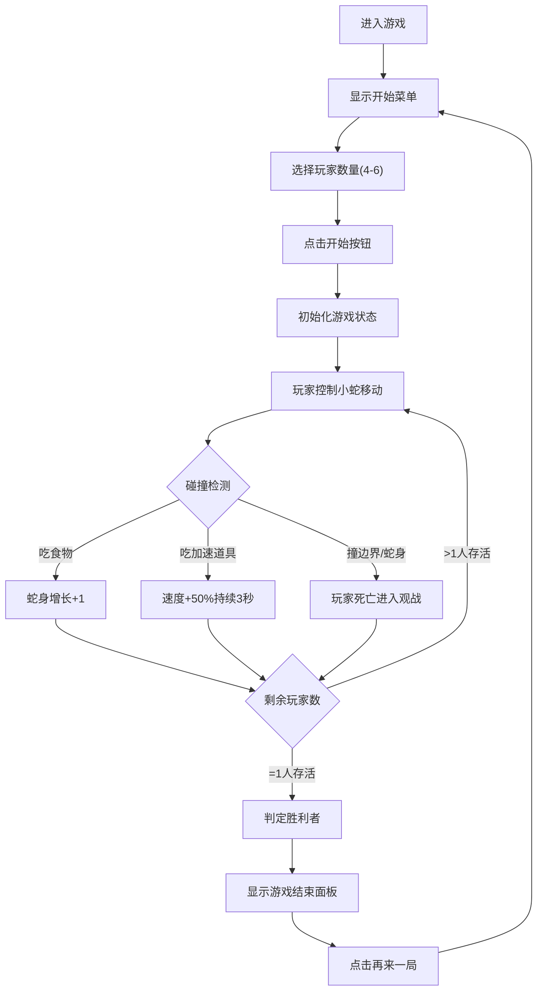

## 1. 产品概述
一款多人实时对抗的贪吃蛇大逃杀浏览器游戏，支持4-6名玩家在同一张800x600像素地图上同时控制各自小蛇，通过吃食物成长和击败对手，最后存活者获胜。
- 核心目的：提供紧张刺激的多人竞技游戏体验，融合经典贪吃蛇玩法与大逃杀模式
- 目标用户：休闲游戏玩家、多人对战爱好者

## 2. 核心特性

### 2.1 用户角色
| 角色 | 参与方式 | 核心权限 |
|------|----------|----------|
| 玩家 | 本地多键盘操控 | 控制小蛇移动、观战、重开游戏 |
| 观战者 | 玩家死亡后自动进入 | 观看剩余玩家对战 |

### 2.2 功能模块
1. **开始菜单**：游戏标题、玩家数量选择、开始按钮
2. **主游戏画面**：800x600游戏地图、蛇身渲染、食物/道具渲染
3. **HUD界面**：左上角分数排名、游戏倒计时、右侧小地图
4. **游戏结束面板**：胜利者展示、MVP标记、再来一局按钮

### 2.3 页面详情
| 页面名称 | 模块名称 | 功能描述 |
|----------|----------|----------|
| 开始菜单 | 标题区域 | 霓虹绿发光效果的游戏标题"贪吃蛇大逃杀" |
| 开始菜单 | 玩家选择 | 支持4-6名玩家数量选择 |
| 开始菜单 | 开始按钮 | 渐变蓝紫色背景，悬停提亮，点击缩放反馈 |
| 主游戏画面 | 地图渲染 | 800x600深色星空渐变背景，闪烁发光边界线 |
| 主游戏画面 | 蛇身渲染 | 每条彩色小蛇6x6像素节，加速时闪烁特效 |
| 主游戏画面 | 食物/道具 | 10个绿色圆形食物、5个紫色菱形加速道具 |
| 主游戏画面 | 死亡效果 | 蛇身变暗透明渐变消失（2秒） |
| HUD界面 | 分数排名 | 毛玻璃背景，实时显示玩家长度排名 |
| HUD界面 | 倒计时 | 2分钟倒计时，结束结算MVP |
| HUD界面 | 小地图 | 200x150像素地图，实时展示所有蛇和食物位置 |
| 游戏结束面板 | 胜利者展示 | 弹入动画，皇冠图标，胜利者名字 |
| 游戏结束面板 | 操作按钮 | "再来一局"按钮重开游戏 |

## 3. 核心流程
玩家进入游戏 → 选择玩家数量(4-6人) → 点击开始 → 所有玩家控制小蛇移动吃食物/道具 → 碰撞边界或其他蛇身死亡 → 进入观战模式 → 最后存活者胜利 → 显示结束面板 → 点击再来一局重新开始

## 4. 用户界面设计

### 4.1 设计风格
- **主色调**：深色科幻霓虹风格，主色#33ccff(青蓝)、#00ff00(霓虹绿)、#cc66ff(紫色)
- **按钮风格**：渐变蓝紫色背景，圆角设计，悬停亮度+20%，点击0.1秒缩放反馈
- **字体**：无衬线等宽字体，白色主文字，霓虹发光效果用于标题
- **布局风格**：主画布居中，左侧HUD排名，右侧小地图
- **图标风格**：Unicode皇冠图标👑，像素风小地图

### 4.2 页面设计概览
| 页面名称 | 模块名称 | UI元素 |
|----------|----------|----------|
| 开始菜单 | 全屏蒙版 | 半透明深色背景遮罩 |
| 开始菜单 | 中央卡片 | 300x200px，圆角12px，内阴影，0.5px白色边框 |
| 开始菜单 | 标题文字 | text-shadow: 0 0 10px #00ff00 霓虹绿发光 |
| 主游戏画面 | 地图边界 | #33ccff，线宽3px，2秒周期闪烁发光 |
| 主游戏画面 | 背景 | 深色星空渐变效果 |
| HUD界面 | 排名面板 | backdrop-filter: blur(4px)毛玻璃，白色12px字体 |
| HUD界面 | 小地图 | 200x150px像素风格，实时更新 |
| 游戏结束面板 | 弹入动画 | 底部向上滑入0.5秒，cubic-bezier(0.68, -0.55, 0.27, 1.55) |
| 游戏结束面板 | 胜利者区 | 显著皇冠👑图标 + 胜利者名字 |

### 4.3 响应式
桌面优先设计，游戏画布固定尺寸800x600px，适配主流桌面浏览器。
