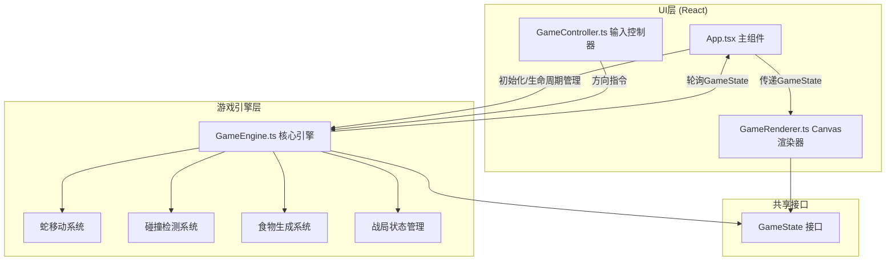

## 1. 架构设计



## 2. 技术说明
- 前端框架：React 18 + TypeScript
- 构建工具：Vite 5 + @vitejs/plugin-react
- 渲染方式：HTML5 Canvas 2D
- 状态通信：GameEngine导出GameState接口，UI层通过requestAnimationFrame轮询获取最新状态
- 无需后端：纯前端本地多人游戏，多玩家通过不同按键控制

## 3. 文件结构
| 文件路径 | 用途 |
|----------|------|
| /package.json | 项目依赖配置，启动脚本npm run dev |
| /index.html | 入口HTML页面 |
| /vite.config.ts | Vite配置，含React插件，输出dist |
| /tsconfig.json | TypeScript配置，strict模式，jsx: react-jsx |
| /src/GameEngine.ts | 游戏引擎核心：蛇移动、碰撞检测、食物生成、战局管理，导出GameState接口 |
| /src/GameRenderer.ts | Canvas渲染器：绘制游戏画面、HUD、UI元素 |
| /src/GameController.ts | 输入控制器：处理键盘输入，传递方向指令 |
| /src/App.tsx | 主组件：初始化引擎/渲染器，管理生命周期，菜单/计分板/结束面板 |
| /src/main.tsx | React入口文件，挂载App组件 |

## 4. 核心接口定义

### 4.1 GameState 接口
```typescript
interface Position {
  x: number;
  y: number;
}

interface Snake {
  id: number;
  name: string;
  color: string;
  body: Position[];
  direction: Direction;
  isAlive: boolean;
  deathTime?: number;
  speedBoost: boolean;
  speedBoostEndTime?: number;
  score: number;
}

interface Food {
  position: Position;
  type: 'normal' | 'speed';
}

type Direction = 'up' | 'down' | 'left' | 'right';

interface GameState {
  snakes: Snake[];
  foods: Food[];
  gameStatus: 'menu' | 'playing' | 'ended';
  winner?: Snake;
  timeRemaining: number;
  mapWidth: number;
  mapHeight: number;
  tickCount: number;
}
```

### 4.2 GameEngine 公共方法
| 方法名 | 参数 | 返回值 | 说明 |
|--------|------|--------|------|
| constructor | playerCount: number | GameEngine | 初始化游戏引擎 |
| start | - | void | 开始游戏 |
| getState | - | GameState | 获取当前游戏状态 |
| setDirection | playerId: number, dir: Direction | void | 设置玩家方向（不可反向） |
| tick | - | void | 单帧更新逻辑 |

## 5. 性能优化策略
- 渲染帧率：使用requestAnimationFrame锁定60fps
- 状态同步：UI层每帧轮询一次GameState，避免不必要的重渲染
- Canvas绘制：批量绘制同类型元素（食物、蛇节），减少状态切换
- 碰撞检测：空间网格化优化，只检测相邻格子
- 死蛇渲染：透明度渐变通过预计算减少每帧计算量

## 6. 玩家按键映射
| 玩家ID | 上 | 下 | 左 | 右 |
|--------|----|----|----|----|
| 玩家1 (蓝) | W | S | A | D |
| 玩家2 (红) | ↑ | ↓ | ← | → |
| 玩家3 (黄) | T | G | F | H |
| 玩家4 (橙) | I | K | J | L |
| 玩家5 (青) | 8 | 5 | 4 | 6 (小键盘) |
| 玩家6 (粉) | U | J | H | K |
