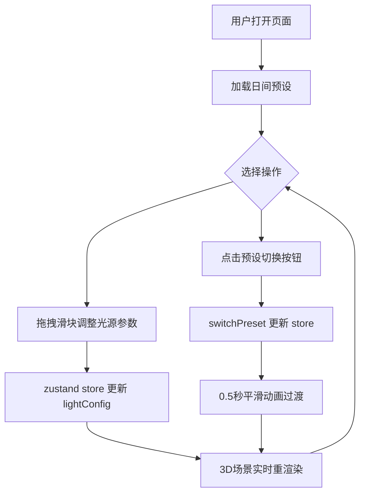

## 1. 产品概述

交互式3D室内灯光场景编辑器，帮助设计师和客户在浏览器中直观预览客厅照明方案在不同时段的光感变化。用户可实时调整三组虚拟光源（主吊灯、落地灯、自然光）的色温、亮度和角度，并一键切换日间/夜间预设方案进行效果对比。

- 目标用户：室内设计师、照明工程师、方案汇报中的客户
- 核心价值：消除平面图与效果图的认知鸿沟，让非专业客户也能直观感受灯光方案的变化

## 2. 核心功能

### 2.1 用户角色

| 角色 | 使用方式 | 核心权限 |
|------|----------|----------|
| 设计师 | 直接操作 | 调整所有光源参数、切换预设、自由浏览3D场景 |
| 客户 | 浏览对比 | 切换预设方案、拖拽旋转视角查看场景 |

### 2.2 功能模块

1. **3D场景编辑页**：客厅3D模型渲染、三组光源实时控制、阴影与色温效果展示
2. **灯光控制面板**：色温/亮度/角度滑块、日间/夜间一键切换

### 2.3 页面详情

| 页面名称 | 模块名称 | 功能描述 |
|----------|----------|----------|
| 3D场景编辑页 | 客厅场景渲染 | 渲染含沙发、茶几、地毯、书架、两扇窗户的客厅模型，所有物体接收/投射阴影 |
| 3D场景编辑页 | 三组光源控制 | 主吊灯（色温可调、亮度可调、向下照射）、落地灯（固定暖光、亮度可调、照射沙发一角）、自然光（固定色温、亮度可调、角度可调、平行光从窗户射入） |
| 3D场景编辑页 | 预设方案切换 | 日间模式与夜间模式一键切换，0.5秒平滑动画过渡 |
| 3D场景编辑页 | 色温效果展示 | 暖色光使物体偏黄红、冷色光使物体偏蓝白，墙壁在暖光下#f0dbb0、冷光下#d8dce0 |

## 3. 核心流程

用户打开页面后，左侧3D场景以日间预设模式渲染客厅。用户可在右侧控制面板中：
1. 拖拽各光源的色温/亮度/角度滑块，实时看到3D场景中光影变化
2. 点击「日间模式」或「夜间模式」按钮，所有光源参数平滑过渡到预设值
3. 通过鼠标拖拽旋转3D场景视角，从不同角度观察灯光效果

## 4. 用户界面设计

### 4.1 设计风格

- 主色调：深蓝灰系（#1a1a2e、#16213e），蓝色强调色（#4a90d9）
- 滑块组件：圆形按钮直径20px白色，活动轨道蓝色#4a90d9，未活动轨道灰色#4a4a5a
- 字体：Inter / system-ui，标题16px加粗，标签13px，数值12px
- 布局：左右分栏，左侧3D场景70%宽度，右侧控制面板固定280px
- 风格：深色科技感编辑器界面，专业工具类应用

### 4.2 页面设计概览

| 页面名称 | 模块名称 | UI元素 |
|----------|----------|--------|
| 3D场景编辑页 | 3D渲染区域 | 深灰背景#1a1a2e、2px浅灰边框、8px圆角、16px边距、Canvas渲染 |
| 3D场景编辑页 | 控制面板 | 背景#16213e、垂直滚动布局、三组光源控制卡片、底部预设按钮 |
| 3D场景编辑页 | 光源控制卡片 | 光源名称标题、色温滑块（2700-6500K）、亮度滑块（0-100%）、角度滑块（水平0-360/垂直0-90） |
| 3D场景编辑页 | 预设切换按钮 | 日间按钮80x36px背景#f0e6d3文字#5a4a3a、夜间按钮80x36px背景#1c2541文字#a8c8e8、圆角6px、悬停放大1.05倍 |

### 4.3 响应式设计

- 桌面端（≥768px）：左右分栏布局，左侧3D场景70%、右侧控制面板280px
- 移动端（<768px）：上下布局，3D场景占上方60%高度，控制面板居下方水平滑动

### 4.4 3D场景指引

- 环境：室内客厅场景，窗户透出泛光天空盒
- 灯光：主吊灯（点光源y=3）、落地灯（点光源x=-1.5,y=1.5,z=1.5）、自然光（方向光从窗户方向射入）
- 相机：透视相机，默认45度俯视角，用户可鼠标拖拽旋转
- 构图：客厅居中，书架靠墙，两扇窗户在侧墙
- 交互：OrbitControls旋转/缩放，滑块实时调整光源参数
- 阴影：PCFSoftShadowMap，沙发和茶几投射阴影到地毯
- 性能预算：光源参数变化后重渲染延迟<50ms，拖拽滑块时帧率≥40fps
