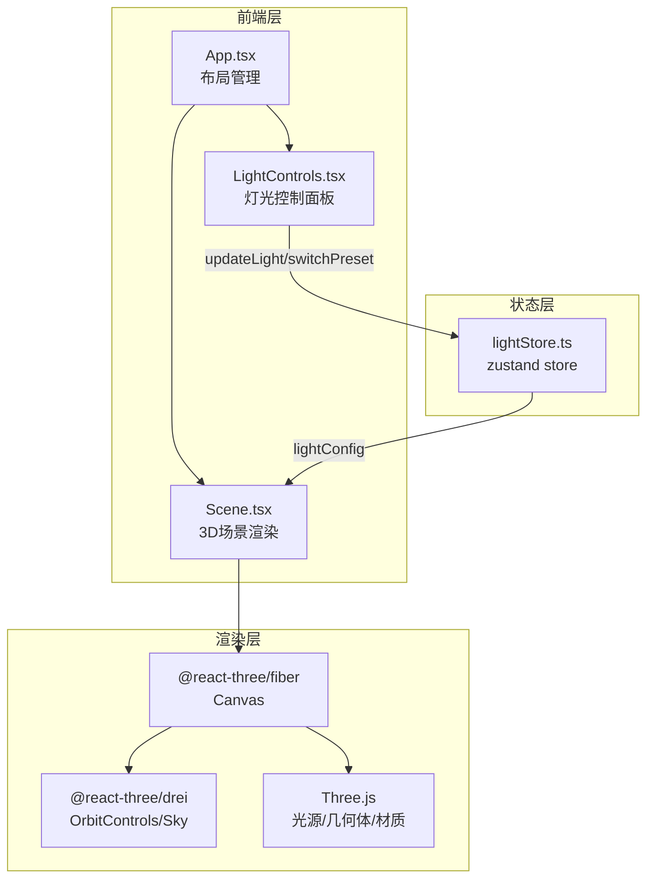

## 1. 架构设计



## 2. 技术说明

- 前端框架：React 18 + TypeScript
- 3D渲染：Three.js + @react-three/fiber + @react-three/drei
- 状态管理：zustand
- 构建工具：Vite + @vitejs/plugin-react
- 样式方案：CSS-in-JS（内联样式 + CSS模块）
- 无后端服务

## 3. 路由定义

| 路由 | 用途 |
|------|------|
| / | 3D场景编辑器主页面（单页应用，无路由切换） |

## 4. 数据模型

### 4.1 lightConfig 数据结构

```typescript
interface LightSource {
  colorTemp: number;
  brightness: number;
  horizontalAngle: number;
  verticalAngle: number;
  position: [number, number, number];
}

interface LightConfig {
  chandelier: LightSource;
  floorLamp: LightSource;
  naturalLight: LightSource;
  preset: 'day' | 'night';
}
```

### 4.2 预设方案定义

| 参数 | 日间模式 | 夜间模式 |
|------|----------|----------|
| 主吊灯色温 | 4500K | 3200K |
| 主吊灯亮度 | 60% | 80% |
| 落地灯亮度 | 20% | 60% |
| 自然光亮度 | 80% | 10% |
| 自然光水平角度 | 0° | 180° |
| 自然光垂直角度 | 30° | 60° |

## 5. 文件结构与调用关系

```
project/
├── index.html                    # 入口页面，挂载 #root
├── package.json                  # 依赖与脚本
├── vite.config.js                # Vite配置，路径别名 @→src
├── tsconfig.json                 # TypeScript严格模式
└── src/
    ├── main.tsx                  # ReactDOM挂载点
    ├── App.tsx                   # 主应用组件（布局管理）
    ├── store/
    │   └── lightStore.ts         # zustand状态仓库
    ├── scene/
    │   ├── Scene.tsx             # 3D场景渲染组件
    │   └── LightControls.tsx     # 灯光控制面板组件
    └── styles/
        └── index.css             # 全局样式
```

**数据流向：**
- LightControls → updateLight() → lightStore → lightConfig → Scene
- LightControls → switchPreset() → lightStore → lightConfig → Scene
- Scene 仅读取 lightConfig，不写入

**调用关系：**
- App.tsx 引入 Scene.tsx 和 LightControls.tsx
- Scene.tsx 从 lightStore 读取 lightConfig
- LightControls.tsx 调用 lightStore 的 updateLight 和 switchPreset
- Scene.tsx 使用 @react-three/fiber 的 Canvas 包裹3D内容
- Scene.tsx 使用 @react-three/drei 的 OrbitControls 提供交互
