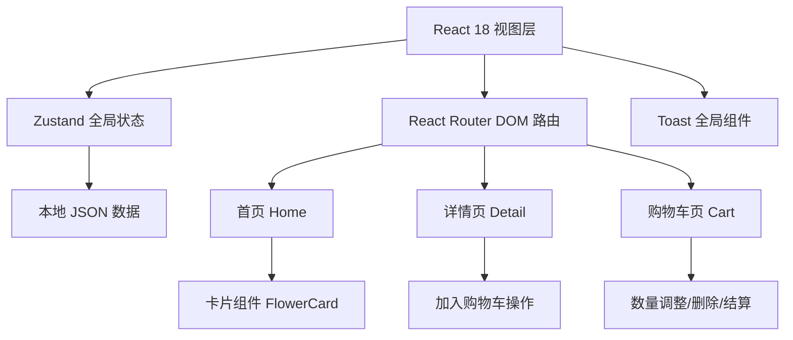

## 1. 架构设计



## 2. 技术描述

- **前端框架**：React 18 + TypeScript
- **构建工具**：Vite 5
- **路由管理**：react-router-dom 6
- **状态管理**：zustand 4
- **样式方案**：原生 CSS（CSS 变量 + 响应式媒体查询）
- **数据源**：本地静态 JSON 文件（flowers.json）

## 3. 路由定义

| 路由 | 页面组件 | 用途 |
|-------|---------|------|
| / | Home.tsx | 首页花束网格展示 |
| /flower/:id | Detail.tsx | 单束花详情页面 |
| /cart | Cart.tsx | 购物车管理页面 |

## 4. 数据模型

### 4.1 Flower 花束数据

```typescript
interface Flower {
  id: number;
  name: string;
  price: number;
  description: string;
  ingredients: string[];
  imageUrl: string;
}
```

### 4.2 CartItem 购物车项

```typescript
interface CartItem extends Flower {
  quantity: number;
}
```

### 4.3 Store 全局状态

```typescript
interface FlowerStore {
  flowers: Flower[];
  cartItems: CartItem[];
  addToCart: (flower: Flower) => void;
  removeFromCart: (id: number) => void;
  updateQuantity: (id: number, quantity: number) => void;
  clearCart: () => void;
  getTotalItems: () => number;
  getTotalPrice: () => number;
}
```

## 5. 项目结构

```
auto84/
├── .trae/documents/
│   ├── PRD.md
│   └── TechArch.md
├── src/
│   ├── components/
│   │   └── Toast.tsx
│   ├── data/
│   │   └── flowers.json
│   ├── pages/
│   │   ├── Home.tsx
│   │   ├── Detail.tsx
│   │   └── Cart.tsx
│   ├── App.tsx
│   ├── main.tsx
│   ├── store.ts
│   └── styles.css
├── index.html
├── vite.config.ts
├── tsconfig.json
└── package.json
```
