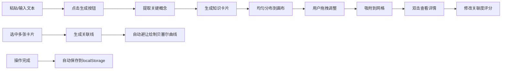

## 1. 产品概述

知识卡片墙是一款浏览器端的纯前端应用，帮助用户将粘贴的文本笔记自动转换为可视化的知识卡片网络。通过自动提取关键概念、生成带样式的卡片、绘制语义关联线，让用户快速建立信息之间的结构化连接，解决手动整理耗时、卡片关联困难的问题。

- **目标用户**：学生、研究者、知识工作者、内容创作者
- **核心价值**：一键将长文本转化为可交互的知识图谱，降低信息整理的认知负担
- **使用场景**：阅读笔记整理、概念关系梳理、知识体系搭建

## 2. 核心功能

### 2.1 用户角色

| 角色 | 注册方式 | 核心权限 |
|------|----------|----------|
| 普通用户 | 无需注册，本地使用 | 文本输入、卡片生成、拖拽编辑、导出保存 |

### 2.2 功能模块

1. **文本编辑区**：Markdown 文本输入、生成按钮、关键词预览
2. **画布展示区**：卡片渲染、拖拽交互、关联线绘制、网格背景
3. **详情浮层**：概念解释、关联卡片列表、关联度评分
4. **浮动工具栏**：缩放控制、全屏切换、PNG 导出
5. **本地持久化**：自动保存、状态恢复、保存时间显示

### 2.3 页面详情

| 页面名称 | 模块名称 | 功能描述 |
|----------|----------|----------|
| 主界面 | 左侧编辑区 | 30% 宽度，浅灰背景，内阴影，文本域 + 生成按钮 |
| 主界面 | 右侧画布区 | 70% 宽度，白色背景，网格线，卡片可拖拽，吸附网格 |
| 主界面 | 浮动工具栏 | 右上角圆形按钮组，缩放/全屏/导出 |
| 主界面 | 保存状态 | 左上角显示上次保存时间，30秒更新 |
| 详情浮层 | 概念详情 | 磨砂玻璃背景，居中显示，淡出动画 |
| 详情浮层 | 关联列表 | 相关卡片跳转，高亮联动 |
| 详情浮层 | 评分组件 | 1-5星关联度评分，可点击修改 |

## 3. 核心流程

用户在左侧粘贴文本 → 点击生成按钮 → 系统提取关键概念（3-10个）→ 为每个概念生成卡片并均匀分布 → 卡片自动分配颜色和图标 → 用户可拖拽调整位置 → 双击查看详情并评分 → 选中多张卡片生成关联线 → 自动保存到 localStorage → 刷新页面恢复状态

## 4. 用户界面设计

### 4.1 设计风格

- **主色调**：蓝色系 (#1976D2) 作为功能主色
- **卡片配色**：浅蓝 #E3F2FD、浅紫 #F3E5F5、浅绿 #E8F5E9 三色随机分配
- **背景色**：左侧 #F5F5F5 浅灰，右侧 #FFFFFF 纯白
- **按钮样式**：圆形直径 36px，蓝色背景白色图标
- **卡片样式**：圆角 12px，带图标，标题 16px 加粗，描述 12px 常规
- **字体**：无衬线字体，清晰易读
- **动效**：拖拽 0.2s 缓动、缩放 0.3s 过渡、面板淡出 0.3s

### 4.2 页面设计总览

| 页面名称 | 模块名称 | UI 元素 |
|----------|----------|---------|
| 主界面 | 左侧编辑区 | 浅灰背景、内阴影、文本域、生成按钮、提示文字 |
| 主界面 | 右侧画布 | 白色背景、25px 网格线、圆角卡片、曲线关联线 |
| 主界面 | 浮动工具栏 | 圆形按钮组、缩放图标、全屏图标、导出图标 |
| 主界面 | 保存状态 | 左上角时间戳、灰色小字 |
| 详情浮层 | 面板 | 磨砂玻璃背景、320px 宽、居中显示、圆角 |
| 详情浮层 | 内容区 | 标题、解释文本、关联列表、星级评分 |
| 关联气泡 | 悬停提示 | 白色背景、圆角 6px、浅阴影、卡片名称 |

### 4.3 响应式

- 桌面端优先设计，画布区自适应剩余空间
- 编辑区固定 30% 宽度，最小宽度 280px
- 画布支持无限滚动和缩放（0.5x - 3x）
- 详情面板居中定位，不随画布滚动

### 4.4 性能指标

- 50 张卡片 + 100 条关联线时帧率 ≥ 45fps
- 卡片拖拽延迟 ≤ 50ms
- 缩放操作过渡平滑无卡顿
- 关联线超过 20 条时自动降低弱关系透明度
