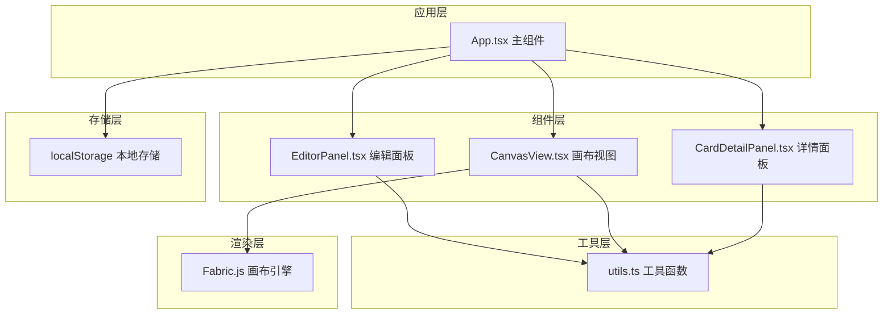

## 1. 架构设计



## 2. 技术选型说明

- **前端框架**：React 18 + TypeScript
- **构建工具**：Vite
- **画布引擎**：Fabric.js —— 内置对象拖拽、缩放、连线支持，适合交互式画布
- **状态管理**：React useState/useReducer，数据由 App 统一管理
- **存储方案**：localStorage 本地持久化
- **样式方案**：内联样式 + CSS 变量，轻量高效

## 3. 文件结构

| 文件路径 | 用途 |
|----------|------|
| `package.json` | 项目依赖与脚本 |
| `index.html` | 入口页面 |
| `vite.config.ts` | Vite 配置，含 React 插件 |
| `tsconfig.json` | TypeScript 配置，strict 模式 |
| `src/App.tsx` | 主组件，布局管理、状态分发、全屏导出 |
| `src/EditorPanel.tsx` | 左侧编辑区，文本输入与生成按钮 |
| `src/CanvasView.tsx` | 右侧画布，Fabric.js 渲染与交互 |
| `src/CardDetailPanel.tsx` | 双击卡片详情面板 |
| `src/utils.ts` | 工具函数集合 |

## 4. 数据模型

### 4.1 卡片数据 (CardData)

```typescript
interface CardData {
  id: string;
  title: string;
  description: string;
  color: string;
  icon: string;
  x: number;
  y: number;
  rating: number;
  relatedSentences: string[];
}
```

### 4.2 关联线数据 (ConnectionData)

```typescript
interface ConnectionData {
  id: string;
  fromCardId: string;
  toCardId: string;
  strength: number;
  description: string;
}
```

### 4.3 画布状态 (CanvasState)

```typescript
interface CanvasState {
  cards: CardData[];
  connections: ConnectionData[];
  zoom: number;
  panX: number;
  panY: number;
  lastSaved: number;
}
```

## 5. 核心算法说明

### 5.1 关键词提取算法
- 基于词频统计 + 词性过滤
- 提取名词短语作为候选概念
- 根据出现频率和位置权重排序
- 返回 Top 3-10 个关键概念

### 5.2 卡片自动布局
- 基于画布尺寸计算网格排列
- 卡片均匀分布，间距适中
- 支持随机扰动避免过于规整

### 5.3 网格吸附
- 拖拽结束时将坐标对齐到 20px 网格
- 使用 Math.round 计算最近网格点

### 5.4 关联线避让
- 使用贝塞尔曲线绘制
- 控制点自动偏移以避让其他卡片
- 根据两卡片颜色生成渐变色

### 5.5 关联强度管理
- 超过 20 条连线时触发透明度调整
- 按 strength 排序，弱关系透明度降至 0.2
- 保留前 20 条完整显示
