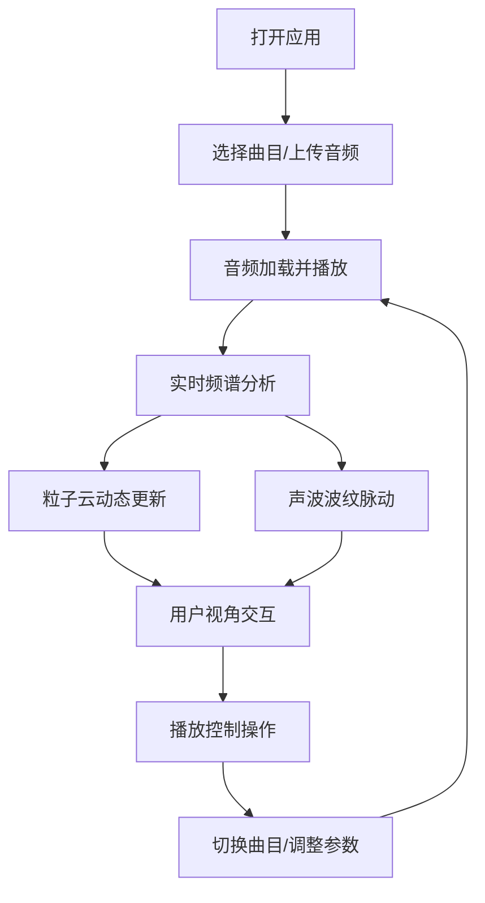

## 1. 产品概述

交互式3D声场可视化与音频播放器，用户可上传音频或选择预设曲目，在三维场景中实时生成随音频频谱变化的粒子云和声波波纹，提供沉浸式音频视觉体验。

- 核心功能：音频上传/选择、3D粒子云可视化、声波波纹动画、播放控制、视角交互
- 目标用户：音乐爱好者、视觉艺术爱好者、需要音频可视化展示的创作者
- 产品价值：将抽象的音频信号转化为具象的3D视觉艺术，增强音乐欣赏体验

## 2. 核心功能

### 2.1 功能模块

1. **主场景页面**：3D声场可视化场景、播放控制面板、曲目信息显示

### 2.2 页面详情

| 页面名称 | 模块名称 | 功能描述 |
|-----------|-------------|---------------------|
| 主场景页面 | 3D可视化模块 | 2000+粒子组成动态粒子云，随音频频谱变化呼吸效果；中心底部环形声波波纹随音频能量脉动 |
| 主场景页面 | 音频控制模块 | 播放/暂停按钮、进度条拖拽跳转、音量滑块、曲目下拉选择 |
| 主场景页面 | 视角交互模块 | OrbitControls拖拽旋转、滚轮缩放、一键重置视角 |
| 主场景页面 | 音频上传模块 | 文件上传按钮、预设曲目列表（3-5首示例音频） |

## 3. 核心流程

用户打开应用 → 选择预设曲目或上传音频 → 音频自动加载播放 → 3D粒子云和波纹随音乐实时变化 → 用户拖拽旋转视角、缩放 → 使用控制面板调整播放状态 → 可切换曲目或重置视角

## 4. 用户界面设计

### 4.1 设计风格

- **主题**：暗色太空主题，深空蓝黑渐变背景
- **主色调**：背景 `#080820` 到 `#101040` 渐变
- **粒子颜色**：中心暖黄 `#ffcc66` 向外渐变至蓝紫 `#6677dd`
- **波纹颜色**：渐变蓝紫，透明度 0.3-0.6
- **控制面板**：玻璃态设计，背景 `rgba(10,10,30,0.7)`，边框 `1px solid rgba(255,255,255,0.15)`，圆角 12px，毛玻璃效果 `backdrop-filter: blur(10px)`
- **按钮悬停**：微亮效果，过渡 0.2s
- **字体**：现代无衬线字体，曲目名 16px 白色，时间码 mm:ss 格式

### 4.2 页面设计概述

| 页面名称 | 模块名称 | UI元素 |
|-----------|-------------|-------------|
| 主场景页面 | 3D场景 | 全屏Canvas，粒子云，声波波纹，轨道控制 |
| 主场景页面 | 控制面板 | 底部中央悬浮，左侧曲目名，中间控制按钮/进度条/音量滑块，右侧时间码 |
| 主场景页面 | 视角重置按钮 | 右上角，一键回到默认视角 |

### 4.3 响应性

- 桌面端优先，全屏显示，无滚动条
- 3D场景自适应视口大小
- 控制UI在小屏幕上保持可用性

### 4.4 3D场景设计

- **环境**：深空渐变背景，无HDRI，营造沉浸感
- **光照**：环境光 + 点光源，突出粒子发光效果
- **相机**：默认位置 `(0,3,8)`，看向原点，距离范围 3-15
- **视角限制**：水平 -180度，垂直 30-60度
- **粒子系统**：2000+粒子，球体分布半径3，大小0.05-0.2，颜色渐变
- **波纹系统**：3-5个同心半透明圆环，宽度0.3
- **动画**：粒子云绕Y轴旋转0.5度/帧，低频收缩变亮、高频扩散变暗，波纹半径随能量脉动
- **性能**：维持55帧以上，音频分析延迟<100ms
