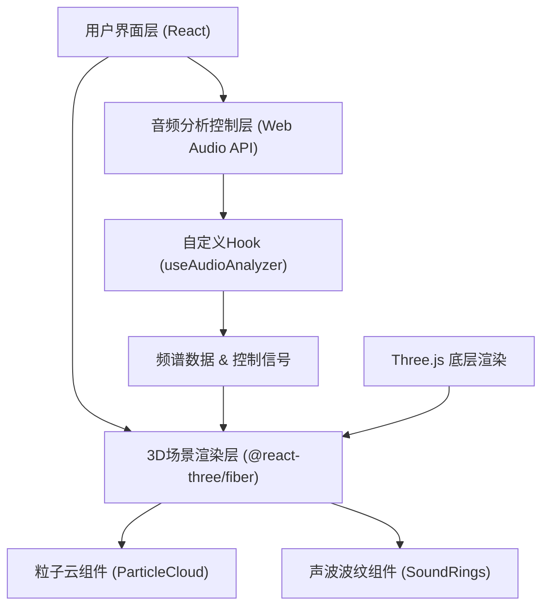

## 1. 架构设计



## 2. 技术描述

- **前端框架**：React 18 + TypeScript
- **构建工具**：Vite 5
- **3D渲染**：Three.js + @react-three/fiber + @react-three/drei
- **音频处理**：Web Audio API (AnalyserNode)
- **状态管理**：React Refs + 自定义Hook（避免不必要的重渲染）
- **初始化方式**：Vite React TypeScript 模板

## 3. 目录结构

```
src/
├── App.tsx              # 根组件，组合场景与UI
├── Scene.tsx            # 3D场景组件，R3F Canvas
├── AudioAnalyzer.ts     # 音频分析模块
├── components/
│   ├── ParticleCloud.tsx   # 粒子云组件
│   ├── SoundRings.tsx      # 声波波纹组件
│   └── ControlsUI.tsx      # 播放控制UI
└── hooks/
    └── useAudioAnalyzer.ts # 音频分析自定义Hook
```

## 4. 核心模块设计

### 4.1 通信机制
- `useAudioAnalyzer` Hook 暴露 ref 对象给 3D 场景
- 场景组件通过 `useFrame` 每帧读取 ref 中的频谱数据
- 避免 setState 导致的重渲染，保证性能

### 4.2 性能优化
- 粒子使用 `BufferGeometry` + `PointsMaterial`
- 直接操作 `position` 和 `color` attribute 数组
- 音频分析使用 `requestAnimationFrame` 与渲染同步
- 8-16个频段数据，减少计算量

### 4.3 类型定义

```typescript
interface AudioAnalysisData {
  frequencyData: Uint8Array;    // 频域数据
  timeDomainData: Uint8Array;   // 时域数据
  energy: number;               // 总能量
  lowFrequency: number;         // 低频能量
  highFrequency: number;        // 高频能量
  isPlaying: boolean;
  currentTime: number;
  duration: number;
}

interface SceneControllerRef {
  resetCamera: () => void;
  updateAudioData: (data: AudioAnalysisData) => void;
}
```

## 5. 依赖清单

```json
{
  "react": "^18.2.0",
  "react-dom": "^18.2.0",
  "three": "^0.160.0",
  "@react-three/fiber": "^8.15.0",
  "@react-three/drei": "^9.92.0",
  "typescript": "^5.3.0",
  "vite": "^5.0.0",
  "@vitejs/plugin-react": "^4.2.0",
  "@types/react": "^18.2.0",
  "@types/react-dom": "^18.2.0",
  "@types/three": "^0.160.0"
}
```
