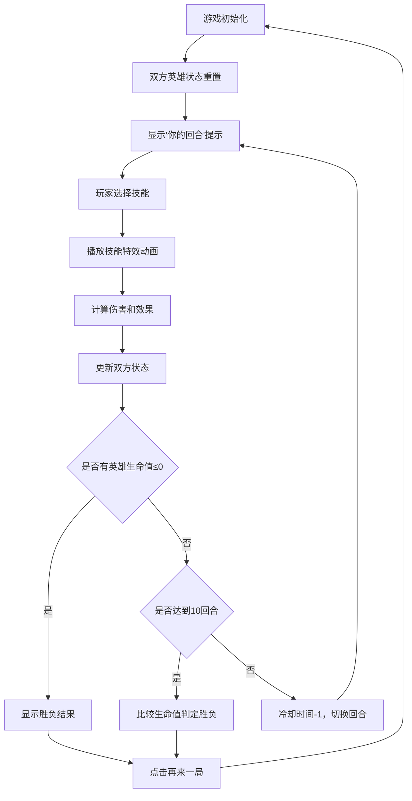

## 1. 产品概述

在线猫咪大乱斗是一款休闲竞技回合制对战游戏，两名玩家在浏览器中操控各自的猫咪英雄进行一对一PK。游戏融合了策略性技能选择和可爱卡通风格，为玩家提供轻松有趣的对战体验。

- 核心目标：通过策略性技能选择，耗尽对方生命值获得胜利
- 目标用户：休闲游戏爱好者，喜欢可爱卡通风格的玩家
- 市场价值：提供轻量级、易上手的浏览器对战游戏体验

## 2. 核心 Features

### 2.1 用户角色
| 角色 | 注册方式 | 核心权限 |
|------|----------|----------|
| 玩家 | 无需注册，直接进入游戏 | 选择猫咪英雄、使用技能对战、查看战斗日志 |

### 2.2 功能模块
1. **对战主界面**：对战场景、英雄状态展示、技能特效动画
2. **技能面板**：技能按钮、冷却状态显示、技能选择交互
3. **战斗日志**：回合行动记录、最新日志高亮
4. **胜负判定**：胜利/失败横幅、再来一局功能

### 2.3 页面详情
| 页面名称 | 模块名称 | 功能描述 |
|---------|---------|----------|
| 对战主页面 | 对战场景 | 左右对称布局展示双方英雄，背景渐变蓝天，技能特效动画区域 |
| 对战主页面 | 英雄状态 | 猫咪大头贴、姓名显示、生命值条（渐变绿色）、防御值显示 |
| 对战主页面 | 技能面板 | 三个技能按钮水平排列，冷却状态禁用，点击动效反馈 |
| 对战主页面 | 回合提示 | "你的回合"淡入提示，持续1.5秒 |
| 对战主页面 | 战斗日志 | 滚动列表，每回合行动记录，最新一条高亮 |
| 对战主页面 | 胜负面板 | 顶部滑入胜利/失败横幅，弹性动画，再来一局按钮 |

## 3. 核心流程

玩家进入游戏 → 双方猫咪英雄初始化 → 显示"你的回合"提示 → 玩家选择技能 → 播放技能特效动画 → 计算伤害/效果 → 更新双方状态 → 切换回合 → 重复直到一方生命值归零或达到10回合 → 显示胜负结果 → 点击再来一局重置游戏

## 4. 用户界面设计

### 4.1 设计风格
- **主色调**：柔和糖果色系 #ff9a9e、#fecfef、#87CEEB、#4caf50、#ffffff
- **按钮风格**：圆角8px，渐变背景，悬停亮度提升1.1倍，点击缩小至0.95，过渡0.15s
- **字体**：无衬线系统字体，清晰易读
- **布局风格**：中央对战场景为核心，左右对称布局，卡片式设计
- **视觉元素**：使用emoji表示猫咪形象，CSS动画实现技能特效

### 4.2 页面设计概述
| 页面名称 | 模块名称 | UI元素 |
|---------|---------|--------|
| 对战主页面 | 对战场景 | 渐变蓝天背景，左右英雄区域对称，中央特效区域，高度600px，宽度占70% |
| 对战主页面 | 英雄卡片 | 120x120px猫咪大头贴（emoji），白色圆角边框，软阴影，姓名标签，生命值条 |
| 对战主页面 | 生命值条 | 渐变绿色#4caf50至#81c784，宽度随生命值比例变化，过渡0.3s ease-out |
| 对战主页面 | 技能按钮 | 80x40px，圆角8px，渐变背景#ff9a9e至#fecfef，冷却时灰色禁用 |
| 对战主页面 | 战斗日志 | 滚动列表，灰色小字，最新一条高亮显示 |
| 对战主页面 | 胜负横幅 | 从顶部滑入，弹性动画0.3s，下方"再来一局"按钮 |

### 4.3 响应式适配
- **桌面端（≥768px）**：对战场景高度600px，技能按钮80x40px，日志面板在右侧
- **移动端（<768px）**：对战场景高度400px，技能按钮60x30px，字号缩小，日志面板移到底部
- 触摸优化：按钮点击区域充足，避免误触

### 4.4 动画效果
- **回合提示**：淡入效果，持续1.5秒
- **技能特效**：猛扑为猫咪爪印从己方飞向对方，时长0.5秒，CSS keyframes实现
- **生命值变化**：宽度过渡0.3s ease-out
- **胜负横幅**：从顶部滑入，弹性动画0.3秒
- **按钮交互**：悬停亮度提升，点击缩放反馈，过渡0.15s
