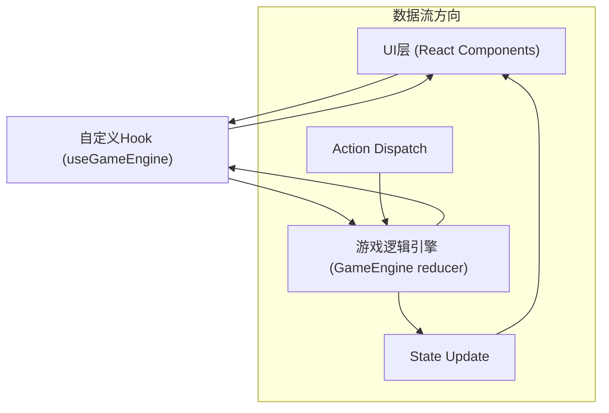

## 1. 架构设计



## 2. 技术描述
- **前端框架**：React 18 + TypeScript
- **构建工具**：Vite 5
- **状态管理**：useReducer + 自定义Hook（单向数据流）
- **样式方案**：纯CSS + CSS Modules/内联样式（按用户要求不使用Tailwind）
- **动画方案**：CSS Keyframes + CSS Transitions
- **初始化工具**：vite-init

## 3. 目录结构
```
src/
├── GameEngine.ts      # 游戏逻辑引擎，reducer函数，初始状态
├── useGameEngine.ts   # 自定义Hook，封装useReducer
├── App.tsx            # 主UI组件，对战场景，技能面板，状态显示
├── main.tsx           # 应用入口
└── index.css          # 全局样式，CSS动画定义
```

## 4. 核心模块说明

### 4.1 GameEngine.ts - 游戏逻辑引擎
**职责**：管理猫咪英雄状态、技能效果、战斗回合、伤害计算、胜负判定

**数据类型定义**：
```typescript
interface Skill {
  id: string;
  name: string;
  description: string;
  cooldown: number;
  currentCooldown: number;
  type: 'damage' | 'defense' | 'heal';
}

interface Hero {
  id: string;
  name: string;
  emoji: string;
  maxHp: number;
  currentHp: number;
  baseDefense: number;
  currentDefense: number;
  defenseBonus: number;
  defenseBonusDuration: number;
  skills: Skill[];
}

interface GameState {
  player: Hero;
  opponent: Hero;
  currentTurn: 'player' | 'opponent';
  round: number;
  maxRounds: number;
  gameStatus: 'playing' | 'playerWin' | 'opponentWin' | 'draw';
  battleLog: LogEntry[];
  animation: AnimationState | null;
  showTurnIndicator: boolean;
}

interface LogEntry {
  id: number;
  round: number;
  actor: string;
  action: string;
  damage?: number;
  heal?: number;
}

interface AnimationState {
  type: 'pounce' | 'shield' | 'heal';
  from: 'player' | 'opponent';
  to: 'player' | 'opponent';
}

type GameAction =
  | { type: 'START_GAME' }
  | { type: 'USE_SKILL'; skillId: string; actor: 'player' | 'opponent' }
  | { type: 'END_ANIMATION' }
  | { type: 'HIDE_TURN_INDICATOR' }
  | { type: 'RESET_GAME' };
```

**核心逻辑**：
- `initialState`：初始游戏状态
- `reducer(state, action)`：状态更新函数
- `calculateDamage(skill, attacker, defender)`：伤害计算公式
- `reduceCooldowns(hero)`：回合开始时冷却时间-1
- `checkGameEnd(state)`：胜负判定

### 4.2 useGameEngine.ts - 自定义Hook
**职责**：封装useReducer调用，暴露状态和dispatch方法

```typescript
export function useGameEngine() {
  const [state, dispatch] = useReducer(reducer, initialState);
  return { state, dispatch };
}
```

### 4.3 App.tsx - 主UI组件
**职责**：渲染对战场景、技能面板、状态指示器、胜负判定

**子组件**（按功能拆分，保持单个组件<300行）：
- `BattleScene`：对战场景容器，英雄展示，特效动画
- `HeroCard`：英雄卡片，大头贴、姓名、生命值条
- `SkillPanel`：技能按钮面板，冷却状态
- `BattleLog`：战斗日志滚动列表
- `TurnIndicator`：回合提示淡入效果
- `ResultBanner`：胜负结果横幅

## 5. 性能指标
- 战斗计算和UI更新：≤200ms
- 技能动画播放：≤500ms
- 整体帧率：≥30fps
- 动画帧率：≥30fps

## 6. 关键技术实现

### 6.1 单向数据流
UI → dispatch(action) → reducer计算新state → useGameEngine返回新state → UI重新渲染

### 6.2 技能冷却机制
- 技能使用后设置currentCooldown = cooldown
- 每回合开始时调用reduceCooldowns，所有技能currentCooldown > 0时减1
- currentCooldown > 0时技能按钮禁用，显示灰色

### 6.3 伤害计算公式
```
最终伤害 = max(5, 技能基础伤害 + 攻击者攻击力 - 目标防御力)
```
- 猛扑基础伤害：20-30点随机值
- 护盾：提升防御15点，持续2回合
- 治疗：恢复20-30点生命值

### 6.4 胜负判定
- 任意一方currentHp ≤ 0 → 另一方获胜
- 达到10回合 → 比较currentHp，高者获胜，相等则平局

### 6.5 CSS动画
- `@keyframes pounce`：爪印从左到右/从右到左飞行
- `@keyframes fadeIn`：回合提示淡入
- `@keyframes slideDown`：胜负横幅滑入（带弹性效果）
- `@keyframes pulse`：生命值变化闪烁提示
