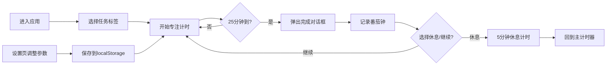

## 1. 产品概述

番茄钟 Web 应用是一款基于经典 Pomodoro 工作法的浏览器端效率工具，帮助用户通过 25 分钟专注工作 + 5 分钟休息的循环提升工作效率。应用支持自定义任务标签、番茄钟统计可视化、灵活的参数设置，旨在解决用户在计时过程中无法灵活标记任务类型、缺乏工作量统计概览的问题。

## 2. 核心功能

### 2.1 功能模块

1. **主计时器界面**：圆形渐变进度环倒计时、开始/暂停/重置控制
2. **任务标签选择**：预置标签卡片展示、自定义标签创建（最多 6 个）
3. **番茄钟完成弹窗**：时段完成提醒、休息/继续选择
4. **历史统计面板**：当日每小时番茄钟数量柱状图
5. **设置面板**：工作时长、休息时长、每日目标自定义

### 2.2 页面详情

| 页面名称 | 模块名称 | 功能描述 |
|----------|----------|----------|
| 主界面 | 计时器模块 | 圆形 SVG 进度环倒计时、实时显示剩余时间、开始/暂停/重置按钮 |
| 主界面 | 标签选择区 | 预置 4 个标签卡片（编码/阅读/写作/冥想）、自定义标签添加 |
| 主界面 | 统计面板 | 水平柱状图展示当日每小时番茄钟数量、入场动画 |
| 主界面 | 完成弹窗 | 恭喜信息、标签名称、番茄钟编号、休息/继续按钮 |
| 设置页 | 设置面板 | 工作时长滑块（15-45 分钟）、休息时长滑块（3-15 分钟）、每日目标（4-16 个） |

## 3. 核心流程

用户进入应用 → 选择任务标签 → 点击开始专注 → 25 分钟倒计时 → 完成弹窗提示 → 选择休息或继续 → 数据自动记录到统计面板 → 可在设置页调整参数

## 4. 用户界面设计

### 4.1 设计风格

- **主色调**：蓝绿渐变（主色 #4ecdc4，辅色 #ff6b6b）
- **背景色**：浅灰 #f5f6fa
- **按钮风格**：圆角 12px，悬停放大 1.05 倍，点击缩放 0.95，波纹反馈
- **卡片风格**：白色背景、圆角 8px、阴影效果
- **整体风格**：最小化卡片式布局，居中对称设计

### 4.2 页面设计概览

| 页面名称 | 模块名称 | UI 元素 |
|----------|----------|---------|
| 主界面 | 计时器 | 直径 300px 圆形、#ff6b6b→#4ecdc4 渐变环、48px 时间文字 |
| 主界面 | 标签卡片区 | 白色卡片、6px 颜色侧边条、添加按钮、字符计数 |
| 主界面 | 统计面板 | 高度 200px、浅灰背景、上边框 2px、蓝渐变柱形图 |
| 设置页 | 设置面板 | 滑块控件、实时预览、齿轮图标切换 |

### 4.3 响应式

- **桌面端**：水平布局，计时器居中，标签区右侧 30% 宽度
- **移动端**（<768px）：垂直单列布局，计时器在上，标签区在下，统计面板为可折叠抽屉
- **触控优化**：按钮触控区域不小于 44px

### 4.4 动效规范

- 所有可交互元素悬停缩放 1.05（0.2s ease）
- 按钮点击波纹效果（ripple）
- 柱状图入场动画（0.5s 从底部升起）
- 弹窗淡入过渡（0.3s）
- 动画帧率 60FPS，无掉帧卡顿
