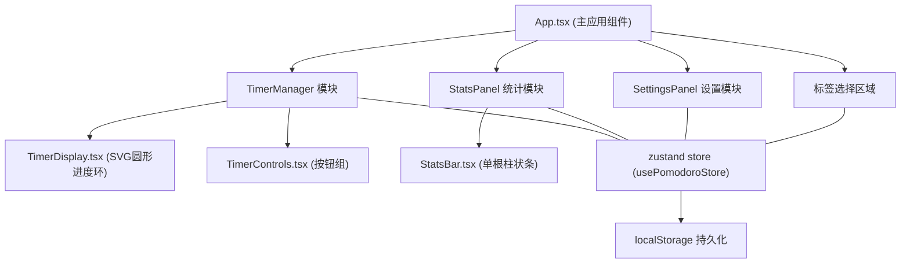

## 1. 架构设计



## 2. 技术描述

- **前端框架**：React 18 + TypeScript
- **构建工具**：Vite
- **状态管理**：Zustand
- **样式方案**：CSS Modules / 全局 CSS 变量
- **计时精度**：requestAnimationFrame（误差 < 50ms）
- **数据持久化**：localStorage
- **动画方案**：CSS 动画 + requestAnimationFrame

## 3. 路由定义

| 路由/视图 | 用途 |
|-----------|------|
| 主视图 (默认) | 计时器 + 标签选择 + 统计面板 |
| 设置面板 | 通过齿轮图标切换显示 |

应用为单页应用，不使用 react-router，通过状态切换显示主界面和设置面板。

## 4. 数据模型

### 4.1 类型定义

```typescript
interface Tag {
  id: string;
  name: string;
  color: string;
}

interface PomodoroSession {
  id: string;
  tagId: string;
  startTime: number;
  endTime: number;
  duration: number;
  sessionNumber: number;
}

interface Settings {
  workDuration: number;
  breakDuration: number;
  dailyGoal: number;
}
```

### 4.2 Store 状态

```typescript
interface PomodoroStore {
  tags: Tag[];
  sessions: PomodoroSession[];
  settings: Settings;
  currentTagId: string | null;
  timerStatus: 'idle' | 'running' | 'paused' | 'break';
  addTag: (name: string, color: string) => void;
  logSession: (session: PomodoroSession) => void;
  updateSettings: (settings: Partial<Settings>) => void;
  setCurrentTag: (tagId: string) => void;
  setTimerStatus: (status: TimerStatus) => void;
}
```

## 5. 文件结构

```
src/
├── store/
│   └── usePomodoroStore.ts      # Zustand 状态管理
├── modules/
│   ├── timer/
│   │   ├── TimerDisplay.tsx     # 圆形倒计时显示
│   │   ├── TimerControls.tsx    # 开始/暂停/重置按钮
│   │   └── TimerManager.tsx     # 计时器核心逻辑
│   ├── stats/
│   │   ├── StatsPanel.tsx       # 统计面板
│   │   └── StatsBar.tsx         # 单根柱状条
│   └── settings/
│       └── SettingsPanel.tsx    # 设置面板
├── App.tsx                      # 主应用组件
└── styles.css                   # 全局样式
```

## 6. 性能保障

- **计时精度**：使用 requestAnimationFrame 驱动倒计时，误差控制在 50ms 内
- **图表渲染**：数据变化时 100ms 内响应，使用 CSS transform 实现柱状条动画
- **渲染优化**：合理使用 React.memo，避免不必要的重渲染
- **动画性能**：使用 transform 和 opacity 属性实现 60FPS 动画
