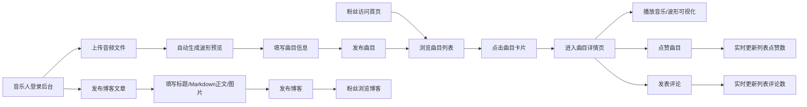

## 1. 产品概述

独立音乐人作品展示与互动博客平台，为音乐人提供简洁高效的作品发布渠道，为粉丝提供沉浸式的音乐欣赏和互动体验。解决现有音乐人网站过于复杂或千篇一律的痛点，打造个性化、高互动性的音乐人专属空间。

- 目标用户：独立音乐人、乐队及其粉丝群体
- 核心价值：低成本快速搭建个性化音乐展示空间，增强粉丝互动粘性

## 2. 核心功能

### 2.1 用户角色
| 角色 | 注册方式 | 核心权限 |
|------|----------|----------|
| 粉丝用户 | 无需注册 | 浏览曲目、播放音乐、点赞、发表评论、浏览博客 |
| 音乐人 | 默认管理员ID（admin） | 上传曲目、发布博客、管理曲目/博客、审核评论、删除内容 |

### 2.2 功能模块
1. **首页**：曲目列表展示、导航栏、选项卡切换
2. **曲目详情页**：波形播放器、点赞、评论区
3. **博客列表页**：文章摘要卡片展示
4. **博客详情页**：完整Markdown文章展示、留言区
5. **管理后台**：曲目管理、博客管理、评论审核

### 2.3 页面详情
| 页面名称 | 模块名称 | 功能描述 |
|----------|----------|----------|
| 首页 | 导航栏 | 渐变背景固定顶部，含Logo、曲目/博客切换、后台入口 |
| 首页 | 曲目网格 | 3列响应式布局，卡片悬停上移动画，展示封面/标题/点赞/评论数 |
| 曲目详情页 | 播放器 | Canvas波形图、播放控制、进度条、时间显示 |
| 曲目详情页 | 互动区 | 点赞按钮（带弹跳动画）、评论列表、评论输入框 |
| 博客列表页 | 文章卡片 | 标题、100字摘要、缩略图、点击跳转详情 |
| 博客详情页 | 文章内容 | Markdown渲染、标题h2、正文行高1.8、图片100%宽度 |
| 管理后台 | 曲目管理 | 列表展示、删除操作 |
| 管理后台 | 博客管理 | 列表展示、删除操作 |
| 管理后台 | 评论审核 | 列表展示、标记已审核、删除操作 |

## 3. 核心流程

## 4. 用户界面设计

### 4.1 设计风格
- **主背景色**：深灰色 #1a1a2e（营造沉浸音乐氛围）
- **卡片背景**：半透明深色 #16213e（层次感）
- **文字主色**：浅色 #e0e0e0（高对比度可读性）
- **强调色A**：珊瑚橙 #ff6b6b（点赞、进度条渐变色）
- **强调色B**：青绿 #4ecdc4（审核按钮、进度条渐变色）
- **导航栏渐变**：#0f3460 → #16213e（顶部固定）
- **按钮风格**：圆角设计，悬停加深，点击缩放动画
- **字体**：使用现代无衬线字体，标题加粗，正文清晰
- **布局**：卡片式网格布局，大量留白，呼吸感强

### 4.2 页面设计概述
| 页面名称 | 模块名称 | UI元素 |
|----------|----------|--------|
| 首页 | 导航栏 | 渐变背景、60px高度、固定顶部、应用名22px加粗白色 |
| 首页 | 曲目卡片 | 圆角16px、背景#16213e、内边距16px、封面200x200px、标题18px、艺人名12px灰色 |
| 曲目详情页 | 播放器 | 80%宽度居中、最大高度120px、背景#0f3460、圆角8px、波形渐变#ff6b6b→#4ecdc4 |
| 曲目详情页 | 点赞按钮 | ❤️图标、未点赞#ccc、点赞后#ff6b6b、弹跳动画0.3s |
| 曲目详情页 | 评论区 | 圆形头像36x36px、背景#1a1a2e、圆角8px、时间戳13px灰色靠右 |
| 管理后台 | 数据表格 | 交替行背景、操作按钮6px12px内边距、圆角6px、删除#e74c3c、审核#4ecdc4 |

### 4.3 响应式设计
- **>1200px**：曲目列表3列网格
- **768px-1199px**：曲目列表2列网格
- **<768px**：曲目列表1列单列布局
- 触摸设备优化：增大点击区域，按钮最小44x44px

### 4.4 动效设计
- 卡片悬停：上移4px + 阴影加深，过渡0.25s ease
- 按钮点击：缩放0.95→1.0，过渡0.2s
- 点赞按钮：弹跳动画0.3s
- 波形播放：进度区域渐变高亮
- 评论提交：平滑滚动到最新评论
