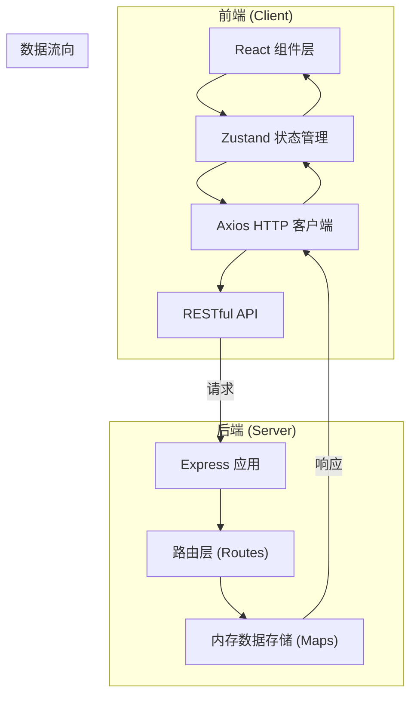
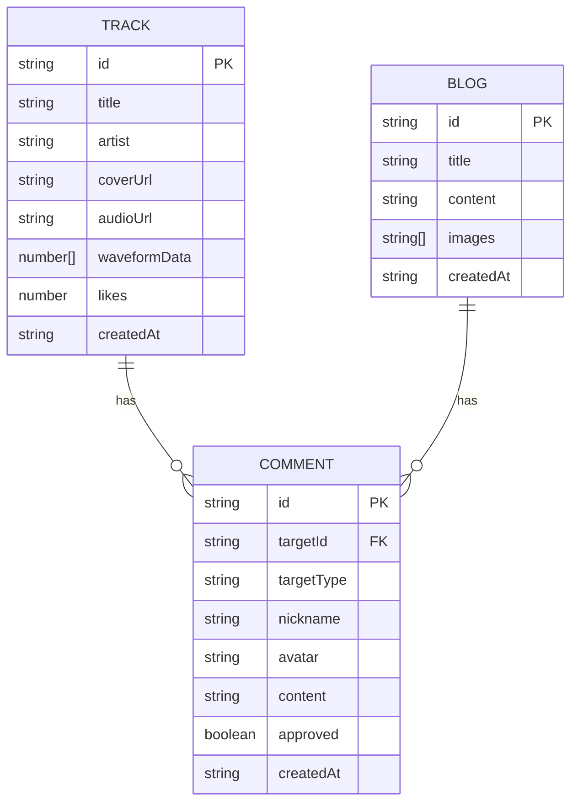
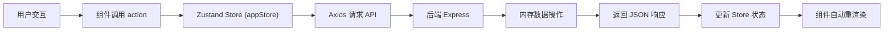
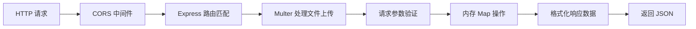

## 1. 架构设计



## 2. 技术描述

- **前端框架**：React@18 + TypeScript
- **构建工具**：Vite@5
- **状态管理**：Zustand@4
- **HTTP客户端**：Axios@1
- **路由**：React Router DOM@6
- **后端框架**：Express@4
- **后端语言**：TypeScript + ts-node
- **文件上传**：Multer@1.4
- **跨域**：CORS@2.8
- **唯一ID**：UUID@9
- **数据存储**：内存 Map（模拟数据库）
- **Markdown渲染**：react-markdown

## 3. 目录结构

```
auto91/
├── package.json                 # 项目依赖和脚本
├── vite.config.ts               # Vite构建配置
├── tsconfig.json                # TypeScript配置
├── index.html                   # 入口HTML
├── server/
│   ├── index.ts                 # 后端入口
│   ├── routes/
│   │   ├── tracks.ts            # 曲目API路由
│   │   ├── blogs.ts             # 博客API路由
│   │   └── comments.ts          # 评论API路由
│   └── types.ts                 # 后端类型定义
└── src/
    ├── main.tsx                 # 前端入口
    ├── App.tsx                  # 根组件 + 路由配置
    ├── stores/
    │   └── appStore.ts          # Zustand全局状态
    ├── components/
    │   ├── Navbar.tsx           # 导航栏
    │   ├── TrackCard.tsx        # 曲目卡片
    │   ├── WaveformPlayer.tsx   # 波形播放器
    │   ├── BlogCard.tsx         # 博客卡片
    │   ├── CommentList.tsx      # 评论列表
    │   └── CommentForm.tsx      # 评论表单
    ├── pages/
    │   ├── HomePage.tsx         # 首页
    │   ├── TrackDetailPage.tsx  # 曲目详情页
    │   ├── BlogListPage.tsx     # 博客列表页
    │   ├── BlogDetailPage.tsx   # 博客详情页
    │   └── AdminPage.tsx        # 管理后台
    ├── types/
    │   └── index.ts             # 前端类型定义
    └── utils/
        └── waveform.ts          # 波形生成工具
```

## 4. 路由定义

| 前端路由 | 页面 | 说明 |
|----------|------|------|
| / | 首页 | 曲目列表 |
| /tracks/:id | 曲目详情页 | 播放、点赞、评论 |
| /blog | 博客列表页 | 文章摘要列表 |
| /blog/:id | 博客详情页 | 完整文章、留言 |
| /admin | 管理后台 | 曲目/博客/评论管理 |

| 后端API | 方法 | 说明 |
|---------|------|------|
| /api/tracks | GET | 获取所有曲目（含点赞数、评论数） |
| /api/tracks | POST | 上传音频文件，创建新曲目 |
| /api/tracks/:id | GET | 获取单首曲目详情 |
| /api/tracks/:id | DELETE | 删除曲目 |
| /api/tracks/:id/like | POST | 增加点赞数 |
| /api/blogs | GET | 获取所有博客 |
| /api/blogs | POST | 创建新博客 |
| /api/blogs/:id | GET | 获取单篇博客 |
| /api/blogs/:id | DELETE | 删除博客 |
| /api/comments | GET | 获取所有评论（后台用） |
| /api/comments | POST | 发表评论 |
| /api/comments/:id | PUT | 标记评论已审核 |
| /api/comments/:id | DELETE | 删除评论 |

## 5. 数据模型

### 5.1 实体关系图



### 5.2 TypeScript 类型定义

```typescript
// src/types/index.ts
export interface Track {
  id: string;
  title: string;
  artist: string;
  coverUrl: string;
  audioUrl: string;
  waveformData: number[];
  likes: number;
  createdAt: string;
}

export interface Blog {
  id: string;
  title: string;
  content: string;
  images: string[];
  createdAt: string;
}

export interface Comment {
  id: string;
  targetId: string;
  targetType: 'track' | 'blog';
  nickname: string;
  avatar: string;
  content: string;
  approved: boolean;
  createdAt: string;
}

export interface AppState {
  tracks: Track[];
  blogs: Blog[];
  comments: Comment[];
  currentTrack: Track | null;
  currentBlog: Blog | null;
  isLoading: boolean;
  error: string | null;
}
```

## 6. 数据流向说明

### 6.1 前端数据流



### 6.2 后端数据流



## 7. 核心算法

### 7.1 波形数据生成算法
- 使用 Web Audio API 的 AudioContext
- 解码音频文件为 AudioBuffer
- 将音频分为40个时间窗口
- 每个窗口计算RMS（均方根）音量值
- 归一化到 0-1 范围存储

### 7.2 Canvas 波形绘制
- 初始化 Canvas 上下文，清除画布
- 绘制已播放区域（渐变色 #ff6b6b → #4ecdc4）
- 绘制未播放区域（单色 #ff6b6b）
- 监听播放进度，按需重绘
- 支持点击跳转播放位置

## 8. 性能优化

1. **内存数据库**：所有数据存储在内存 Map 中，响应时间 < 150ms
2. **状态管理**：Zustand 轻量状态，避免不必要重渲染
3. **虚拟列表**：超过50首曲目时实现虚拟滚动
4. **Canvas 优化**：仅在进度变化时重绘波形，稳定 30+ FPS
5. **请求缓存**：GET 请求结果短时间缓存，减少重复请求
6. **图片优化**：封面图使用合适尺寸，添加 loading="lazy"
