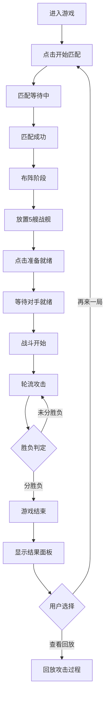

## 1. 产品概述

在线海战棋双人对战游戏，让两名玩家在各自浏览器中指挥舰队在10x10的网格上布阵并轮流炮击，先击沉对方所有战舰者获胜。

- 主要目的：提供一款经典海战棋的在线双人对战体验
- 解决问题：实现跨浏览器实时对战，包含完整的游戏流程和社交互动
- 目标用户：休闲游戏玩家、对战游戏爱好者
- 市场价值：经典游戏网络化，支持实时对战和社交互动

## 2. 核心功能

### 2.1 用户角色
| 角色 | 注册方式 | 核心权限 |
|------|---------|----------|
| 玩家 | 无需注册，直接进入 | 创建/加入房间、布阵、攻击、聊天、查看回放 |

### 2.2 功能模块
1. **主匹配界面**：开始匹配按钮、等待状态展示
2. **布阵阶段界面**：10x10网格布阵、战舰选择与旋转、准备就绪按钮
3. **战斗阶段界面**：双棋盘展示、回合倒计时、攻击交互、击沉记录
4. **聊天表情面板**：6个海战表情按钮、表情冒泡展示
5. **游戏结束界面**：胜负结果展示、再来一局、查看回放
6. **回放系统**：2倍速重演攻击步骤、攻击落点高亮

### 2.3 页面详情
| 页面名称 | 模块名称 | 功能描述 |
|---------|---------|----------|
| 主匹配界面 | 匹配模块 | 点击开始匹配，展示旋转锚形图标等待对手 |
| 布阵界面 | 布阵模块 | 拖放放置5艘战舰，点击旋转，冲突检测，准备就绪 |
| 战斗界面 | 战斗模块 | 点击对手网格攻击，命中/未命中特效，15秒回合倒计时 |
| 战斗界面 | 聊天模块 | 6个海战表情按钮，表情冒泡动画 |
| 结束界面 | 结算模块 | 磨砂玻璃背景，胜负展示，再来一局和回放按钮 |
| 回放界面 | 回放模块 | 2倍速重演，黄色高亮闪烁攻击点 |

## 3. 核心流程

玩家进入游戏 → 点击开始匹配 → 匹配成功进入布阵 → 放置5艘战舰 → 点击准备就绪 → 等待对手准备 → 战斗开始轮流攻击 → 一方全灭游戏结束 → 显示结果/回放

## 4. 用户界面设计

### 4.1 设计风格
- 主色调：深蓝渐变背景 #0a1628 到 #1a2a4a
- 强调色：亮蓝色 #4a90d9（按钮）、红色 #ff4d4d（倒计时/命中）、黄色 #ffd700（回放高亮）
- 按钮样式：圆角设计，按压反馈 transform: scale(0.95) 0.1s，悬停背景微亮
- 字体：统一现代无衬线字体，白色文字
- 布局：卡片式半透明设计（#ffffff10），圆角12px
- 图标：使用emoji作为表情图标（⚓️💥🌊😤🏆🤝）

### 4.2 页面设计概述
| 页面名称 | 模块名称 | UI元素 |
|---------|---------|--------|
| 主匹配界面 | 匹配模块 | 深色背景、居中锚形旋转动画、"正在寻找对手..."文字 |
| 布阵界面 | 布阵模块 | 左侧己方10x10网格、右侧战舰选择栏、战舰深蓝色、悬停半透明预览、冲突红色边框、"准备就绪"按钮 |
| 战斗界面 | 战斗模块 | 左右双棋盘（各占45%）、中间白色虚线分隔、上方状态面板（倒计时+击沉记录）、右侧聊天栏（20%宽度） |
| 战斗界面 | 特效模块 | 命中红色"✗"（32px，0.4s脉冲放大）、未命中白色"○"（20px，0.3s淡出） |
| 结束界面 | 结算模块 | 半透明磨砂玻璃背景、居中文本"你赢了/你输了"、两个操作按钮 |

### 4.3 响应式
- 桌面优先设计，最小宽度1024px
- 768px以下屏幕网格缩小，保持交互功能
- 媒体查询适配不同屏幕尺寸

### 4.4 动画与交互
- 匹配等待：锚形图标旋转动画
- 布阵：战舰拖放、悬停预览、冲突红色边框闪烁
- 攻击：命中脉冲放大、未命中缩小淡出
- 倒计时：红色计时条实时缩短
- 表情冒泡：从底部弹出到顶部，3秒后消失
- 回放：攻击点黄色光晕闪烁0.3秒
- 所有按钮：按压缩放0.95，0.1秒过渡
